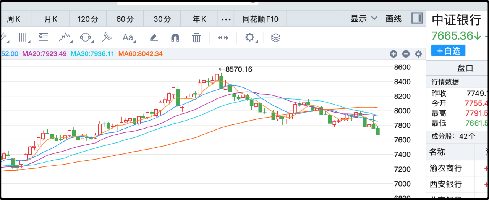
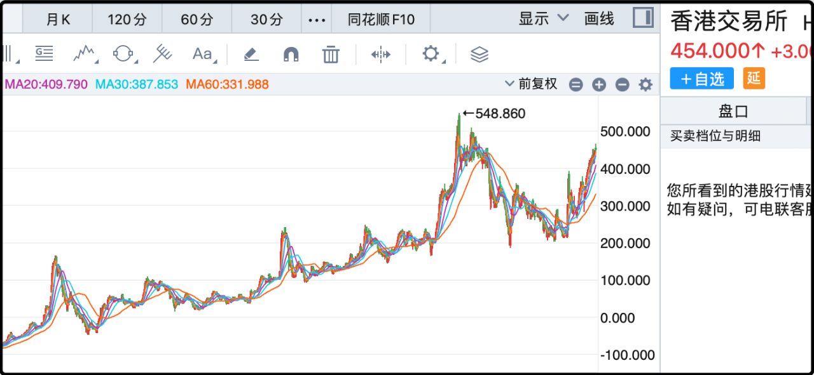

昨天评论里有好几个网友讨论了指数涨个股不涨的问题，我之前写过2025年市场全景数据，今天再更新一遍。

2024年12月31日a股总市值85.37万亿，2025年9月1日a股总市值103.87万亿，**+21.67%**。

a股目前一共有5141只股票在交易，中位数表现是**20.61%**。

今年上涨的股票4306只，占比**83.75%**。

有意思的是我上一次发布统计的时候市值+16%，中位数+24，结果这几天权重股一直在涨，小盘股一直在跌，市值涨幅已经反超中位数涨幅了。确实只看最近半个月的话，大部分个股是跑不赢指数的，因为资金在快速流向权重股。

另外我经常关注的宽基年内表现如下：

上证指数 +15.63%、上证50 +11.04%、沪深300 +14.96%、中证500 +24.18%、中证1000 +25.91%、中证2000 +33.5%、创业板指 +38.04%、科创50 +37.23%、

微盘股指数因为没有跟踪的ETF我就不统计了，以上指数都是有对应的ETF的，大盘不涨是大盘的问题，大盘涨了你没跟上是你的问题。具体原因很多，有仓位不满的，有低抛高吸做反t的，有选错板块严重踏空的，总之如果你觉得指数跑太快自己追不上，最简单的办法就是买指数ETF。

还有就是昨晚很多网友参与了命运、人生选择相关的讨论，有个女读者问正确的人生选择是否都是因为提高认知的结果，这个我真觉得不是。大部分的时代机遇都不是凭借认知预判出来的，就是风口来了，有些人恰好站在那里被吹起来了。

70后、80后参加工作，结婚买房，自然而然就能享受到楼市红利，而90后结婚买房很容易就买到山顶高位，这两拨人在认知上没有差异，但命运却天壤之别。

再比如我，从大学起就擅长写作，毕业后在互联网的多个论坛里也都很有影响力，但直到有了微信公众号这个产品，才让我成为了大v，享受到了流量的红利，这和努力、选择都不相干。

还有我2022年初开始转投新兴市场，正好踩到低点，赚了不少钱。其实这也不完全是我眼光好选出来的，老读者都知道2021年底我遭遇了一些事，我原先的财路都断了，被迫滚出舒适区，开辟新的战场。

所以人生就是有很多歪打正着，我两次重要的节点，一次是趁着风口起飞，一次是撞墙了被迫拐道，都不是我主动选择出来的。当然我也不能过分谦虚，每次遇到机会我能做成事，我也是有点东西的。但总的来说我觉得人生里的小成功可以规划，大成功要随缘。
……
今天两市成交2.75万亿，市场中位数+0.53%，涨得比较健康，量能也在合理水平。今天涨幅最高的是黄金板块，国际金价只涨了1%，a股黄金板块暴涨8%，这就是牛市的乘数效应。整个市场都涌动着亢奋的情绪，每个人都想抓住时间窗口多挣点，所以只要一有信号资金哗哗的就流过去。

这个时候整个市场的心态是积极进取的，所以那些曾经在牛市里表现优异的防御板块就不行了。比如今天中证银行指数再跌1%，自从7月初见顶以来已经阴跌两个月了，而这两个月也是牛市行情完全展开的两个月。

其它红利属性的股票也是一样的道理，像高速公路板块、水力发电最近也在持续阴跌，跌的幅度不大，但最关键的是浪费了宝贵的行情。很多股民持有红利股之前熊市如沐春风，最近两个月如坐针毡，既想卖出仓位切换到创业板、科创板，又怕自己换仓后节奏踩错两头亏。

遇到这种情况来问我的我都不回答，得失心这么重的人做高频投机很容易搞坏心态，到时候输不起锅就扣我头上。做交易判断的时候很重要的一点，就是先反省下自己是个什么样的人，不要走自己无法驾驭的路线。
……
1、比亚迪8月新能源汽车销量37.36万辆，与去年同期的37.31万辆几乎持平。这是一个很消极的信号，比亚迪此前一直维持30%以上的增速，市场也是按照那个预期定价，但自从价格战以后可能是受政策调整影响，比亚迪的销量疲软，单月已经不增长了，假如后面几个月依然没有好转的话，错过本轮牛市事小，甚至向下的空间也是有的。

2、今天有小作文说多晶硅产业重组计划很快就要公布，就是行业头部公司出钱凑成产业基金去收购/关闭小厂产能。今天多晶硅期货大涨5%，目前是51740元/吨。光伏设备今天上涨11.9%，明显跑输大盘的水平，但困境反转板块共识凝聚需要时间，你想靠买光伏跑赢芯片ai是不可能的。

3、暑期档电影119.66亿票房，增长2.76%。今年暑期档看似讨论度很高，其实除了南京照相馆外别的片子票房都一般。

4、港交所上半年利润85.19亿，增长39%。香港的股票很多都没底线，前几年熊市的时候跌太狠了都不敢买，我唯三敢越跌越买的只有腾讯、盈富基金和港交所。其中这个港交所真的是异类，因为除了伦交所，你在全世界买不到同类型的股票了。现在中美对抗，上市公司出海都不太去美股了，大都选择港股，所以港交所的收益未来会持续看好。

5、高盛进一步上调了寒武纪的12个月目标价至2104元，他们现在已经是寒武纪第一吹鼓手了。哦对了，阿里巴巴今天辟谣了下订寒武纪15万片gpu的消息。昨晚我也看到了那个消息，但我查了一下来源有问题就没写。

6、好久没说股票的胡锡进今天说自己赚钱了，日子好起来了，一口气买了5件polo衫，接下来还打算买新西装。他的收入买几件衣服肯定绰绰有余，人家就是唱一唱正能量，鼓励大家赚钱了去消费。

最后还有个事，就是最近股指期货的贴水突然变大了，9月份的近月合约年化贴率都到26%了，我怀疑是不是最近跑路的人太多导致的。这个贴率我不着急卖，如果大盘涨了我等月中交割的时候再减。

别的没啥，接着奏乐接着捂。

--------------
Q：猫哥你觉得目前牛市进度相较于以往大概走完多少了？大盘目前可以说处于主升浪阶段了吗？
<u>A:通常大行情里出现第一次剧烈调整，大概是2/3的信号，现在还没遇到第一次大的调整，我觉得可以乐观的认为还在上半场。</u>

Q：券商
为什么这么惨
A：东方财富、同花顺和指南针没少涨，以后别买那些没有卵子的传统券商了，买互联网这一块的，朝气蓬勃。

Q：比亚迪能考虑么？拆股了，虽然预期没达到销量，但还是国产第一。
A:这个时候买容易错过牛市行情，而且它现在的业绩还在走下坡路，你问我反正我现在不考虑。

--------------
**在20225年9月1日的时间点来看，今年的股市行情是很好的，几个主要指数都有两位数的上涨，板块方面科技股，微盘股涨势更好。对于普通散户而言，操作个股不如操作相关ETF来的安全和有保障。**

**以中证银行为代表的红利收息股完全踏空最近两个月的行情**

**比亚迪销量增速下降，未来预期降低，后续适当看空**

**港股最稳的三个股票：腾讯，盈富基金，港交所**

