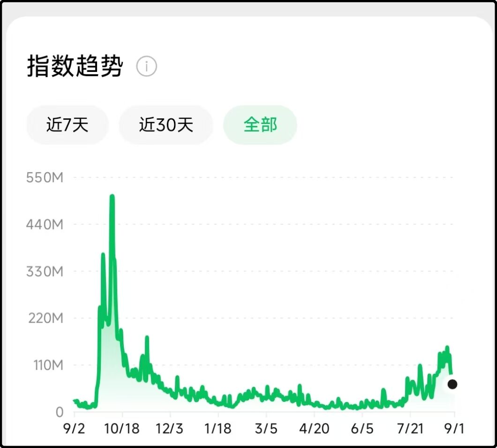
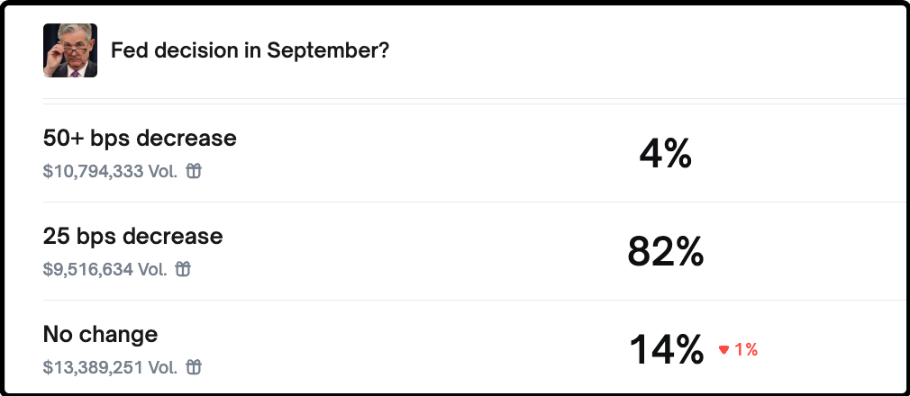
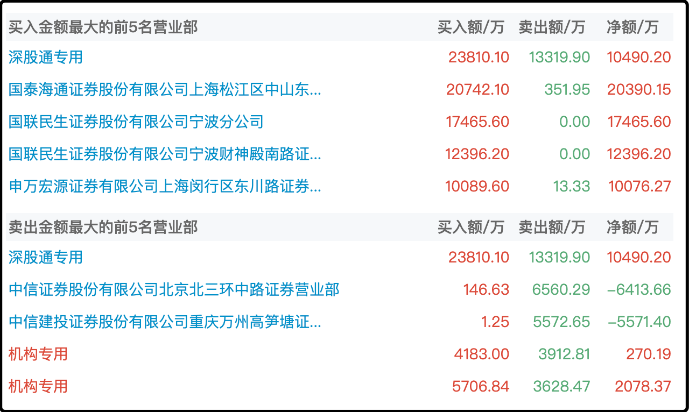

今天市场成交2.87万亿，市场中位数下跌1.54%，最近a股的稳定性没有以前好了，上周三刚插了个中阴，这过去不到一周又调整了。像这两次的下跌，搁过去4个月里都是没出现过的，这也说明a股市场近期的分歧有扩大的迹象。

至于下跌的原因，玄学派觉得是招商策略会挖的坑，阴谋派怀疑是重要日子维稳限制净卖出，于是有人提前跑路，还有乐子派说今天提前检阅了空军，总的来说股民对市场波动的承受能力大多了，像今天这个级别的回调还不至于引发大面积的恐慌。

看看今天跌的多的行业，通信光模块-5.4%、元件-5.1%、电源设备-4.6%、半导体-4.5%、电子-4%、it服务-3.9%.......全都是过去半年的明星板块，涨幅巨大，今天集体回吐应该是里面有不少资金下车止盈。

今天涨幅唯一超过1%的只有银行，防空洞板块，大盘涨的好的时候无人问津，大盘一跌就有人抱头鼠窜进银行。

说白了就是市场里有相当一部分人从很早开始就把明天当做重要节点，节点之前阶段性止盈，止盈的人多了场面就略微混乱。昨天有读者问我现在到什么阶段了，我觉得9.3当做中场哨还挺合适的。

休息15分钟，我们进一段广告，后面是下半场。

我这些天一直有持续关注舆情热度，比如微信指数里“牛市”关键词的热度，最高也就到1.4亿-1.5亿，而去年9月底那轮行情的峰值热度是3-4亿。另外百度指数的“牛市”热度只有1400-1500，远不及去年9月峰值的2700-2800。

用通俗的话来说，目前的a股已经是牛市状态无疑，但只是“热身牛”，还没到全力牛，更没到疯牛，后续是有成长空间的，真正的久财3.0军团还没有整体入场。所以我到目前为止只减了一手ic，这个占我仓位的比例很低，谨慎一点预期，我觉得a股再向上10-20%的可能性是存在的。

.......

1、格力中报不及预期，最近3个交易日累计下跌8%。今天晚上公司公告第二大股东京海互联的增持计划实施完毕，该计划从3月20日至9月2日，计划增持10.5-21亿的股票，最终执行20.99亿，是奔着上限买的，平均增持股票的成本是45.26元。

京海互联是格力的经销商联盟，历来是站董明珠这一边的，可以视为准一致行动人。这次的增持半年前就披露了，对短期股价略有帮助，但不会很明显。格力现在的问题是房地产低迷，卖不出去新房子对空调的需求就不足。美的集团的小家电做的挺成功，小家电是日常消耗品，一定程度可以抵消周期，而格力则太依赖空调了。

格力空调营收占比近80%，美的47%，海尔21%，彼此受房地产的影响程度是不一样的。

2、comex黄金最新达到3553，刷新史高，目前市场几乎已经在完全定价美联储9月降息，我去看了一眼链上赌场的下注，降0.25%的概率是82%，降0.5%的概率是4%，不降息的概率已经下降至14%。

3、科创50指数根据规则调整权重，最大的权重股寒武纪目前权占比15%，之后要下调降至10%，因为规定单只股票的权重超过10%的要调回。这对寒武纪的股价有一定的负面影响，因为根据目前跟踪科创50的etf规模计算，接下来会有104亿的资金将被动抛售寒武纪。

4、长春高新连续两个涨停，窜升至各大股票社区的热股榜榜首。公司回应异常波动，公告称没有未披露事项，我看了下公司研发的新药之前汇报过进度，算是一个潜在利好，但看起来这一轮暴涨另有原因。从今天披露的龙虎榜看主要是游资大户在推动，过去3天国联民生证券宁波的席位买了3亿，国泰海通上海席位买了2亿，买的这么高调的通常都是关联避嫌的，也许只是想用打板的方式创造热度，吸引跟风。

5、还有不少读者追问顺丰最近怎么了，我看了下主要是把年报业绩不佳，被境外机构下调评级和目标价了。当然还有一个潜在的利空，我觉得外卖三巨头目前在血拼的即时零售，在某个角度看也是短程快递的替代品，外卖打的热火朝天，顺丰不知不觉被挖了墙角。

6、碳酸锂产能释放超预期，今天期货价格大跌4%。之前因为宁德时代矿场暂停利好涨的那点幅度都跌回来了。这个行业最大的特点就是几乎都是民营企业，国企央企几乎没什么声量。所以政府就算想推行反内卷去产能，也缺乏直接操作的办法，大概只能提高环保要求，提高行业门槛来间接施压，而底下的民营企业则是各怀鬼胎，都想着死道友不死贫道。

7、宇树科技官宣四季度提交IPO申请，到时候可能会带动人形机器人的一波热潮。

哦还有一些读者昨天对我踏空300万美元的币感到好奇，这事不是我故意编出来哄你们开心的。那个协议叫thena，它从上线的第一天起我就提供lp挖矿，前前后后挖了2年多，是主力矿。我挖到的矿币都卖了，加起来有15-20万美元，结果后面它突然IEO，价格涨了10-15倍。区块链市场波动剧烈，涨10倍其实都不算什么，就好像双色球每个星期都会开出500万，不是你的就不要多想，做投资保持平和心态很重要。

就这些吧，问题不大，可以继续奏乐继续舞。

--------
Q：最近ETF白酒涨幅不多，恐高的会鬼扯给白酒一波补涨机会么
A：8月中下旬白酒其实悄么么涨过一波，但很多持有白酒的人希望获得像热门板块或者双创指数那样的涨幅，是不可能的。你这个位置买白酒，获得了安全边际，就要损失机会空间的弹性。我以前说过买股票就是在选队友，你想想现在买白酒的人都是什么想法，就知道它肯定涨不快。

--------
**虽然经历了两次比较大的回撤调整，但当前仍处于牛市上升阶段，现在的状态大概率是在牛市半场休息阶段**
