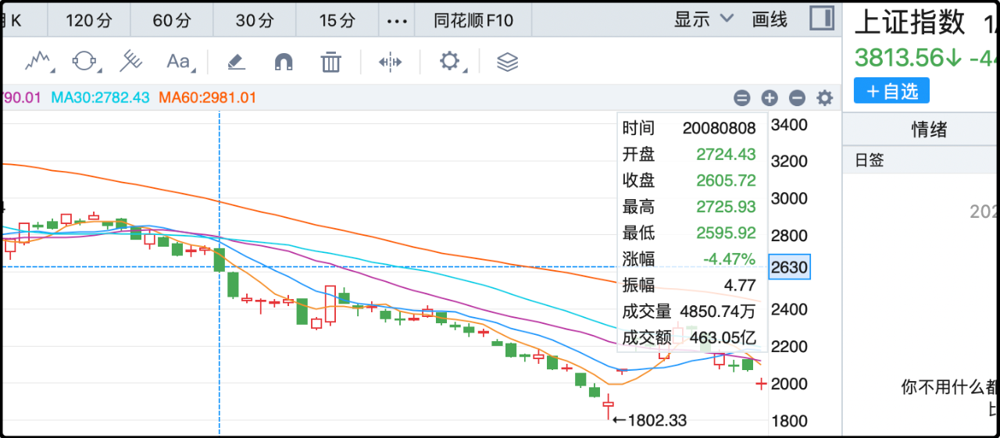
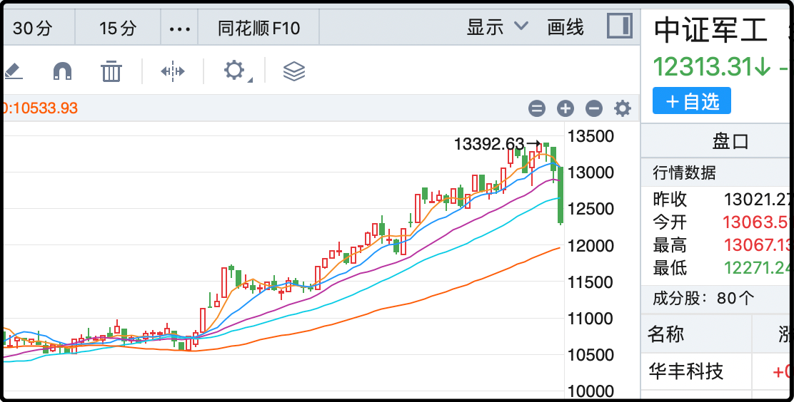

托这次盛大活动的福，我和大崽有了人生第一次关于历史和世界观的讨论。

他们学校布置课题，要求观看活动+写读后感，结果我吃午饭（其实是早饭）的时候他突然过来问我，当年日本打我们的时候俄罗斯有没有帮忙？

我愣了一下，然后告诉他当时的俄罗斯叫苏联，他们被德国打，顾不上帮我们。等到他们把德国打败后，腾出手来还是帮我们打了一下日本，然后日本就投降了。

他似乎对苏联和德国有了兴趣，我就概要性的给他介绍了二战简史。讲完欧洲战场讲亚太战场，当听到日本轰炸珍珠港后美国参战，他又露出了困惑的表情，为什么美国会帮中国打日本，他们不是一伙的吗？

我说他们现在是一伙的，以前不是。国家和国家很像学校里的同学，今天他两关系好，明天他两闹矛盾，关系分分合合一直在变化，不是固定的。就好比我们50年前和俄罗斯也曾经有过矛盾。

我在讲中国战场的时候提到了国民政府和蒋介石，他都没听说过，不过等讲到国民政府败退台湾，他眼睛一亮说知道台湾的事，说那里有坏人要分裂国家。我点点头说国家没有统一就是当年留下的历史问题，那里的人和我们说一样的话，写一样的字，是同族兄弟，但是社会制度有些区别。

他问有哪些区别，我挑了他能听懂的部分讲给他听，间中他还问了一些我觉得蛮有质量的问题，父子就你来我往的聊了差不多15-20分钟。

孩子今年10岁了，开始有好奇心了，未来他一定还会来找我问问题，我会帮助他了解历史，认识世界。
……
今天的行情是拉胯的，成交量萎缩到了2.36亿，比前几天少了将近5000亿，市场中位数下跌2.08%，除了创业板指外几乎所有宽指都跌了1%以上。

很多股民感到沮丧，因为觉得一个喜庆盛大的日子被a股扫了兴致。其实你要真是成熟的股民就应该学会把投资和现实情绪剥离开，a股从来就不是助兴的祥瑞，我很早就深刻理解了这一点。

我是2007年入市的，先赚了些钱，然后在第二年的熊市都被跌回去了。整个2008年令我印象最深刻的是8月8日，那一天是奥运会预定开幕式的日子，当天大盘大跌4.47%，次日再跌5.21%，我当时重仓的香溢融通连续2天跌停。

白天亏的一脸死灰，晚上看到林妙可演唱《歌唱祖国》，又感动的热泪盈眶，这种剧烈的情绪起伏构成了我对那一天的深刻印象。不过也是从那一天起，我就理解了a股是个不讲觉悟，只讲利益博弈的市场。

如果有新股民还领悟到，那么今天中证军工-5.44%的长阴会补上这一课。

今天收盘后很多人在讨论会不会本轮行情就此结束，我个人的看法比较乐观，我昨天也说了9.3是中场哨，休息时间进一段广告，后面是下半场。你要问我包对吗，那包不了的，我之所以比较淡定是因为现在贴水率年化接近9%，除非真涨到风险很高的点位，否则止盈出去我还真不好找性价比更好的标的。

投资从来不是单一维度上的非黑即白，而是全维度的综合评估，我很喜欢说值博率这个词（机会收益/潜在风险的比率），虽然股市里的很多人都唯结果论，但输赢这件事有时候是带点随机的，所以我也很重视过程中的值博率。
……
1、顺丰控股回购a股118.5万股，涉及资金4978万，公司股价近期表现不佳，所以回购来提振信心。这也是中美股市的一个显著差异，a股公司的回购都是维稳、安抚性质的，通常出现在股价大跌之后用来护盘，而美股只要上市公司挣钱了，哪怕今天刚创历史新高也会巨额回购。

顺丰这次的回购是2025年4月28日宣布的计划，5-10亿，时间区间12个月，但之前一直没买，最近股价跌的多，开始买了。

2、今天很意外的是光伏设备板块竟然大涨1.21%，成为a股表现最好的行业。其中板块新大哥阳光电源暴涨15%，逼近历史前高。很多读者以前也留言问过为什么光伏板块里别的公司都亏炸了，阳光电源业绩一直很不错。因为大部分光伏企业做的都是组件，产能严重过剩，内卷到全行业亏欠。阳光电源的主营是逆变器，属于储能业务，这一个细分产品的竞争没那么激烈，它的技术准入门槛高，迭代快，而且主做海外市场，让阳光电源逃过了这一轮光伏行业的残酷内卷。

3、comex黄金继续刷新史高，突破3600大关，联动黄金板块今日再涨1.1%。目前境外机构普遍给出了3800的年内目标价，乐观一点的已经看到4000美元。话说有色板块今年也很牛，大家对芯片的讨论度比较高，但国证有色指数今年上涨幅度已经51%了。不只是黄金牛市，整个有色都很强劲。

4、特朗普在他的账号上提到了中国的盛大活动，说当年有很多美国人协助中国作战牺牲，希望中国人民也能记住他们，另外还祝中国人民度过一个美好的庆祝日。当然他频繁发推的另一个目的是辟谣自己生重病的传闻。

就这些吧，奏乐～

-------
Q：一直疑惑工业富联为什么走势这么好，郭老板不是立场有点问题吗？
A：富士康挺有技术含量的，你别以为它就是个血汗工厂，就中国什么行业都要卷三层的大环境，富士康还真没人卷的过它就知道它有东西。真正有实力的人立场不算什么，老黄在外面也好几次口误说错话，从来没人追究他。

Q：回购可不可以简单理解为增大了对公司的控股权？
A：如果是大股东回购，确实增加了控股比例，但如果是上市公司主体回购，就相当于是全体股东一起回购，大家的持股比例都浓缩了。

Q：831猫哥，电力人民币有没有成为现实的可能。
A：电力人民币？电力哪有什么人民币，你是想说虚拟币人民币吧，据说大厂正在游说监管层，我觉得有30-40%的可能性，不过就算落地了也是离岸市场。

Q：贴水都到9%了，不是说明市场对未来极为不看好嘛
A：如果你在这个市场久了，就对这些所谓看好和不看好的信号没那么在乎了。因为他们也都是普通投资者，看好的不一定涨，不看好的不一定跌，否则就用贴水率做量化指标躺赚白嫖了。

Q：地产的值博率高吗
A：一线城市从目前的位置再向下跌15-20%，就很有值博率了。三四五线城市无论怎么跌都没有。

--------
**算上今天已经出现了连续两天的中等级别回撤，大牛猫目前仍比较乐观，认为现在还是在牛市的中场休息阶段，下半场的冲刺依旧存在。但他内心淡定的主要原因是目前IC贴水高达9%，一边是高息贴水，一边是不太高的指数，平衡下选择按兵不动**

**大牛猫提到了人民币稳定币，认为30-40%的可能性会有落地方案，不过可以肯定的是即使落地，也是在香港的离岸市场上**

**顺带还提了一嘴房地产(房价)，总结一点就是不看好，除了一线城市全部看空，一线城市仍旧有下跌空间**