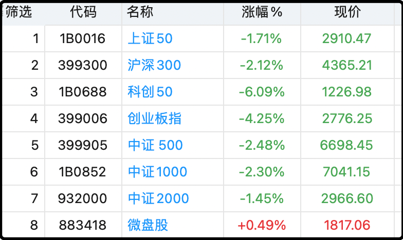
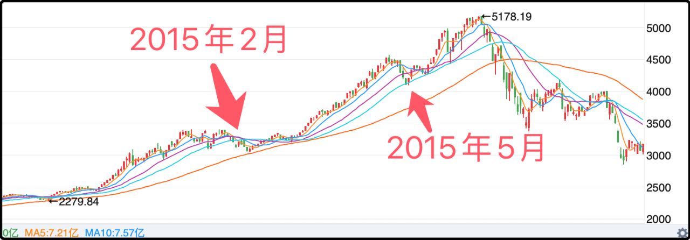

今天大盘继续回调，成交2.55万亿，市场中位数下跌0.41%。个股杀伤幅度不大，甚至在最近几个交易日里算跌幅温和的，但宽指表现惨淡，除了微盘股外跌幅平均在2%以上，最惨的双创分别-6%和-4%。

简单说就是最近一段时间涨的多的，这两天跌的也多，芯片-5.4%，通信-4.1%、元件-3.9%，跌舒服了。不过只要你不是前几天追高过仓位的话，这样的调整其实也还好，比如今天跌了14%的寒武纪依然有1200元，利润回吐罢了。

连续三天中阴让不少股民开始惶恐不安，其实这种程度的调整都不算什么的。上证指数目前距离最高点回撤3.16%，类似的波动在2015年的行情都算不上重大调整。

2015年在2月和5月有两次调整，2月那次上证指数回撤10.4%，5月份那次回撤10.1%，幅度都比现在大3倍以上。所以即便是公认的大牛市也不是一帆风顺，不然每天都涨谁会拿不住？就是因为有曲折，有剧烈的震荡才会让散户陷入纠结，来来回回的犯错。

昨天有读者留言，说万一这次不是牛市，只是一波涨到3888就跌回去的反弹行情呢？那也不是没可能，股市里所有没发生的事情都没法打包票。要是跌回去我就老老实实的继续滚期指，虽然只在7070卖了一手略微可惜，但那个价位真让我清仓我是不愿意的。所以我是把可能发生的坏的情况也提前想过了，权衡利弊后做出的选择。

很多散户的问题是，他们只想过赢的前景，没想过输的情况，没有计算输的结果自己是否能承受，怀着侥幸的心理去博弈自己输不起的后果，一旦玩砸了就心态爆炸。

趁着这几天行情泼冷水，正好冷静下来想想。比如大盘往下跌10%，跌回3500以下，你是否受得了，受不了的话那现在卖点仓位，卖到你能受的了的仓位。那些害怕要清仓的，要是过几天大盘启动第二波，向上突破4000点你能不能心平气和的踏空，做不到的话就别卖光，留点仓位。

做交易很重要的一点是平衡自己的心态，不要把自己逼到极限高压的境地，容易出大漏勺。
……
1、这一段也删了。

2、科技板块资金大幅度流出，一些低位滞涨板块和防御板块今天支棱起来了，消费普遍反弹，另外银行和电力也都逆势上涨。农业银行今天猛猛拉升5.17%，刷新史高，同时接棒工商银行成为a股市值最高的上市公司。所以换个思路，如果你对行情极度悲观，觉得后面没戏了，那切换到防御板块也是个选项。

3、今天部分指数跌破了20日线，后台有很多人留言问是否要执行卖出，这就要问你自己了，有较大可能过几天会再度向上，到时候你可能要以更高的价格买回来，是否可以接受这样的结果。20日线策略在2015年那波也是错了好几次小的，但最后在6月18日崩盘前夕成功逃顶。

有人看了历史k线后觉得20日线太敏感了，用30日线或者60日线会错的次数更少，但是这些迟滞的k线最终逃顶的时候也会更迟钝。盈亏同源，请理解这四个字。

反正我现在没有执行趋势策略，我就很简单，中证7000以上开始减仓，每涨1%就减一点，无它。

今天奏乐你们还有心情舞吗？

----------------
