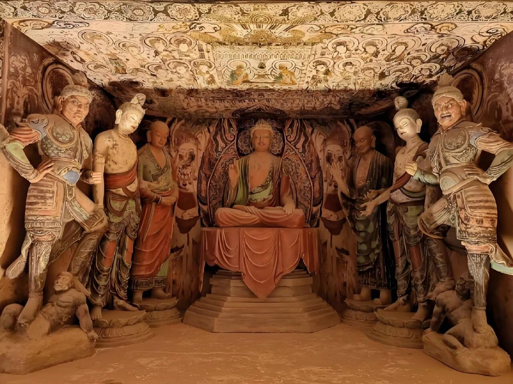
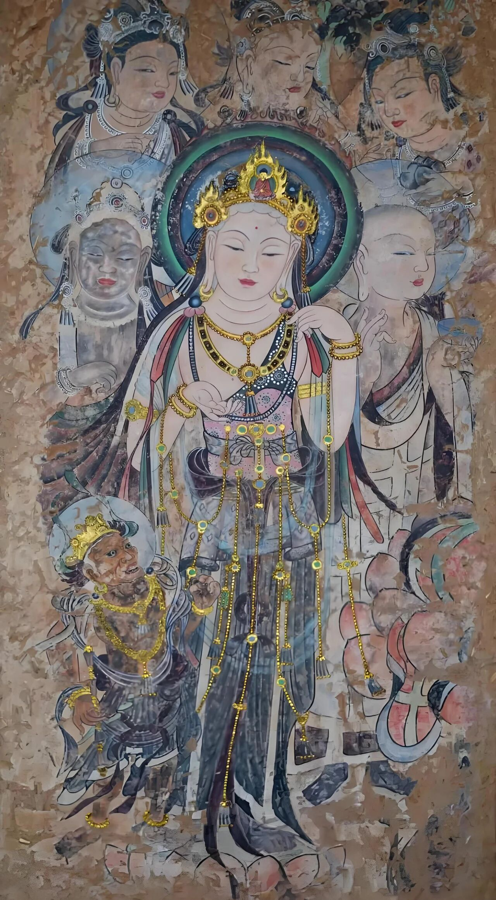

昨天在飞机上我很长时间都透过窗望着地面发呆，因为长那么大我从没见过如此大面积的戈壁荒漠，底下灰茫茫的没有一点绿色，山是灰的，地面也是灰的。这对于有生以来都在东部生活的我来说，视觉冲击感很强。

我的眼神很好，地面上看不到10个房子以上的村庄，最显著的人为痕迹就是贯穿戈壁的公路，但鲜少有汽车在上面行驶。第一次来西北，原来这就是西北的感觉。

敦煌市面积也不大，人口只有18万，我问导游这个城市除了旅游业，还有哪些产业可供年轻人打工赚钱。

导游想了想，说可以种棉花、种玉米、种葡萄，但年轻人大都不愿种地，另外还有一些和光照有关的新能源，就这些。

我用手机搜了一下敦煌本地的上市公司，结果是零，没有。想起上市公司里有一个敦煌种业，还有一个莫高股份，但都不是敦煌本地公司，一个在酒泉一个在兰州，它们只是名字用敦煌的IP而已。

所以敦煌这个县级市就业渠道有限，当地人主要就是围绕着老祖宗留下的旅游资源营生，本地人生活在这样的旅游城市我猜是有压力的，因为收入不高，但消费却不低。万一遇到前几年那种不可抗力，对旅游行业是毁灭性打击。

我们的地陪导游是一个本地中年汉子，他说那3年只干了6个月的导游，剩下的时间开过出租车、去光伏厂组装过玻璃、干过装修工人……为了养家糊口什么都愿意做。

……

今早的行程安排是参观莫高窟，我要简单讲一下它们的门票系统，分为普票、应急票、特窟票。

普票每天6000张，要官网提前30天预约，238/人；

买不到普票的现场可以买应急票，每天12000张，100/人；

为什么限量呢？因为莫高窟的洞窟普遍面积小，容客有限，而且大量游客呼出的二氧化碳对壁画也有损害，所以严格限流。

应急票的权益是最小的，没有导游讲解，就3个普窟排队参观一圈，打个卡，证明自己来过了。

普票的权益更多，每35个人凑一组，导游带队参观8个普窟，带讲解。具体哪8个窟是随机的，系统排班，游客不能点菜不能挑。

除了这两种票外还有一种更厉害的特窟票，按窟收费，每窟150-200，有特级导游讲解。特窟票不能直接购买，需要你先买普票，看完8个窟再现场排队，票少，很难买。我这次是找搬砖组长的关系预定，直接8个普窟+2个特窟，还免了排队之苦，嗨，这些人情世故你们都懂的。

整个莫高窟最有名的特窟是45窟和57窟，你们记一下，如果有机会就买这两个，造型最好，保存最佳，颜色最鲜丽，确实比其它普窟明显好。特窟的门是上锁的，特导专门开门进去，我问她这里一天能进多少人，她说100限量。

至于特窟里面是不让拍照的，我一看工作人员这小心翼翼保护文物，我连问都不好意思问了。不过我可以去网上的数字敦煌给你们找照片，45窟太有名了，有的是照片。

第45窟​​：盛唐彩塑的巅峰之作，塑像神态栩栩如生 。

​​第57窟​​：因精美的“美人菩萨”壁画而闻名 。

我猜会有读者看了图片后感到懵，就这？世界知名国宝？

哈哈艺术就这样的，普通人看热闹，专业人士看门道。其实我也不太懂，我要是精打细算的工薪族，带家人看个普窟也就差不多了，理性消费。

普票游客必去的两个大窟，一个是当年王道士发现经书的藏经洞，另一个是9层楼阁，里面装了整个莫高窟最大的石佛，武则天当年出钱修的，这个女皇帝执政的时候有钱，龙门石窟最大的佛像也是她出的钱。

……

下午的行程安排是沙漠露营，现在是淡季，整个营地只有我们一行人，骑了骆驼，还开沙地车进了沙漠深处，这一段我就不描述了，给大家上照片吧，太能出片了。

照片不全是我自己拍的，上面这张是我带着我妈在营地附近散步。最后是我晚上写文章的照片，亲友们都嘲笑我是队伍里班味最重的人，哈哈哈，要上钟啊。

股市的信息我粗略看了一下，问题不大，没特别重要的事，周五反弹大涨，创业板指阳包阴创新高，说明a股最勇敢的那批人没有下车，这车还能坐，反正我不跳。

就这些，发射！

-----------
Q：猫哥，第一次留言，请教一下滚期指到底是怎么滚的？
A：我这个账号，还有一个视频号，视频号里有2020年录的滚期指科普解说，你们可以去看。当年讲的东西没过时，现在依然可以用。