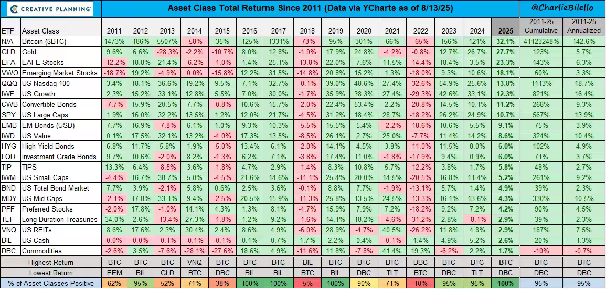

昨晚发完文章后我一直在沙漠待到半夜2点，因为恰逢难得一见的月全食（血月），我又正好在上佳的观月地点，不愿错过这个机会，拍了一些照片。这不是vivo的广告，我只能说他们的手机拍照片太顶了，其他手机对着月亮都不行。

月食的过程很慢，前后持续1个多小时。月亮就一点一点被黑暗侵蚀。但不知道为什么当整个月亮都被黑暗侵蚀后，它反而变成了血红色，看起来格外诡异妖艳，照片里就是我肉眼看到的效果。从小到大第一次见到这种天文现象，叹为观止，目瞪狗呆。

我们熬到那么晚其实还有一个目的，就是想等月全食“关灯”的时候顺便看看童年记忆里的星空和银河。结果血月的时候我抬头能看到数百颗星星，但始终没有看到银河，观星师说城市的灯光污染有干扰，要去离敦煌40公里外的无人区拍摄才有清晰的银河。

我看着他拍的照片发愣出神，下次我一定要找机会看到这样的夜空，一定。

……

今天早上的行程依然是莫高窟，这次预定了3个特窟，156+158+159，经典路线。

156窟是节度使家族窟，有著名的张议潮统军出行图，我看过安州牧的《西北有孤忠》，对归义军的历史有一些了解，这次近距离观摩壁画遗迹太幸运了。

另外156窟还有一段插曲，俄国十月革命成功后有500人的白俄士兵战败逃入中国，被民国政府缴械，1921年敦煌县政府不想让这群外国人打扰百姓，就把他们安排拘住在莫高窟的洞里，156窟也关过人。

冬天的敦煌比较冷，白俄士兵为了取暖在窟里生火，壁画被烟熏损毁，156窟的窟顶至今依然一片漆黑烟痕。

昨天有人说王道士当年把国宝廉价卖给外国商人很痛心，我回复他共识形成之前国宝也是便宜货。现在特级保护的洞窟，当年只是嫌弃安置外国战俘的囚房，找谁说理呢？

158窟里面有整个敦煌最大的卧佛，横长17.2米，相当于5层楼横倒下来，建于西夏时期。释迦牟尼80岁涅槃，在当时人里算是很长寿了，佛教里面规定他涅槃后56亿年，未来佛弥勒继位，到时人世间会变成弥勒净土，吃的穿的用之不尽，有点像共产主义。但佛教这个饼画的太远了，56亿年...太阳寿命预计也才50年，我不想活那么久，累了。

158窟的壁画由于早年无人保护，有各种各样的人刻写“到此一游”。其中令我印象深刻的是一个叫胡守悌的，到此一游后面还刻了时间，67年5月27日，我默默算了一下要是1967年他是个年轻小伙的话，现在很可能还在世。

厉害了胡老哥，我连拍照都不允许的特窟壁画，你60年前能在上面刻字，我裂开

159窟...其实蛮普的，乏善可陈，主打一个来都来了，捆绑销售。特窟每人每窟200，我们10个人看一个窟就是2000，3个窟消费6000，你们如果有的选的话只要156+158即可，159duck不必。

……

下午的行程是又见敦煌演出，搬砖组长安排的太周到，提前买好了至尊贵宾票。价格是普票的2倍，但我小声说一句性价比一般，你们看的话买普票。

“又见”系列是王潮歌导演（女）的作品，她是艺二代，和国师有私交，参与制作08年奥运会开幕式，对这种大型文艺演出确实有一手。最早和国师弄“印象”系列，专门接地方政府的文旅演出项目，后来挣了钱十几亿把公司卖了，又自己出来弄了“又见”系列。

我在平遥看过又见平遥，现在来敦煌看又见敦煌，前者投资4.7亿，后者投资6亿，时间上也是前后脚搞起来的项目。

你们如果从来没看过类似演出的，第一次去看一定觉得精彩，但平心而论我觉得敦煌这出不如华清池、也不如平遥，但比承德那套好看，我的审美你们信就是了。

……

今天a股成交2.42万亿，量没之前大，但是中位数+1.07%也很不错。cpo光模块继续调整，寒武纪、新易盛、中际旭创这些明星股今日大跌，像这种概念投机就是要信早信，晚信不如不信，妖涨的时候如果不敢买错过就错过了，不要觉得它们跌下来贪便宜去买，这是典型的锚定心理。

这几天有一股趋势，资金从cpo光模块流出，流向了固态电池，论坛里游资大v在带舆论，行业里研究员也在拼命引流，这背后就是牛市行情里争夺关注度的pk，一旦固态电池的趋势起来了，会对cpo形成显著的虹吸。因为说白了a股最激进最勇敢的就是那批人，那批钱，他们在板块之间的迁徙会直接影响下一个阶段的主题。

持有宽基的不需要操心这个，热门概念轮动对宽指的影响很小。我白天在外面玩，实在无聊掏出手机看行情也就1-2次，我其实不是很担心行情在这个位置崩溃，或者换一个角度，错过7000点的卖点我不会觉得可惜，目前12月份的ic年化贴率12%，完全没有下车焦虑。有涨赚钱当然好，不涨混日子也挺好。

最近有一些新股民留言问我怎么弄期指，有没有风险。最低140万一手的杠杆工具何止是有风险，风险大的一批，新手玩会死人的。我以前有一篇文章，是集思录一个网友滚1手ic的盈亏记录和心路历程，没看过的建议去看看《极限承压》

最后想给你们分享一个图，主要是美股里面交易的资产，图片可以点击放大看。

最左边一列是代码，美股代码是字母，不是数字。第二列是资产名称，后面几列是各个年份的表现。资产里面的qqq和spy就是我一直推荐的纳斯达克etf和标普500etf。

最底下倒数第三行是年度最佳资产，倒数第二行是年度最差资产。

其实表格里有些资产我也不太熟悉，但只要看仔细看表格，你很难不被btc所吸引，一个是它的回报实在太tm高了，碾压所有，另一个就是它的节奏实在太规律了，up-up-up-down，up-up-up-down，三年冠军一年垫底，三年冠军一年垫底。

好了，现在又是up-up-up，连续三年冠军，我反正今年只卖不买，谁说这次不一样都不好使，就算后面还能涨，这钱我不要，让给你了。

------------------
Q：化工ETF您感觉如何？我看他们都盘了两年多了
A：可以埋伏，目前是周期低位，但你买了很可能牛市里赚不到块钱，别买了以后又天天来问我怎么还不涨，什么时候涨，你最好买之前就有预期管理。

Q：不懂就问，就是为啥看见大盘趋势是下降的过程还那么坚定执行滚了？为什么不折时躲避一下了？
A：等你滚5年以上就会有感悟了。很多人都觉得自己能预判趋势，所以滚着滚着就忍不住主观干预，加入了投机操作，最后反而亏的一塌糊涂，这种人挺多的。你如果有这个想法，我警告你别去滚了。

Q：上上周就听你说机器人板块，上周五埋伏了下，今天融资上杠杆右侧买入收获了一根巨阳。但是挺患得患失的，第一次用杠杆，有没有什么建议？
A：诚实的问自己，如果今天融资上杠杆吃到的是同样长度的巨阴，你今晚难不难受，如果扛不住，那这种冒险你就不要再玩了，会玩死自己的。