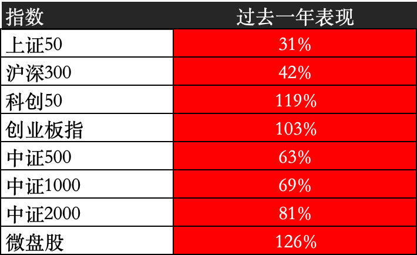
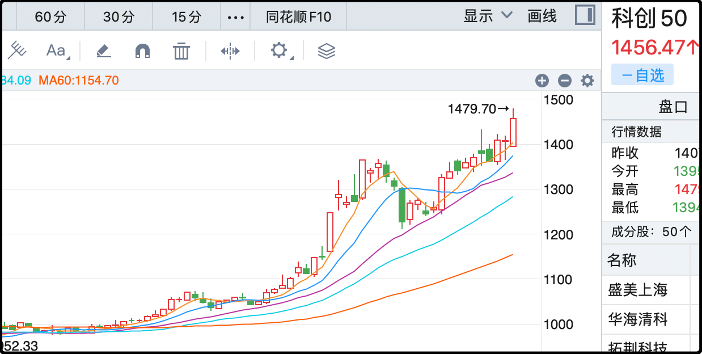

今天是9月24日一周年，去年的今天出现了a股历史级别的拐点。

你们都还记得当时a股的绝境嘛，连续救市一年多，越救跌的越深，每一次利好都是高开低走。最后没办法国家队直接下场买了几千亿，也才堪堪守住2700。

于是各个部门动员起来，在9月24日当天打出了政策组合拳，包括降准、降息、降存量房贷、降首付、给股市拨了5000+3000亿回购贷款、推动长期资金入市。

终于a股被唤醒，开启了一波估值修复的行情。过去一年a股主要指数表现如下：

不管启动之前的低位惨状，只看这一年的区间表现的话确实妥妥的大牛市行情，区间内大概1400多只股翻倍，全市场中位数+57%，很牛了。像半导体、通信、游戏、互联网、电池、电机、元件这些板块涨幅都超过100%，但同时也有大量传统行业远远跑输大盘，最弱势的是油气开采、煤炭、电力、公路铁路、白色家电、中药、白酒，涨幅都在20%以下，有些甚至只有个位数涨幅。

我在文章里提到过很多次了，像这种两极极端分化的行情对很多散户非常不利，因为大量散户有“去强留弱”的习惯，他们会持续的卖出解套的、盈利多的股票，用现金去加仓浮亏的、涨的少的股票，这种交易习惯会导致原先可以凭借运气赚到的钱，都靠自己的实力逐一错过。

这对散户来说是个彻头彻尾的悲剧，更悲剧的是大部分人迷迷糊糊的甚至不清楚自己输在哪，只会抱怨命运不公，卖掉的总是涨，死扛的迟迟没有表现。

其实坑不是踩的，是自己挖的。潜意识里选择卖掉和死扛的标准就不对，正确的操作应该是“去弱留强”，指数公司每次更新成分股的原则就是“去弱留强”，因此大部分的散户长期表现跑不赢指数。

……

今天a股继续强劲表现，成交额2.33万亿不高，但是市场中位数+1.25%没少涨，尤其是双创指数，一个涨3.5%，一个涨2.3%，继续创新高。资金继续狂怼时下最热门的半导体和电池，前者涨4.6%，后者涨2.9%，这两者看似无关联，但绑定的都是同一个未来愿景。

今天阿里巴巴吴泳铭有一句话令我印象深刻，他说未来的世界智能体+机器人的总数会超过全球人口。

想象一下这样的可能性确实存在，只要ai和机器人的性能双双突破一个临界点，使得生产出来的机器人通过劳动创造超过机器人本身的价值，那在商业上就是越造越多越挣钱，到时候机器人的数量就会呈现指数级增长，超过不愿结婚不愿生育的人类只是时间问题。

一旦进入到那样的社会形态，针对人类的需求就会持续萎缩，而机器人所需要的算力、电力、电池会爆炸性增长。现在资金彻底押注ai是下一次成功的人类社会革命，只要和ai有关就买买买，蹭不上ai的行业就会惨遭冷落。

目前大盘的趋势依然稳健，尤其是双创k线，最近3个月都稳稳运行在20日线上方（图中紫线），完全不需要考虑提前下车或者止盈。其实本轮牛市的调整已经非常温和，目前已出的最大回撤只有2015年的1/3程度，如果连这样的车你都坐不住那就很难挣到钱了。

……

1、稳定币巨头Tether（就是usdt的发行商），正在寻求一轮150-200亿美元的融资，总估值在5000亿美元，计划通过私募的方式出售3%的股份。这家公司是世界上人效比最高的企业，全公司员工不到200人，但是去年净利润达到了130亿美元，大概是腾讯的一半，这赚钱能力太恐怖了。

这次融资5000亿美元的估值也很高，大概相当于2/3个腾讯，这才是真正的稳定币概念。tether公司的盈利很依赖于美元利率，因为它们的现金储备80%以上都买了美国国债，一旦美元利率下降肯定冲击公司的盈利能力。

2、阿里巴巴说除了3800亿ai的基础设施建设外，还计划追加更大的投入，这是目前市场最想听的话，阿里港股今天大涨9%。其实你用英伟达、openai甚至是寒武纪去对标的话，阿里巴巴目前的估值还是相当便宜的。

3、六部门：严禁新增水泥熟料、平板玻璃产能，新建改建项目须定制产能置换方案。官方在主导的产业转型，这就是时代车轮滚滚向前，坐在车上的人吃香喝辣，躺在车底的人直接把你屎都轧出来。

4、恒瑞医药签署瑞康曲妥珠单抗项目授权协议，获得1800万首付，并有机会获得最高10.93亿的销售提成。创新药这一轮上涨全靠海外授权打鸡血，这是利好无疑，只是这个金额规模太小了，看明天市场买不买账。

5、今天还有一个新闻，是中国将不再寻求世贸组织里新的特殊和差别待遇。这一条我估计很多人没看懂，其实就是从今以后主动放弃发展中国家的待遇，但是之前享有的发展中国家待遇继续享有。美国之前一直指责我们是世界第二大经济体，不能再享有发展中国家的优惠，这次算是主动让步了。

那我们算不算发达国家呢？当然还不算了。发达国家的最低门槛是20000美元，我们还差不少。

今天就这些吧，发射。

