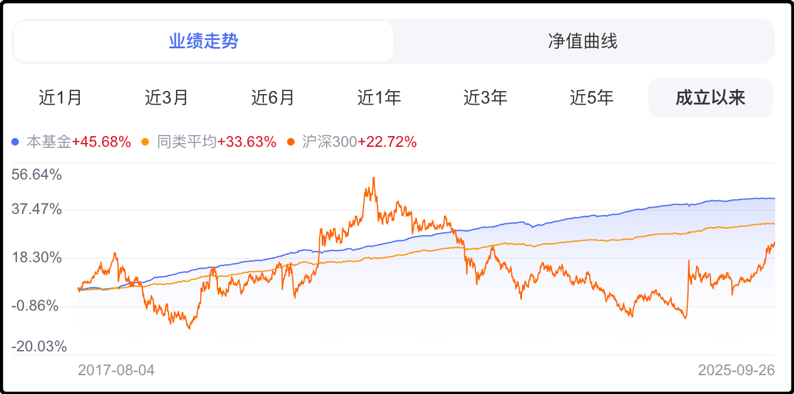

来写今天晚上的夜报之前，我正在知乎那里溜达，今天热榜没意思，我看的推荐流。我的习惯是一路往下滚，看到点赞上万的才停下来看看讲了什么。

说说几条让我印象深刻的问答。

一个是有人问如果我能让英伟达来我们镇投资开厂，我能一路提干高升吗？

下面回答说你把英伟达拉来之前你可能是香饽饽，但是英伟达来了以后你就不香了。想要一路提干高升，你得有能力让英伟达从你们镇搬走。统战的价值在于你有多大的能力搞破坏，而不是你之前做了什么。

我是凭记忆复述，原文可能略有出入，但大致是这意思，我觉得这条说的挺好，应该会启发到不少人。

还有一个是有人问姜萍有没有可能被冤枉了？

下面回答说在东大，梅西有可能送外卖，迈克杰克逊可能在富士康打螺丝，村上春树有可能在起点写网文，但是高斯绝对不可能读中专。

hahahahaha，看的我在屏幕前哈哈大笑，这就是知乎style，那里最普的用户画像就是高学历直男，他们可以接受自己穷，职业生涯失败，买不起房娶不到老婆，但骨子里还是有作为教育精英的自尊心和优越感。他们最不能接受的冒犯是有人在教育这件事上造假，谁敢挑战就会追杀到底。

前几年有个博士学历的演员叫翟天临，直播的时候随口说了一句“知网是什么东西”。这事在其它平台都没发酵，唯独在知乎捅了马蜂窝，连续多日热度爆炸，铺天盖地的质疑和口诛笔伐，最终查实论文抄袭，北电撤销了博士学位，翟天临道歉退圈。

包括去年的姜萍事件，别的平台声援姜萍的大有人在，唯独知乎从头至尾都是最激烈的质疑和嘲讽，不信就是不信。

另外还有一个高赞回答，说是卖淫女被拘了，警方根据转账记录给我打电话怎么办？

底下支招的说阿sir我现在不在当地，在外地办事，等我回去了再去派出所报到。挂完电话立刻买票跑外地溜达半个月。派出所通常不会为了一个治安案件去外地抓人，另外真要抓也不方便异地执法，你游山玩水每天换一个城市，异地找派出所协查也不好弄。

等到半个月后，卖淫的妹子也已经放出来了，你再回去，根据一个转账记录也不能把你怎么样。

这个回答几万点赞，我不是教你们学坏，我就是看了觉得好笑分享一下

……

我这两天在整理老婆早几年买的基金，当时为了帮渠道冲业绩，东一锄头西一榔头的买了不少基金，这两天看看有差不多的就出了。

然后就看到了压舱的债基，我以前在文章里推荐过多次，招商系的那支，我们家平时流动现金管理都放里面，这几年下来浮盈都有几百了。

我拉出了这支债基的历史走势表现，如图：

该债基2017年8月成立，图里面上上下下的那条是沪深300，同期表现+22.72%；橙色平缓向上的是债基平均水平，同期表现+33.63%；我买的债基是蓝线，同期表现+45.68%。

这图倒是揭示一个残酷的事实，中国股市的波动率虽然远远大于债券，但是长期回报率还不如债券。要知道现在还是a股罕见的牛市行情，涨了不少上来，要是选历史上别的时期这个差距会更大。股市承受更大风险的同时获得更少的回报，毫无性价比可言。

我让grok帮我计算债基的年化收益表现，结果按年单利算是5.6%，按年复利算是4.8%。但是要注意，早些年收益高，今年债券被股市虹吸普跌，最近一年的收益率只有1.9%。

总的来说我觉得债基作为家庭活期现金的管理工具还是不错的，这么多年下来碾压跑赢沪深300，我滚期指多余的现金就是放这里面增厚收益，遇到行情有不好的苗头，就赎一些现金出来补充保证金。

……

这几天身边的人都在聊一个新梗，叫“力工梭哈定律”。

力工，就是体力工人，该定律说的是一些男人一辈子就知道打工赚钱，自己不懂享受也不会花，攒下来的所有钱就是为了买车买房娶老婆养孩子，一把全梭进去。

需要说明的是这个力工梭哈定律不是褒义词，原创语境是嘲讽，认为这种男人没有自我价值，就知道在固定的人生轨迹里当牛做马，繁殖后代。现在互联网上如果有人说你是力工思维，这不是夸奖，算是骂的挺难听的。

我昨天说买两套房子，一套老婆喜欢一套老妈喜欢，底下也有人留言说这是典型力工思维，哈哈哈哈。

感觉这是新一轮男性享乐主义的觉醒。就和前几年很多女性反婚姻反生育，要求活出精彩人生一样，现在男性也开始反婚姻反生育，如果都强调自己挣钱自己花，我觉得大部分男性可以活的比女性更潇洒。

如果青年男女都放飞自我，谁最着急呢？除了老一辈的父母外，还有就是政府，政府现在已经为低生育率开始发愁，互联网上男一拳女一拳的还在鼓吹不婚不育，我猜社会主义铁拳已经蓄势待发。

其实我觉得每个人对人生的理解是不一致的，我觉得娶妻生子组建家庭，多挣钱给家人花，这样的生活很温馨，也给我提供了情感满足。你觉得我像力工可没有人勉强我，这就是我选的人生剧本。

当然有人觉得不结婚不生育自己花钱逍遥自在，我也尊重你的选择，各自安好，互不干涉，这也是一种互联网礼仪。

今晚差不多就聊这些，大家周末愉快呀。

---------------
Q：米子雷子怎么突然一大堆黑料
A：这几年一直就有一个人群在孜孜不倦的黑小米黑雷军，了解那个圈子的都懂是咋回事，我之前调侃了一句，对方派人来删我的评论，结果不知道怎么误操作把我所有历史评论都删了，还是我找腾讯的小伙伴去恢复的。这种癞皮狗惹不起还躲不起吗。

