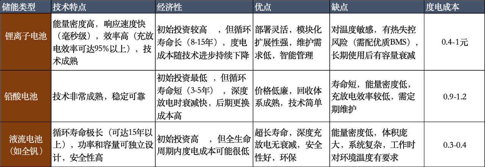

昨天发了熔盐电站的内容，很多读者留言说不如光伏发电，直接转换效率高，但是光伏发电有不稳定这个致命弱点，晚上不发电，白天发电量也受天气影响。风电同理。

所以通常在大型光伏、风电场附近，往往要配建一个火电厂，用来调节平衡发电波峰波谷的差异。火电厂虽然很多人一听就嫌弃，但它凭借可以24小时人为调节发电量这个优点，现阶段就无可替代。

未来政府要大力发展储能，最佳储能方式是水电站，昨晚我说转换比60%是过时数据，现在已经能做到75-80%以上，但是水电站极其依赖地形，平原地区目前储能有三个技术方向：

锂电池储能现阶段成本还有些高，但随着技术发展在快速降低，未来只要突破某个商业临界，很可能成为主流储能技术，并大力推广。届时锂电池和光伏板块都会迎来二次爆发的契机，但我不知道那个时间节点什么时候出现。

马斯克曾经畅想未来，铺上四川省面积那么大的光伏面板，再搭配上足够规模的储能站，就可以供给全人类对电能的需求。会有那么一天吗？

哦对了，还有好多人问我熔盐电站是否可以参观游览，可以的，它们在携程和抖音上都卖票，100/人，权益含展厅参观+现场讲解、游览，我觉得算是一个很有特色的景点。

……

今晚的标题说的是oracl，也就是甲骨文公司，它们今晚盘前交易股价暴涨30%，这是一个很恐怖的数字，因为甲骨文本身就是一家市值6000多亿美元的顶级巨头，它涨30%相当于今天晚上涨出来一个中国石油。

之所以有如此疯狂的表现，主要有2个原因：
1、巨额订单。未实现履约义务（RPO）达4550亿美元，同比激增359%，主要来自与OpenAI等大型AI公司的数据中心建设合同。
2、云业务预期暴增。预计2026财年云基础设施收入增长77%至180亿美元，未来四年将进一步增至1440亿美元，增长8倍。

确实太劲爆了，完全吃到了ai热潮的红利，业绩暴增的同时还彻底打开了未来5年的成长空间。美股的上市公司真就藏龙卧虎，你方唱罢我登场，像永动机一样一直有增长，一直在爆赚。

甲骨文的老板是拉里埃里森，今年81岁的老登，特朗普密友，潜在的世界首富，今晚暴涨过后他和马斯克的差距不到3%。埃里森在中国的口碑极差，老登长期宣扬中国威胁论，公开说“甲骨文公司绝不培养中国工程师”。甲骨文1989年就进入中国，但商业态度傲慢强硬，不会因为赚中国钱就刻意讨好，2019年撤离中国市场。

中国的上市公司里，和甲骨文业务形态最相似的是**用友软件、达梦数据、星环科技**，不是我推荐的，是我问了deepseek、豆包、grok之后它们三总结的。

……

今天a股成交进一步缩量，成交额1.98万亿，跌破了2万亿关口。大涨后缩量当然不是好事，通常意味着市场新增资金变少，推动行情继续向上的动力变小了。目前缩量但还没有下跌，是因为抛盘的人也暂时处于观望状态，卖和买的人都暂停了活动。

今天市场中位数是零，不涨也不跌。目前活跃资金还是集中在芯片光模块和电池这两个板块上，成交额前十的个股几乎各占1/3，传统行业在这一轮的行情中几乎没有话语权，就算你在低位，估值也不贵，但就是没人去炒。

这一点我觉得真要学习埃里森，他都81岁了，领导的甲骨文还能梭哈ai，没有登味，也不僵化。我们社会上有多少人一旦过了50岁，就不愿意接受新事物，自己不学习，看到新事物成长起来还要贬低打压，这种很容易被年轻人掀翻后一脚踢开的。

接下来几天关注行情的趋势，持续缩量很容易引发突破，不向上就向下，目前这个位置想躺平是躺不平的。

……

1、昨天有人就在传阿里要新推一个业务干美团，阿里否认针对美团，今天公布结果，是给高德地图搞了一个扫街榜单，接下来要发10亿补贴，鼓励用户到店消费。说来说去还是冲美团来的，都去店里吃了就不需要外卖了呗。

2、统计局发布上个月cpi跌0.4%，ppi跌2.9%。还记得两三年前统计局还说负通胀是暂时现象，数据马上反弹，现在已经不说了。这次cpi数据惨淡主要原因是食品价格下跌4.3%，接下来要在生猪端去产能，但养猪的都不是国企央企，他们不会那么听话的。

3、外媒报道美国可能会出政策，限制美国制药公司从中国药企那里购买实验药物的权利，另外还将阻止制药商依赖中国患者的临床试验数据， FDA 已经普遍要求制药商将晚期临床试验数据主要针对美国患者。百济神州盘前交易一度大跌12%，不过开盘后跌幅收窄至7%，明天看看创新药会不会受影响。

4、苹果发布了iphone 17，起售价799美元；air笔记本厚度5.6毫米，是苹果迄今为止最薄的笔记本，起售价999美元；airpod 3将具备ai支持的实时翻译功能，起售价349美元。

今晚就这些吧，发射！

----------------
Q：9月降息前黄金是持有还是逐步减仓呢
A：没想过减仓，后面美元要降息1.5%左右，黄金可以拿着再看看，接下来几年世界也不消停，感觉都会助攻黄金。

