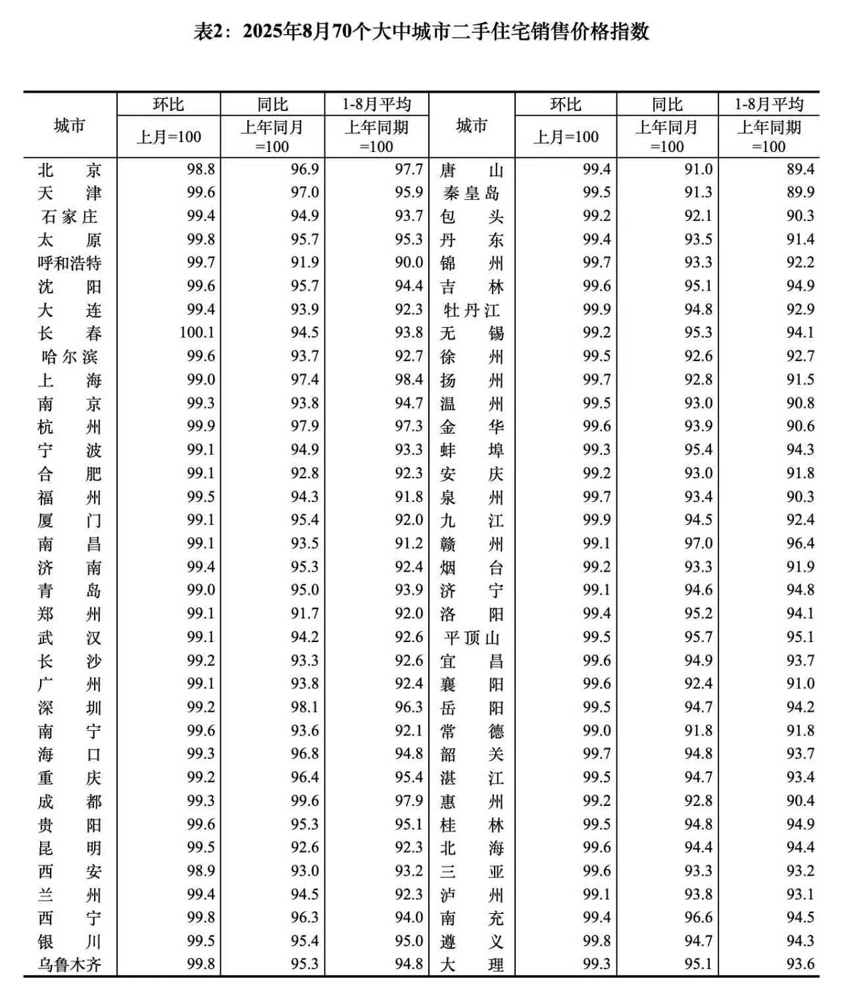

你们应该也都看到了，西贝公开道歉了。

但那个道歉一整个流露出的态度是无奈和不情愿的，其中最迷的一句话是“顾客虐我千百遍，我待顾客如初恋”，这种清朝的梗被拿到这个场合抖机灵其实不妥，你最多说罗永浩虐你好几遍，广大顾客怎么就虐西贝了？

贾国龙的原话里还说了罗永浩是网络黑嘴、黑社会，真是看的人直摇头，我能理解贾国龙是传统行业58岁的老板，缺乏网感，但像他这样每一次发言都能给自己和企业扣大分的说话水平，以后就不要直接面对媒体和舆情了。

今天让我印象很深的还有一个视频，是媒体采访华与华的老板的一段话。这个华与华是服务于西贝的咨询公司，签约10年，咨询费6000万。

我以前以为咨询公司无论有没有真材实料，起码都是舌灿莲花，说话情商一定很高。结果这位老板面对镜头短短几句话，把两个油腻老登的形象塑造的活灵活现，真看笑了。贾国龙的审美如果是这类成功学大师，那他对这个世界的理解真的太陈旧了。

今天我看到群里很多人讨论，说一些中老年成功人士，身边的圈子往往围满了巴结和拍马屁的人，已经不太能接触到外界的异见，久而久之就会失去对外界的感知力。

我第一反应就想到了另一个人。“我五年不给你分红你又能怎么样我？”、“你不买我的xx不是有病么？”、“我从来不犯错，因为我做的每件事都是对的”......不需要联系上下句的语境，这几句话就算是断章取义也都够炸裂的。

这几年有一句夸人的话叫做有少年感，说的就是一个人价值观不古板，对世界的感知始终与时俱进。我的读者里有大量的社会成功人士，有不少也是身边圈子里的领导，老板，大家一起共勉共戒。

……

先更新最新一期统计局发布的70个大中城市的房价数据，如下：

老规矩，教新读者看表。环比99就是比上个月跌1%，同比101就是比去年这个月涨1%。

只有长春一个城市环比是涨的，其余69城市都在水下。浓眉大眼的京城领跌全国，已经连续2个月月环比超过-1%，所以挤牙膏式的五环外取消限购也作用不大。

一线城市加速下跌，之前政策刺激反弹的那部分在加速回归，所以人为干预只能影响曲线的短程走势，不能缩短周期，更不会改变趋势。

持币观望的人这几年爽感十足，每个月房价下跌的部分都能省下3-5个月工资，相对应高位站岗的人每个月都在损失3-5个月的工资，这会进一步削弱中产阶级家庭的财务安全垫，打击他们的消费信心。

只要房价还在显著的下跌通道，没有企稳，传统消费板块就很难好起来。茅台酒和房价都是2021年见顶的。

……

今天a股成交2.27万亿，市场中位数-0.5%，整体情绪略有降温，有色、军工、芯片ai都有调整，除了创业板外其它宽指的表现都一般。创业板今天是头号权重股宁德时代发飙了，最直接的原因是他们向供应商上修了2026年的要货指引至1100GWh，同比增长高达46%，这远超市场预期，然后股价就起飞了。

不过宁德时代今天高开的多，开盘后冲高回落，阳线实体部分短，影线长，说明电池板块的号召力和芯片ai还是差挺多的。芯片ai有利好的时候，比如deepseek发布了新版本，再比如前几天甲骨文业绩暴涨，这种间接利好直接把整个行业打上高潮，大盘光头阳线收尾。到了电池这边，行业老大重磅利好，里面资金都心不齐，今天借着利好出货的不少。

大盘8月底抵达3800后已经在这个位置震荡调整了半个多月，这不是坏事，置换出去了一部分止盈盘，目前的k线看起来比8月底的时候反而要健康的多，可以持仓看高一线没问题。

a股现在是中国经济最大的亮点，并且虹吸效应开始起作用，已经在源源不断的吸纳社会低成本资金，尤其难得的是这一轮行情的节奏张弛有度，所谋其远，不是以前短线暴力牛的剧本，这要是也坐不住的话你前几年在慢熊市里吃的苦就白吃了。

……

1、互联网酒类监测平台最新数据显示，2025年散瓶批发参考报价1770元，再刷新低。尤其是在拼多多上已经有店铺给出了双瓶3400，折合单瓶1700的低价。我之前2000多的时候就说过会跌到官售价1600附近，大家拭目以待。

2、泡泡玛特大跌8%，起因是摩根大通下调了股价评级。摩根大通的说法是年内股价+209%，预期基本打满，接下来市场对任何负面信息的容忍度会很低，风险收益比快速下降。其实就是我经常和你们说的“值博率”，泡泡玛特目前还没有明显衰退的迹象，但是结合暴涨后的股价，目前的泡泡玛特值博率不吸引人了。

3、路透社报道美国贸易谈判代表表示接近解决tiktok问题，但同时也讲了如果没解决的话，不会影响到整体关系。

4、gemini下载量超过chatgpt登顶美区苹果appstore免费榜。我对gemini的印象还蛮好的，它很懂长话短说，如果它觉得一个问题用100-200字就能回答明白它就不愿意废话。另外它的响应速度很快。

5、马斯克增持了250万股特斯拉股票，介于372-396之间，这刺激了股价进一步上涨，感觉又错过了抄底机会，特斯拉这票和我没缘分。

今晚差不多就这些吧。昨晚我一朋友请我吃饭，品牌不提，米其林2星+黑珍珠2钻，这种肯定没有预制菜，因为连菜单都不固定，每个季节会有当季的时令菜，每次去能点的都不一样，做的味道也很不错。但真的贵，普通工薪肯定吃不起，我如果不是招待贵客，只带家人出门吃饭不会去的。

就这些，发射吧。

----------------
Q：能不能预测一下房价多久止跌，房奴快受不了了
A：目前看高盛之前的预测一直比较靠谱，最快最快明年初企稳，他们去年底和今年初都是这么说的，说2025年还会跌10%以上，起码。

Q：这房价跌得算不算加速了？？不是说房价一般金九银十么？大屁股觉得9月会反弹吗？？
A：月环比-1.2%，还是政府端统计的数据，这还不算加速什么算加速？金九银十别做梦了，下个月月环比跌速能收敛到1%以内都值得报喜。

