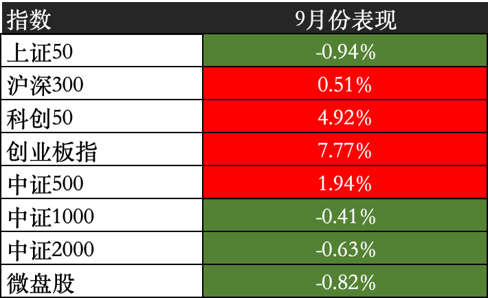
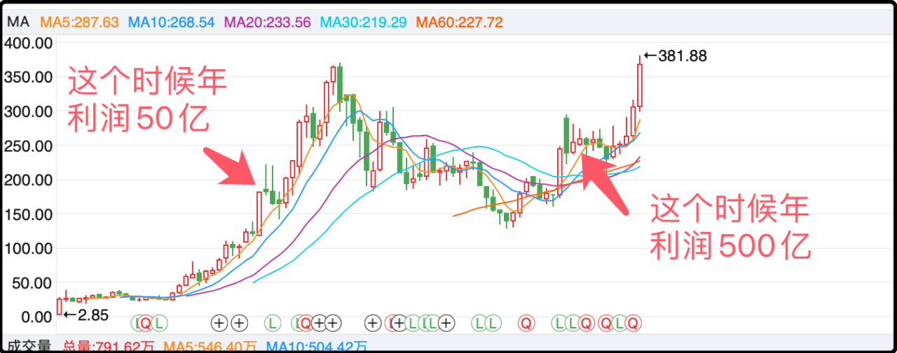
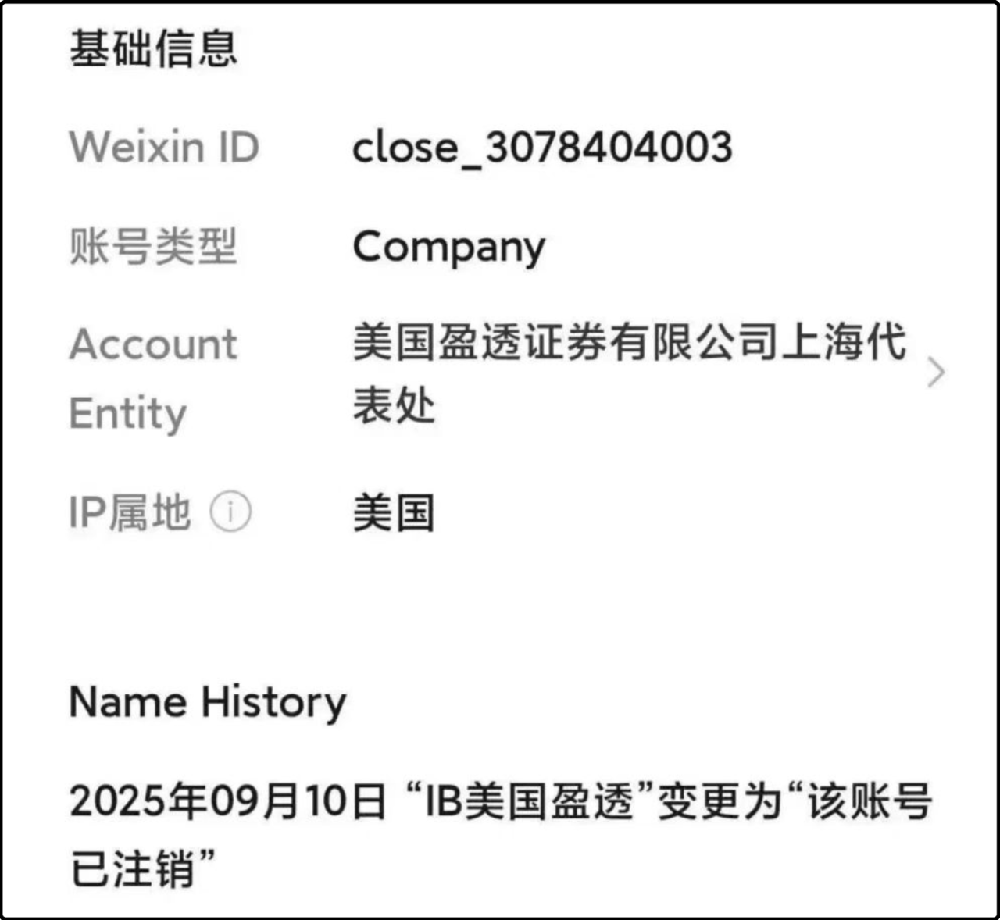

最近很多人在抱怨a股很难挣钱，挣不到钱。

倒也不是错觉，事实上这一轮行情的主升浪就到8月底，从9月份开始就一直在震荡调整。我计算了一下9月份到目前为止市场中位数的表现是-3.05%，整体是下跌的。

宽基的表现红绿各半，头部和底下的小盘股也不太好，胸部腰部指数表现强势。

看具体行业的话，电机制造、电池、消费电子、黄金、游戏、元器件、自动化设备、半导体、能源金属、风电、光伏在9月份的表现强势，这其实也基本都包含在科创板和创业板的主要成分里，所以双创指数明显跑赢大盘一截。

至于表现差的板块有保险（-11%）、休闲食品（-10%）、多元金融（-9%）、军工（-9%）、稀有金属（-9%）、证券（-8.5%）、软件服务（-8%）、出版业（-7%），另外还有一串和消费有关的行业普跌4-6%我就不列了。

和大家的日常印象比较接近，传统行业的老登股日薄西山，新兴产业交替上涨，这一轮牛市的资金极端偏爱科技板块，起码到今天都没看到风格切换的迹象。

股民论坛上每天热门话题，就是两类不同风格持仓的股民在论战彼此的逻辑，小登们赚到了钱，对传统行业冷嘲热讽，老登们憋一肚子火，每天各种怨天尤人。我小时候玩的《大富翁》里有一种道具“黑卡”，使用后可以让指定的股票跌停，可惜现实中没有这玩意，不然老登们能一口气下单买到2100年。

很多人受不了了，想要换仓，又怕换完了吃亏，来问我行不行。可我从来就没在市场风格上押注，我a股最大的头寸都在期指上你们知道的，中证500今年上涨25%，算上贴水大概32-33%，不用操心就能获得这个收益率我还要什么自行车呢。

我一直建议散户买宽基etf，它能修正交易上的一些坏毛病，比如老想卖掉盈利的股票去补仓亏损的股票，另外还能解决一直踩不准市场热点的难题。如果你发现自己在大多数的时间里都跑不赢大盘指数的话，就说明你是真的菜，继续瞎炒也是糟蹋自己的辛苦钱。

……

英伟达宣布将分批投资openai，最高上限1000亿美元，这件事引发了行业热议。这笔投资让人觉得古怪的地方在于，openai拿了英伟达的投资款，主要支出还是找英伟达买硬件，钱绕了一圈又回来了，商业闭环达成。

这反映了ai行情的现状，钱和算力在少数几个顶尖玩家之间循环，oepnai需要资金去扩张版图，英伟达需要更多的订单来维持繁荣，两家公司深度绑定+各取所需。

有人可能会担心，那要是过几年ai应用迟迟无法商业落地，openai的巨额投资赚不回钱，这种左脚踩右脚的梯云纵怎么办？

这种未来的风险没法在当前细琢磨，要信就早信，信晚了不如不信。你们可以去看宁德时代的k线，涨最疯狂的是2020年，从30多涨到了200多，总市值直逼万亿。而宁德时代当时年利润只有50亿，很多人质疑它的估值不合理。

从2020年底开始宁德时代的盈利潜力开始兑现，2024年净利润已经超过500亿，短短4年时间涨了10倍，但是股价只比2020年涨了40%。

很多人都知道炒股炒预期这句话，但实际交易的过程中很少有人愿意跑在预期之前，因为那样领先事实太多，看起来很不靠谱，很危险，但往往是很不靠谱很危险的交易才能获得超额收益补偿。

一个生意的确定性越高，它的回报率一定就越低，炒股也一样的。

……

1、离岸开户进一步收紧，老虎和富图证券现在已经不再接受中国公民提供境外工作或生活证明文件开户，现在只允许非中国内地身份证件的客户开户。另外今天晚上我发现一个事，全球最大互联网券商盈透证券把微信公众号注销了，看来是打算彻底退出中国市场。

2、纽约期金突破3800美元，本来还以为年底能到3800，结果是9月底到3800。感觉现在全球流动性过程，开始资产焦虑，能买的都很贵，被迫怼了一部分仓位到黄金上面。

3、最近看到一批西方国家都开始承认巴勒斯坦国，目前五常只有美国还没承认，国际舆论给以色列的压力越来越大。我每天都能在抖音和视频号上刷到巴勒斯坦难民的悲惨日常，之所以迟迟未能达成停火是因为以色列和哈马斯有一些核心矛盾无法达成共识。

早先是关于以色列人质的释放和停火，哈马斯不愿让步，然后以色列就疯狂斩首哈马斯的领导层。大概从上半年开始哈马斯主战派被杀的差不多了，态度已经软化，打算用人质交换和平，但以色列坚持要哈马斯解除武装，这是哈马斯无法接受的底线，于是双方又继续打下去。
当初哈马斯发动恐怖袭击的行动杀了以色列1000多人，结果这几年以色列报复杀了巴勒斯坦4万多人，要说是非道义这两手上都沾满了血，普通老百姓永远是最倒霉的。

今晚就这些，发射～

----------------
Q：猫哥，目前看大盘短期上升趋势破坏了吗？你觉得这个位置做m顶的概率大吗
A：目前看上升趋势良好，现在无法判断是否铸顶，2015年那波行情中间过程也非一帆风顺，从遭遇挫折的程度而言比现在要大的多。

Q：我和巴菲特有一样的毛病，觉得黄金和加密货币不生息，就不爱买
A：虚拟币在defi上是生息的，而且不低，会玩的话10-20%的池子都有。至于黄金确实不生息，但我最近发现有黄金rwa币，在链上也有池子理财，年化15%以上，它要是早几年发的话我肯定会配置更多的黄金仓位。

Q：会不会以后qdii或etf也买不了了
A：国内的etf肯定是能让大家买的，官方鼓励散户入场投资。至于投资境外的qd，我觉得以后难讲，外汇渠道多半会收紧，另外也要担心中美起冲突后被对面制裁。

Q：证券这一波牛市是不是真没戏了
A：这是本轮行情与之前几次最大的不同，成交量都飙到三万亿了，券商也死水一潭，可能还有大资金在里面抛售，涨不了一点。

Q：猫哥，贴水策略为什么选择500，而不是1000，1000不是更多？如果做这个策略，只要不爆仓，是不是什么时候入场都可以
A：我最开始滚期指的时候还没有im，贴水最大的单品就是ic。至于后来im出来后也没有换，主要原因是觉得im的风格更极端，波动更大，虽然贴水多但你要承担的波动风险也更大。本来a股就是高波动股市，我就尽量选风格中庸一点的。