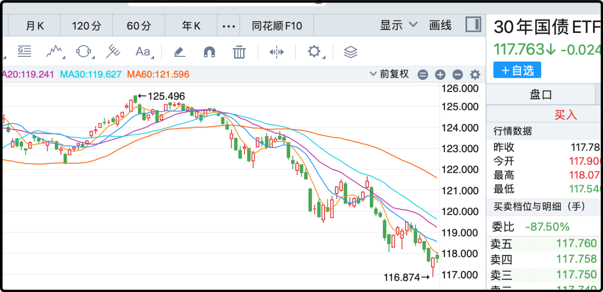

顺着昨晚的说，很多读者在评论里问我说的债基是哪一个，这个也没啥保密的，招商产业债是了，有a份额和c份额，申赎费率不一样，交易之前记得看条款，别吃了亏后怨天尤人。

另外我昨晚的内容有错，该基金是2012年3月成立的，但我在百度看历史走势的时候它的源头不知道为什么定在了2017年8月，这波只能甩锅百度了。

招商产业债成立13年，历史总表现是+129%，同期沪深300的总表现是+75.8%，无论怎么选取时间区间都是债基碾压股基，这其实是很不正常的，因为股票承受了更大的风险波动，理应获得更高的回报，但在中国炒股的性价比就是远远不如投资债券。

但你也别听完我说的话转头就去买债，今年的情况不一样，股市难得好行情，正从债市虹吸资金，30年国债etf今年不但没涨，累计下跌4%，是标准的债市小年。另外就是政府之前改了政策，以后新债要多交一笔税，性价比又会降一点。

另外还有个事，就是管理这支债基的基金经理跳槽了，公募限薪令对这种行业明星经理的影响很大，钱给不到位，再三挽留也留不住，后来听说他在静默期后去了天弘，民营背景的明星公募，估计在待遇上要比国企更灵活。他们的pr哥们当时还忧心忡忡的，拜托我不要参与发酵，怕引发恐慌赎回潮。其实债基换人的影响不会那么明显、直接，我自己也不着急，观察一段再说。

总的来说债基是我们家低风险活期资金的基础配置，略懂即可，不必深度研究，真想挣钱也没指望它，闲置资金低风险生息，聊胜于无罢了。

……

前几天还有个话题，我说到自己2016年买了1500的房子，首付600贷款900，底下很多读者问我当时才30出头钱从哪来的？

很重要的一笔钱是我2005年大学毕业来北京后不到半年就买房了，怎么样我还挺有眼光的吧，当时就觉得北京房子要起飞，找我妈要了7万首付的赞助，贷款30万买了50平米的一居室，我自己每月还3800的月供。这套房子后来提前还清贷款，等到2016年的时候涨了七八倍，我给卖了凑大房子的首付。

另外就是前一年的牛市我赚了一笔，当时成功逃顶，股灾基本没回撤。不过即便如此买房子的首付也严重掏空了我手里的现金，当时甚至还找朋友临时短借了100万应急，蛮窘迫的。

当时自媒体流量已经起来了，但还不会变现，那年头主动找上门投广告的主要都是p2p，出价最高的是深圳某平台，报价单次50万，或者3次100万。我骑自行车回家的路上一直在纠结接不接，因为当时确实很需要这笔钱，后来也是下了很大的决心拒绝，因为我觉得自己未来一定能凭本事挣钱，不必拿自己的声誉冒险。

多说一句，那个平台后来倒了，126亿窟窿还不上，老板判了无期，目前在里面服刑。

背上房贷后我又做了个决定，就是不再骑车上下班，我骑的那条小路没有专用的非机动车道，汽车在我边上呼啸而过，很没有安全感。我琢磨万一我出事了，老婆孩子应付不了900万的贷款，于是我就不上班了。这一宅到今天差不多10年，缺乏运动量一直成了我的健康隐患。

可能对于很多厌倦了班味的打工人来说，上班实在是深恶痛绝的事，但要是年纪轻轻就长期居家不上班，时间久了很容易脱节，好在我每天晚上会上来更新夜报，和你们有事没事聊几句，这也算某种形式的上班，让我保持了和社会的链接。

很多人最初关注这个公众号的目的可能都是看行情分析，看投资思路来的，看着看着就发现有些货不对板，博主家长里短，打嗝放屁的事情都会写。我对公众号的定位就是我的公共日记本，每天遇到的想到的事都写一写，这个公众号最大的内容产品不仅仅是股票投资，那只是一部分，这个公众号最大的内容产品是我这个人，我的思考，我的三观，我的喜怒哀乐，都包含其中。

可能有人会觉得奇怪，干嘛要看每天晚上看一个素不相识的中年人，要是觉得无聊看不下去那算咯，能看的下去的继续看嘛。

今晚就这些，不开盘的日子就不发射了。

--------------------
Q：猫老湿，超长线持有招行，不买、不卖、不做T，对标超长线持有招商产业债券，不买、不卖、不做T。哪个收益会高一些？
A：你自己拉开招行的k线看一下不就知道了，2012年持有招商银行的话，前复权成本是负数，说明分红已经把成本都分回来了，还白赚了40多元一股。招行是银行里的茅台。

Q：李蓓开始以滚 ic 的方式买入科技股
A：啊？？看到你这条留言的时候我愣了一下，马上找grok确认，还真是，她最近也在买ic，原因是ic里的科技股比例较高。大资金也来滚ic的话，会缩小贴水空间呢。