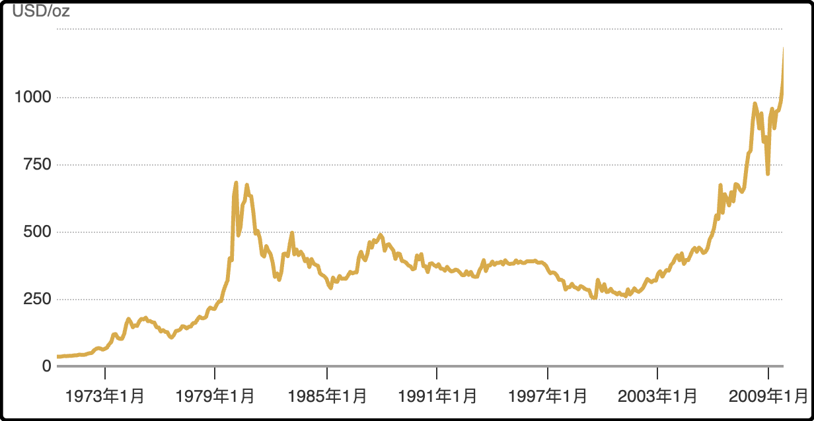

昨晚有个女读者贴了过去10年的金价，我后来仔细看了一下她的数据可能不太对，世界黄金协会的官网有国际金价历史走势，2015年10月大概是1100左右涨到现在的3900。

过去10年按照年化复合收益率是13.1%，这个收益率很高了，同期标普500的年化复合收益率是12.6%，纳斯达克的年化复合收益率是16.9%，黄金还略胜标普500一筹。

现在的我们用后视镜去看，过去10年中国股市回报率微薄可怜，中国房产整体处于亏损状态，对于老百姓来说10年前最好的投资品竟然是黄金，这是当时很多人根本想不到的。

目前黄金的趋势非常强，机构差不多每个月都要更新目标价预期，这种情况下去预测顶部是很容易被逼空的。但黄金的基本面并没有发生重大变化，它的储量和产量保持稳定，它的使用场景也没发生变化，工业用量少，主要还是储值和奢侈品佩戴。

要说这几年和黄金有关的因素有啥重大变化，主要还是疫情那几年全球都印了太多钱（主要是美元），再加上美债信用降低，各国都在加仓黄金作为美元的替代品。

黄金历史上的年化回报只有5%左右，最近10年能飙到13%属于很异常的情况，所以有一种可能，就是本轮行情结束后可能会迎来漫长的调整期，最终摊平年化收益率。

这样的事情在历史上是有先例的，黄金曾经在1980年有一波大行情，之后回落调整了20多年，一直到2006年才成功填坑创出新高。我贴个图，你们注意看底下的年份坐标。

总的来看黄金的历史走势并不平滑，符合28定律，即80%的涨幅都是在20%的区间内涨出来的，所以对择时水平要求挺高的。

……

我昨天说本轮巴以冲突是哈马斯2023年10月主动袭击导致，后台有很多支持巴勒斯坦的读者说不能只算到这，巴以的账还得往前算。

ok反正国庆节闲着也是闲着，我就往源头捋一捋，看看到底谁理亏在先，谁理亏得多。

上古的历史不提了，就从1900年往后讲。那块地是奥斯曼帝国的，一战战败后换了英国统治。那几年犹太复国主义高涨，英国人管不过来，1947年联合国推动一项提议，在那块地成立一个犹太国家，一个巴勒斯坦国家，还顺带划分了领地。但这份划地方案比较偏向于以色列，阿拉伯国家们不服，所以联合起来想要灭了以色列，这就是第一次中东战争。

打了两年，以色列赢了，顺带反击占领了大片巴勒斯坦的领土，两边签了协议暂时停战，但并没有化解仇恨。

时间一晃就到了1967年，这次是以色列主动发起第三次中东战争，打了一波强势突袭，只用6天就大获全胜。以色列占领了大片战略地区，把上百万巴勒斯坦人赶出家园，然后把自己犹太人往里搬迁。

如果说之前以色列只是自卫反击，那1967年的中东三战则明显道义有亏，属于自己拳头硬了就主动欺负对方。全世界大部分国家都表示了反对，包括我们中国，主张的都是1967年中东三战爆发之前的主权版图。

中东三战阿拉伯国家输的不服，于是在1973年也策划偷袭以色列，这是中东四战，结果又是以色列赢。

以色列虽然每次都打赢，但来自巴勒斯坦人民的反抗也日益激烈，时间久了以色列国内也有呼声希望能换个思路解决问题。终于在1990两边的主和派共同签署了《奥斯陆协议》，这个协议最大的突破就是双方互相承认对方的主权，以色列决定出让一些土地来换取和平。

结果没过几年以色列领袖拉宾遇刺身亡，主和派遭遇重创。另一边1987年成立的哈马斯组织在激烈抗争，阻碍和平进展，《奥斯陆协议》不了了之。

从2000年往后巴以就不再试图和谈，两边态度都很强硬，隔几年就要大打出手，哈马斯军事水平远不如以色列，几乎每次冲突都吃亏，终于在2023年10月哈马斯搞了把大的，偷袭以色列音乐节，打死+绑架1400多以色列人，这下两边彻底不死不休。

我写完这段概述后，先后问了deepseek\grok\gemini，它们都说基本符合史实，立场也比较客观。像这种两个国家民族之间近百年的恩怨纠葛，肯定无法用简单的是非对错去评价，两边都做错了很多事情，也都错过了和平的机会，结果是底层的老百姓去承担了巨大的代价。

哈马斯已经证明了他们的路线不能解决问题，甚至会给平民引来深重的灾难，这次他们彻底认输放手，也算是一个时代的终结。

希望巴以人民都能获得长久的和平。

