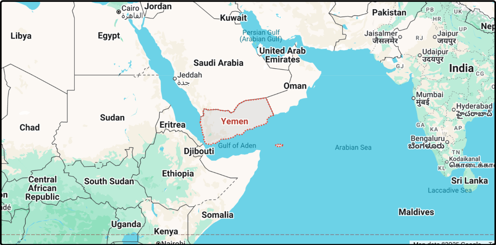

我们长假这几天资本市场表现真不错，黄金今天再涨1.2%，已经来到了3950上方，离突破4000美元只差临门一脚。

日经225今天暴涨近5%，创历史新高。

台湾加权+1.45%，从8月份以来每个星期都在创历史新高。

还有比特币，昨晚也刷新史高，不过这次刷的幅度不大，8月份的时候就到过124400，昨晚突破125000就跌回来了。总体观感上比特币的主升浪有些后继乏力，这两个月倒是身后的蓝筹币表现更强势，尤其是bnb，最近涨的已经不做人了。

2025年名副其实的投资大年，手里的钱只要买出去了，除了房产和债券，别的几乎无论买什么都是对的，今年还有三个月，各类资产都还有空间再冲一冲，今年要多吃点肉，过几年光景不好了才有肥膘去过冬。

很多人留言担心等到a股开盘了又是高开低走，一哄而散。我觉得不会，这半年a股的调性已经不一样了，历史上从来没有涨的这么稳健的走势，不升温，不疯癫，不暴躁，不激烈，这样的a股不像去年9月那样令空头感到恐惧，但温水煮青蛙会害死更多的空头。

……

昨天评论里有人提到胡塞武装和美军打的有来有回，我随口调侃了一句，后台就有人要我说说胡塞武装到底什么水平。

这还用问嘛，其实用大腿思考一下，没科技也没钱，当然是泥腿子水平。但他们利用自己的特定优势，确实给美国造成了一些困扰。

最大的优势是地理位置，正好卡住曼德海峡的咽喉，最窄的位置海峡宽度也就20公里，所以即便是胡塞武装手里的那些简陋武器（无人机、廉价导弹），也能给路过的商船造成威胁。

美军为了给盟友撑腰，派航母编队来护航，胡塞武装当然没能力正面抗衡，但他们很好的利用了非对称战争的特点，主打游击战，分散指挥，频繁移动，打完就跑，美国又不愿意像伊拉克、阿富汗那样登陆打地面，确实没办法重创胡塞武装。

美军之前发动了1000多次空袭，摧毁了大量胡塞武装的目标，一度导致胡塞武装的无人机、导弹攻击减半，但他们自己地下工厂能生产，另外伊朗也在背后支持，所以“野火烧不尽，春风吹又生”。

胡塞武装除了躲在山洞和地道，还利用平民做掩护，他们会强迫部分居民滞留在自己的武装单位附近，这样美军来炸肯定会伤及无辜，届时就能从人道主义给对方施压。这倒不是胡塞武装原创，中东很多势力都会。

美军曾和胡塞武装打了几个月，大概杀死500多名武装人员，另外也造成100-150平民死亡。胡塞武装向美军发射了大量的无人机和导弹，美军说95%被拦截，剩下的精度太差打偏了，没有舰艇和人员伤亡。

胡塞武装自己对外说打伤了美国航母，但我搜了，全球没有一家知名媒体报道过此事，国内自媒体确实有不少人写过。

美军虽然军事能力绝对优势，但这么耗着在经济上很吃亏，上百万的导弹拦截对方几千美元的便宜货，拦一次亏一次，3个月花了十几亿美元，引发美国国内质疑，没有必要管闲事。于是美军就和胡塞签了停战协议，胡塞武装不能再打美军，也不打别的商船，但是会继续打以色列的船。

大致就是这样，我平时很少写时政军事，因为我自己也就粗略看看，对投资没直接帮助的信息没兴趣细研究。但网上真的有很多人相信胡塞武装和美军打的有来有回，这也太反智了，如果美军那么菜，我们何必要造第四艘航母，最多两艘，就可以蓝星横着走了。

……

今天我和老婆在畅想以后的日子，我和她出门旅游，一个城市一个城市住过去，每天早上酒店睡懒觉，中午吃完饭，下午跑一个景点，然后就回酒店玩手机。

不着急赶进度，一个月玩一个省，玩累了就先回家休整，调整好了再出门。大概两年左右可以玩遍全国各省的景点。

费用不会很贵，我们觉得住亚朵和全季这个级别的酒店也ok，每天住宿成本800以内，加上出去玩半天，单日1500应该能打住，全年算下来50万，两年100万就能畅游全国，我这账算的没毛病吧。

夫妻两盘算到一半的时候，阿弟突然来了一句妈妈我要喝椰子水，老婆就转身去拿水，我瞄了一眼两个崽，心想要不是你俩，爸爸妈妈现在就可以出去过逍遥日子了。玩完国内玩国外，50岁之前逛遍全球。

现在因为要养育孩子，走不开人，最快要等到阿弟读大学，也就是13年以后才彻底解放，到时候我和老婆都55岁了，虽然还没老到走不动路的程度，但玩的感觉肯定和现在40多岁没法比。

这就是养育孩子的代价，身为父母让渡了大量的自由，所以年轻人一个个都不愿生孩子，每个人的人生都只有一次，大家都想让自己活的更轻松自由，大家都在逃避奉献和牺牲。

今晚就聊这些吧，6/8提醒，余额不多了，请尽快充值

--------------
Q：点你文中的“bnb”居然可以看行情，看来是有些微微变化
A：啊？ 被你这么一说我还特地拿起手机看了一下，真的有呢。我的bnb是熊市里200-250买的，前几年laucnpool+链上种田，本金都几倍回来了，现在1200一枚，真的是又吃又拿。
