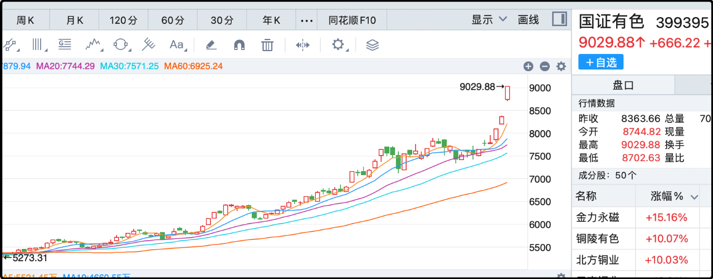
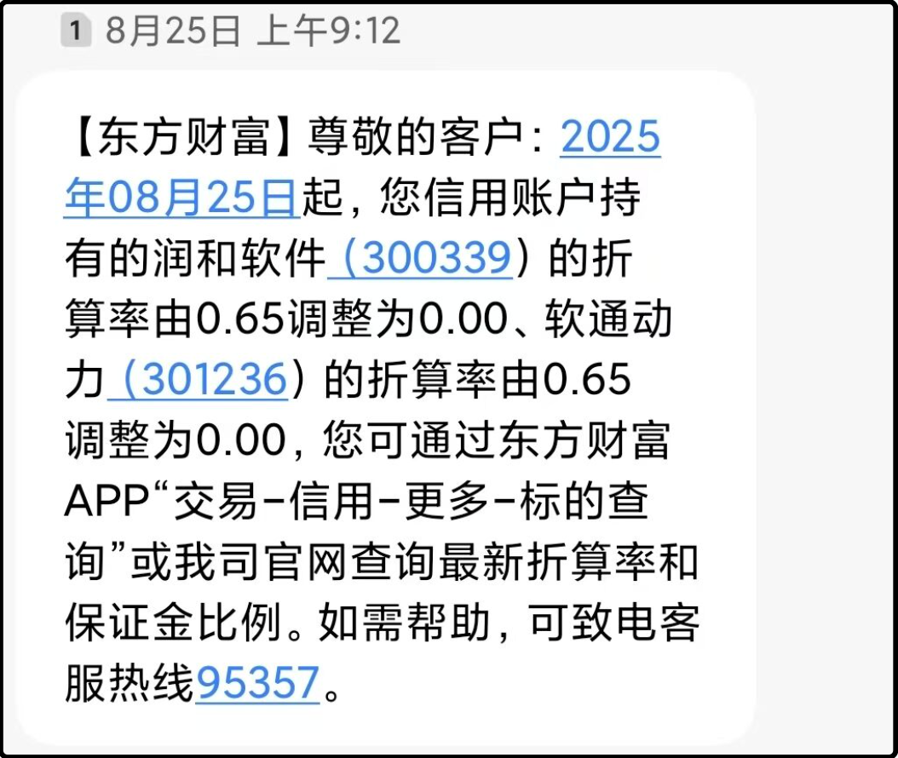

节后首日喜迎开门红，上证指数站上了3900，4000点叩关近在眼前。今天A股中位数+0.47%，涨幅不算很大，但是各个概念板块非常活跃，盘面赚钱效应明显。

冲在最前面的是各种金属，贵金属+8.3%、小金属+5.3%、工业金属+5%、金属新材料+5%、能源金属+4%，主要原因还是受国庆期间黄金大涨的刺激，但更大的背景是美元降息周期下，全世界大宗商品掀起普涨狂潮，2025年不仅仅是ai科技牛，更是有色大宗的暴力牛市。

国证有色指数今年累计上涨81%，这个幅度就挺吓人的，有色金属是传统的强周期板块，好的年份盆满钵满，衰的年份跌起来不做人，波峰波谷差距极大。所以那些做长线价值投资的对有色大都敬而远之，反倒是波段高手对有色尤为偏爱。

昨晚读者留言问有色金属a股有没有etf工具，我今天去找了一下有两个可以加入自选。有色金属etf基金（516650），矿业ETF（561330），这两个etf的前10大权重股一模一样，区别只是带头大哥紫金矿业的权重比例稍有不同。516650的规模较大，有9亿，交易的流动性比较好。561330规模稍小，3亿，这个体量的基金在线下打新申购有较好的增益。

……

今天早盘的时候ai芯片板块也涨的很好，但午休之前场内流传了一个消息，说东方财富把“中芯国际”、“佰维存储”的折算率下调至0，这在一定程度上引发了场内对ai芯片板块的负面情绪。

中芯国际上午一度冲高+9%，结果最终收盘还是绿的，下跌0.87%。

上面提到的折算率是两融业务里的一个概念，两融是股民向券商借钱，需要用自己账户里的股票作为抵押品。比如你有100万市值的中芯国际，之前的折算率是0.75，那就可以按照75万去抵押借钱。现在折算率下调为零，就意味着你不能再用中芯国际去融资借钱了。

东方财富解释了下调折算率的原因，交易所规定个股静态市盈率一旦超过300倍，或负数的情况下，折算率就会被下调为零。该规定从2016年起实施并沿用至今。

我去看了一眼，中芯国际的静态市盈率最新是300.45倍，正好超过300倍。既然是交易所的规定，那应该所有券商也执行了，不知怎的轮到东方财富执行就闹出这么大动静，不愧是网红券商。

这件事客观上抑制了部分高估值的科技明星股抵押借钱上杠杆，今晚我看到润和软件和软通动力也收到通知，折算率下调为零，所以它不是孤例，随着行情上涨会有越来越多个股享受同等待遇。

此外我觉得这件事更重要的是给场内炒作资金一个心理暗示，就是这些票的估值偏高，风险已经大到券商都不能继续用来抵押了，换做是谁心里都难免有些各应。

……

1、昨天提到东方财富询价转让，今天确定价格为24.4元，比今天的收盘价低了8.8%。这种通过询价转让的股份在6个月内不能转让，所以不用担心立刻砸盘，但上市公司老板短短几个月内减持近百亿，对二级市场的信心肯定有冲击。

昨天还提到了新易盛询价转让，今天确定价格为328元，比收盘价低了6.6%，这股今年涨了3.2倍，这把高位出货爽麻了。

2、今天跌最惨的两个板块，影视-4.6%，旅游酒店-3.55%，都挺有逻辑的。影视是因为国庆档拉了个大胯，我昨晚分析过了无论是上座率、观影人次、票价都是近七八年来最差数据，光线上半年在《哪吒2》暴赚，但是这次的三国题材上映9天连8000万都没有，所以不能根据单个爆款电影就给影视公司高估值。旅游板块节前资金就抢险跑路了，后面要到春节前夕才有炒作节点，如果今天还没跑的也不用跑了，等下一轮博弈吧。

3、哈马斯和以色列已经签署了“20点计划”的第一阶段协议，哈马斯将释放20名在世的以色列人质，另外还有28人已经死了，届时将归还遗体。最初哈马斯绑架了251名人质，这些年来有些被营救，有些用来交换囚犯，有些主动释放，还有很多死了，最后就剩下这些。之前一直无法实现停火的重要原因是哈马斯不愿放弃人质筹码，这次既然打算放手就是彻底认输了。

4、今天盘后商务部、海关总署公布了包括稀土在内的一些货物的出口管制，这可能又是明天炒作的点。

5、中国核聚变装置BEST建设有了一些进展，今天相关概念上涨6%，媒体报道说2030年计划通过核聚变发电点亮第一盏灯，这听起来感觉核聚变离我们已经很近了。实际上还差很远很远，2030年最乐观的预期是发电，但肯定无法控制成本，就是为了发1度电可能要消耗很多度电的能源。目前最最最最最乐观的预期是2040年有望小规模投入商业发电，但也是说不准的事，事实很可能是2050年甚至2060年都无法落地。只能说现在是牛市，任何能够引起舆情关注的概念都有炒作的空间价值。

差不多就这些吧，最后感谢一下昨晚给我打了稿费的读者们，我发现腾讯做了改版，不再显示具体打赏的人数，那可能是这方面有忌讳，我也不说具体人数了，总之每一位都十分感谢。

昨晚我随口说了一句自己家资颇丰，不靠打赏维生，出发点是建议打赏1元即可，不必多给，另外就是让新来的读者感觉轻松一点，稿费是可给可不给的。但不知怎的被人解读为炫富显摆，有人说看到这句话就不给了。我觉得这属于价值观差异，如果有人觉得我有钱，那我的写作就不应该获得酬劳，那看电影、看小说、看演出，那些生产内容的人也没几个是穷人，他们也没免费嘛。

我没想过炫富，但现在知道了这些网友们的想法，我后面打死也不会装穷，我希望你们认可的是我的内容，毕竟那是稿费，不是捐款。

就这些，发射。

--------------
Q：终于等到了，光伏板块隆基今天行情大好
A：ai后续的发展涉及电力和储能，光伏板块最近显著回暖，5个月涨了37%了。现在最惨的是传统消费，今天又是绿的。

Q：黄金是不是短时间没有什么上限
A：技术上也不支持无限上涨，现在还在涨无非是流入资金大于抛盘，等到了某一个临界点，抛盘大于买入资金就会触发调整。4500之前肯定有一个大的盘整，否则高盛就不是预测明年4900，而是今年底4900.

Q：看完你总结，我发现这波牛市适合这种策略：大A更适合趋势投资，主力资金在哪，就跟着聚哪。只买上涨通道的龙头，龙头股聚集了市场最汹涌最大头的资金，有最高的溢价和最强趋势，跟着这种趋势走，事半功倍；不要试图去抄底下降趋势中的个股，下降趋势中资金有出逃的惯性，会导致这种抄底，压根没有底
A：还挺善于总结的，你说的对，在a股的主流就是这么玩的，趋势为王，尽量别去赌拐点，赌困境逆转，除非真的很坚毅，不会被环境动摇的那种人。

