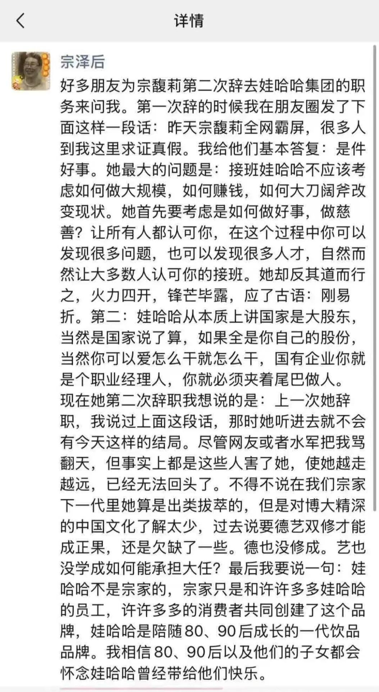

白天随手写的那一条，还不到12小时，阅读量就已经比前几天日更的夜报多出15-20%。所以“发布”和“群发”在功能性上已经没有边界，理论上现在一个公众号每天想发几条发几条，不再有次数限制。但我就一个人生产内容，我的产能有限，每天只能写一篇，再多就是竭泽而渔，拔苗助长，杀鸡取卵、饮鸩止渴、割肉补疮、焚林而猎......挤不出来了。

你们今天多少也听到点风声了，前几天中国政府宣布了史上最严格的稀土出口管制，这让对岸那位气的在社交媒体上一顿狂喷，完了还要从11月1日起给中国商品在现有基础上加税100%。

这件事在后半夜发酵，重创了资本市场。纳斯达克昨晚大跌3.5%，标普500下跌2.7%，在新加坡交易的a50期指闪跌4.5%，原油暴跌5.3%，但真正惨烈的是在区块链市场，凌晨5点左右向下极限打针，干爆了162万个账户地址，爆仓清算金额加起来190亿美元。

打针是币圈特有现象，背后原理是区块链的高效清算。传统金融，比如我的期货账户要是保证金跌超了是不会立刻强平的，经纪商会给我打电话催我增加保证金，如果我说自己实在没钱，他们也会宽限一晚，第二天早上发现我依旧没钱才会择机减仓。不会卖光，卖到健康度低于100就行。

区块链的杠杆就没这么人性化，因为根本就没有人，数据和程序自动运行，只要触发价格就立刻平仓，没有警告也没得商量。所以一旦遇到暴跌就会boom—boom—boom连环爆仓，一瞬间把价格干到很深的低位，然后快速反弹，k线看起来就像打针。

通常每一次打针的背后都是很多人的血泪，因为价格回来了，他们的持仓回不来了。这就是为什么我早上打开手机看了一眼后那么慌张的原因，万幸我大部分仓位有惊无险，就局部清算丢了1万刀，运气还不错。

今天社交媒体上有很多人在哭惨，我就看到截图，有说自己贷款上百万一夜清空的，有说半生积蓄上千万全部亏光的，还有发帖说自己打算轻生的。老实说这种我看都看麻了，每年都有向命运梭哈的赌狗，要是赌赢了就是洋洋得意成功学，侃侃而谈致富路，赌输了就是世界破碎，人生崩盘，命运不公。

其实终究是逃不出“盈亏同源”这四个字的。

……

补充说说宗馥莉辞职的事。

这是她第二次辞职，上一次是内部改革遇到了阻力，宗大小姐用辞职来威胁，最终达成和解。而这一次不是即将辞职，而是已经辞完了，对外宣布这个结果。

这次辞职明面上的说法是娃哈哈商标使用权的问题，但背后还是内部利益冲突的矛盾。

大家平时知道的娃哈哈，股权结构是杭州国资46%，宗家29.4%，员工持股24.6%。然后宗家又成立了一个宏胜系，宗家100%持股。这个宏胜系承包了娃哈哈的供应链，包括原料供应、包装、物流、销售，全部都是宏胜系承接，这么多年老挣钱了。

这也是为什么一直有传闻说娃哈哈给宗家利益输送，从原则上来宏胜系的这些生意完全可以由娃哈哈自己来做，赚更多的利润。另外宏胜系还有擅用娃哈哈商标的问题，等于是用娃哈哈的品牌资产给宗家谋私利。

原先老宗在世的时候威望高，娃哈哈是他一手闯出来的，国资睁一只眼闭一只眼就认了。现在小宗接班后一顿搞，可能让杭州国资也觉得不舒服，就拿违规使用商标说事。小宗拍拍屁股走人，打算自己另立门户，注册了几个品牌叫娃小宗、宗小哈、娃小哈。

能看出来是既想独立又不愿彻底切割，其实我觉得叫宗哈哈也蛮顺溜的图片

至于10月2日被带走调查的小宗心腹严学峰，前几天已经结束调查回来上班了，所以关于小宗也被调查的传闻大概率是不可信的。

今天在社交媒体上还看到老宗的弟弟在朋友圈留言，说小宗刚易折，我作为一个旁观者觉得他的发言登味太重了，就小宗那脾气根本不会听的。

就这些吧，一天上两回钟，回头看看能不能给我弄个调休什么的。

