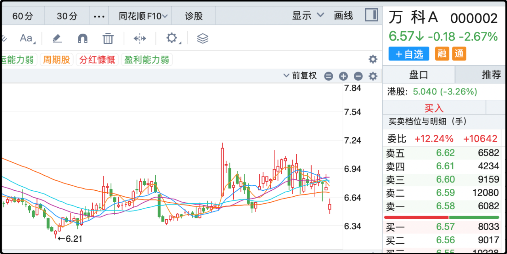

今晚就先从万科的公告开始聊吧，公司公告董事长辛杰因个人原因提出辞职，董事会随即选举黄力平（现任深圳市地铁集团有限公司党委副书记、董事、总经理）接任董事长。

辛杰的辞职看起来是不太正常的，他于今年1月27日接替郁亮火线救场，满打满算只干了半年多。媒体报道说他最后一次公开露面是8月29日，我前几天就听到一些说法，但万科和深铁都没官宣，我一个写公众号的不会抢着说的。

有一点是毫无疑问的，辛杰代表的一定是深圳地铁里支持全力援救万科的力量，仅就在他在任的这七八个月，深圳地铁就以多笔低息贷款的形式输血万科259亿，两家企业已经深度绑定，荣辱与共。这种情况下辛杰突然离任，引发了股市小范围的恐慌，深铁对万科的财务支持还会继续吗？后面还能借到钱吗？

其实就深铁已经砸在万科身上的沉没成本，换谁来这个时候都不可能做切割，这已经不是壮士断臂，这是要断头。

深铁最早从华润那里接手万科股票，花了371亿，每股成本22元。
从恒大那里接手万科股票，花了292亿，每股成本18.8元。
然后又先后借了259亿给万科，另外还杂七杂八认购了一些reits。
总的加起来已经接近1000亿了，就算深圳有钱，这1000亿也是塌下来压死官的天文数字。无论房地产熊市还要持续多久，万科可以苟着活，但绝不能死。

那些在万科里死扛的散户，倒是不用担心股票跌退市了血本无归，但现在楼市一片冰凉，就算大盘涨到4000点以上也很难有资金去拉万科。过几天统计局70城房价就会披露，但不要抱什么希望，没有好转的，一线城市环比跌幅在1%以上。甚至下个月披露的10月份房价多半也就那样。

……

今天的a股倒是表现出了很强的韧劲，其实贸易战的氛围从昨晚开始就有松动，万斯在电视采访时态度比较温和，表示愿意和中国协商谈判。当时美股还在周末休盘，但币圈的资产已经立刻反应，集体井喷，包括链上赌场的相关池子（中美11月份的关税比例）下注，超过60%的资金选择了关税维持目前水平不变。

早上意料中的低开，低开幅度和我昨晚预期的差不多，我原话是“凭经验主板可能会在2%以上，双创低开的幅度会更大一些。”还有我昨晚就说对a股目前的抗压能力表示乐观，原因是大盘连涨了4个月，之前又没有被重创调整，场内心气还是很高的。结果今天开盘就差不多是日内最低价，而且一开盘就窜上去了。

说来好笑，我今天早上很难得的定了闹钟，想9点半爬起来看看能不能捡个漏，以我的判断如果中证500给砸奥7000附近，起码日内是有较大机会操作一下赚2-3%的。结果今天开盘大概是想抄底捡漏的人太多了，导致股指期货的贴水被大幅压缩，下不去手，我合上电脑骂骂咧咧滚回床上补觉了。

今天板块里涨最好的是贵金属和稀土，这没毛病。目前没有任何机构看衰黄金，继花旗之后，美国银行也上调明年金价目标至5000美元，我上次咬咬牙在3840加仓了6万刀，今天一看都4126了，糟心，确实有点下不去手。

稀土是这一轮贸易摩擦的核心品种，被资金追捧是肯定的。另外今天半导体的表现依然强劲，今年最强主线没有断，依然在凝聚共识。

反而是内循环消费股今天还是很拉垮，中证白酒-1%，年内跌幅累计9%。段永平今天在社交媒体上说买了点茅台，但他是做长线价值投资的，买逻辑不买趋势，而且他只说了买茅台，没说具体的仓位，这有时候也会引起误会。之前2022年有过争议的是他说了几次抄底腾讯，但后来又说腾讯一共买了1%的仓位，把很多底下抄作业的散户给看破防了。

总体来看这一轮的贸易摩擦在向着好的预期发展，中美很有机会在11月之前通过沟通和协商来避免相关加税，资本市场表现出了足够的韧劲去消化利空，但这并不意味风险已经化解。大家只是提前下注乐观预期，如果间中再有什么意外，特朗普发一篇帖子可能又是地动山摇。

……

1、雷军今天有喜有忧。社交媒体热传成都那边一辆小米汽车事故后起火，路人救援，视频里车门没有被打开，不清楚是卡住了还是司机昏迷失能，这个要等后面的正式通报。小米股价受影响下跌5%，又回到了50港币下方。其实我之前算过账，小米这一轮的合理价格就是50-55，已经包含了汽车大卖的预期。

上面说的是坏消息，好消息是中国政府指定要求稀土申报文件用wps软件，金山软件的a股和港股双双大涨，雷军也是这家公司的董事长。

之前雷军说自从做汽车以来感受到的压力前所未有的大，这是肯定的，电动车行业在小米入局之前就已经是竞争激烈的红海，小米这个体量冲进来分走了那么大一块蛋糕，必然是四方树敌。另外雷军可能之前没细想，小米手机就算出现各种产品故障，也不会造成恶性事故，但你卖汽车就必然会有一个概率会遇到交通事故，每一次有客户去世都会被放大，最后压力汇聚到雷军头上都是舆论债。

2、美股稀土巨头MP Materials大涨8%，美国政府打算斥资10亿美元扩大国家战略储备。后面就算中国还会出口给美国，他们也肯定要发展自己的供应链。

就这些吧，发射。

