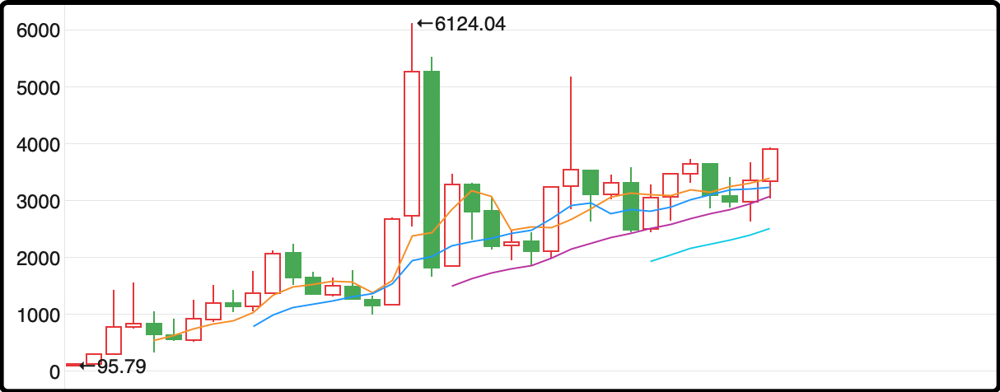

今天行情不错，暖暖的回了一口血，中位数上涨1.06%，所有指数涨幅都在1%以上，除了成交量2.07万亿缩的有点多，但只要大盘在上涨，哪怕是缩量上涨也不是坏事。

昨天好几个关键指数击穿了中期均线，让场内的氛围变得有些微妙，已经有不少人在纠结要不要下车止盈，这个时候来一个中阳对稳定军心至关重要。

从盘面上看今天又回到了之前几个月科技主导的风格，但没有那么极端，资金也流向了部分传统行业，涨的比较均衡和谐。我复了好一会的盘面，没有灵感，竟然觉得无话可说。今天涨的多的汽车整车、机场航运、电网设备都不是一直以来的主线，它们今天涨的多不代表明天还能涨。今天跌幅靠前的港口航运和小金属，也没发现有什么明显的硬伤。

夜报虽然每天都写，但每天的感觉不一样，有时候还没开始写就觉得今天有很多事情要和你们分享，打字跟机枪扫射一样流畅。但也有像今天这样的，愣了半天也不知道说啥，写文章跟硬挤老牙膏似的。

这一轮行情涨上来我ic一共卖了7手，从31减到了24，减仓的平均卖价基本就和今天中证500的收盘价差不多。我对目前这个位置的a股的看法是它大概率能借着惯性和趋势再上一层，但它的合理估值也差不多到了，4000点的a股不虚但也不亏，拿着再看看也行，卖了也不必后悔。

这话的意思是就算后面能涨到4000点上方，耐心点过几年也一定能在4000点以下买回来，进退取舍只看你对投资周期的宽容程度。

……

1、今天白天有人在网上倒腾小作文，说特斯拉给三花智控下单了50亿的设备订单，可以装备18万个人形机器人。这新闻传着传着就传到了推特上，被一些特斯拉的粉头账号看见并转发，发酵扩散竟然有20多万人浏览。再然后这些推特内容又被截图转发回国内，被当作小作文传播。

午后三花智控的股价被拉起，很快就封住了涨停。公司关注到了股价异动，说要去调查核实。三花智控一直是特斯拉的供应商，它们承接订单的可能性是有的，但这个新闻我用搜索工具尝试溯源，发现最早发消息的那些自媒体全部都被删除了，而正规媒体没有一家报道此事。

我有些怀疑是有组织的一次小作文助推炒作，推特上面那几个特斯拉粉头账号没准背后也是中国人，正经老外谁会来看中国自媒体的土特产。另外给大家分享一个我的经验，自媒体文章里感叹号用的越多的，可信度越低，尤其是标题都用感叹号的，最好就别看了。

2、中国cpi下降0.3%，ppi下降2.3%，就这样吧，没有低于预期，因为本来预期也不好。蛋类、猪肉、鲜菜同比下降都在10%以上，网络上经常会有人说通缩有什么不好的，价格下跌是好事啊。那是因为你只站在了消费者的角度去看，我们的ppi也已经跌了好几年了，工厂出货的产品价格也一直在跌，最终会影响到全社会大部分人的收入。

3、欧盟正在考虑要求中国企业如果想在当地经营，必须向欧洲公司转让技术，这些措施将适用于汽车和电池等关键数字及制造业市场的公司。同时欧盟还要求这些公司使用一定数量的欧盟商品和本地劳动力。

说实话看到这条消息第一反应是感慨三十年河东，三十年河西。差不多就在30年前，我们当时也是这样要求那些来中国开公司的欧洲企业，现在轮到中国企业去欧洲攻城略地，他们要求技术转让和本地保护了。

我专门去查了一下，2000年中国、美国、欧盟的gdp全球占比分别是3.6%、30.5%、23.9%，到了今年已经是18%、26.8%、18.4%，中国和欧盟将近7倍的差距快要追上了。

4、黄金站上4200了。外媒吐槽目前国际黄金是最拥挤的交易赛道，但说归说，里面的人没几个愿意下车的。

5、亚马逊将向中国税务机关报送所有中国卖家信息，即使中国卖家仅在非中国地区的亚马逊商城销售产品，信息仍会被纳入涉税信息报送范围。那些做跨境电商生意的也要交税了，今年征税工作重点就是向离岸收入课税。

我牙膏挤不出来了，今晚就这些

