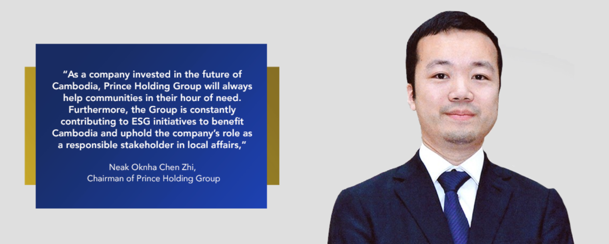
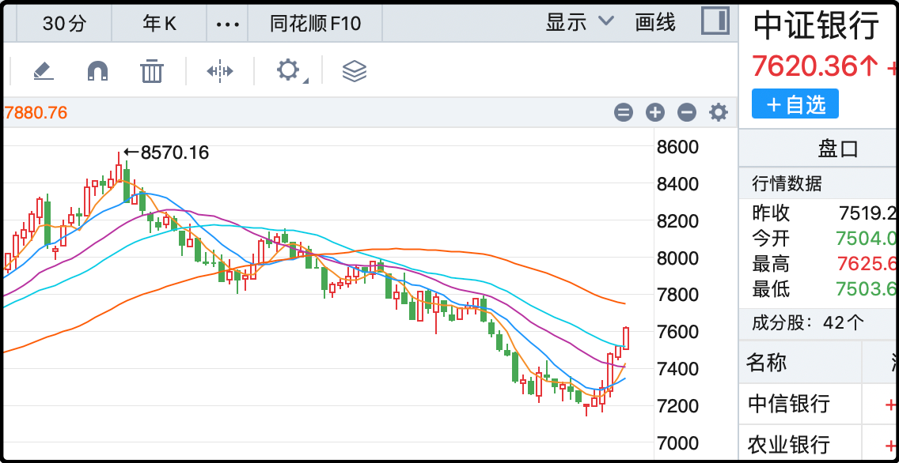
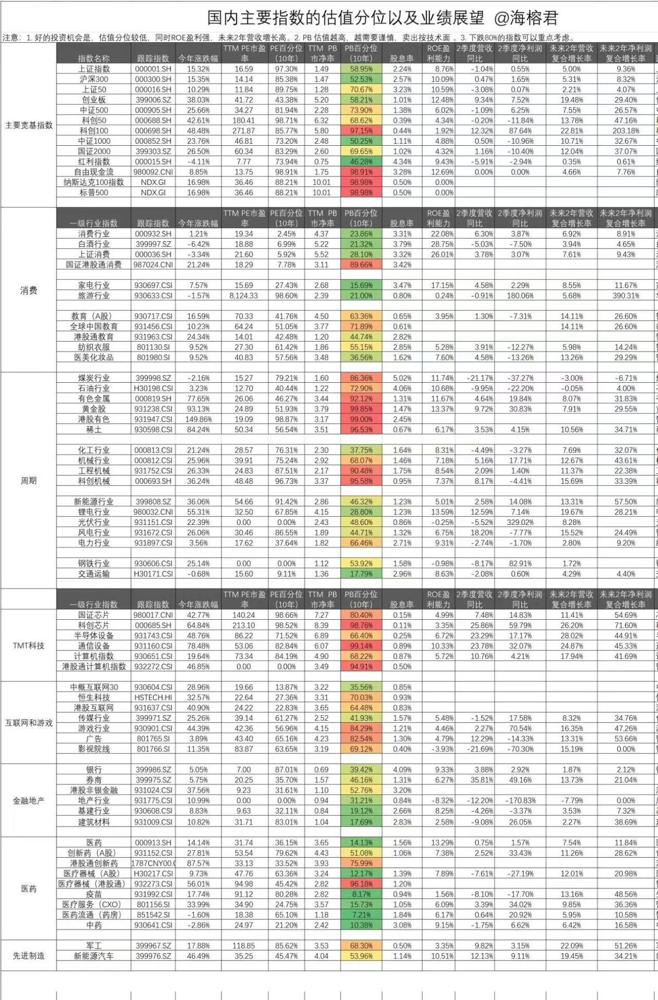

今天吃到了一个大瓜，美国司法部没收了柬埔寨太子集团实控人chenzhi12.7万个比特币，价值150亿美元，原因是这个陈志组织领导了10个以上的电诈产业园，诱导欧美人玩虚拟币杀猪盘，如果这些罪名成立将面临最高40年监禁。英国跟进美国，冻结了chenzhi在伦敦的19处房产。

我在查看信息的时候，第一个意外就是没想到这个chenzhi这么年轻，1987年生人，籍贯是福建连江县，早年移民柬埔寨，2010年才开始创业。2015年成立了Prince Group，至今有员工8000多人，产业达上百亿美元。

明面上的生意是房地产、金融、旅游酒店、但在柬埔寨这种地方只靠这些生意我不信能赚到这么多钱，私底下他还运营了一个比特币挖矿平台（lubian），以及这次美国司法部指控的电诈产业园。

我在看新闻的时候最好奇的是美国政府如何可以没收这150亿美元的比特币，因为如此大一笔财富，肯定不可能会存到交易所。美国司法部的文件里也说了，这批比特币最初存放在chenzhi“个人持有私钥（private keys the defendant personally held）”的非托管加密货币钱包（unhosted cryptocurrency wallets）中，大概率就是离线保存的冷钱包。

最关键的部分，文件里没说具体怎么没收的，不可能是硬破解私钥，人类科技还没到这个水平。但美国政府确认获得了私钥，有可能是内部线人告密，有可能是物理搜查获得私钥，也有可能是社会工程情报窃取，美国政府不说的话我也查不到。

简单说这整件事就是华裔老板在柬埔寨做黑产，辛辛苦苦十几年，最后一把被美国政府给撸了。150亿美元，够付美国国债4天利息。目前chenzhi人还在柬埔寨，他是首相顾问，有政治庇护，如果美国不是铁证如山柬埔寨不会交人。

很多人看到这里估计对比特币钱包的私钥没有概念，它是一长串随机生成的数字+字母，比如我让ai随机生成一个：
1a3b7f9c2d4e6a8b0c1f3d5e7a9b2c4f6e8a0b1c2d3e4f5a6b7c8d9e0f1a2b3

就上面这组，你有信心能记住吗？一旦记错其中一个，没有地方可以找回，这笔钱就永远没了。绝大多数人都不敢冒这个险，所以多半会找个地方保存这组密钥，只要你保存了，就是漏洞。怎么确保自己一定能找到，同时确保别人一定找不到，这是一门学问。

……

今天a股行情一般，成交量近期比较罕见的跌破了2万亿，两市加起来只有1.93万亿。缩量具体到短线很难指导涨跌，但扩大周期来观察，肯定是行情差成交低迷，行情好成交活跃。今天两市中位数下跌1.25%，已经把昨天涨的都砸回去了。

周二老登板块反弹的时候我说事不过三，起码要再观察两天，现在三天过去了，还真就支棱起来了。中证白酒过去3个交易日+2.8%、+0.63%、+1.41%，中证银行+2.54%、+0.53%、+1.34%，这两个指数都完成了均线突破，从趋势上看都已经结束了下跌通道。

再看今天涨幅榜上的行业，从上至下依次是煤炭、保险、港口、银行、中药、白酒，可以说含登量爆表。这是一个重要信号，意味着市场风格确实在发生变化，场内热钱不再是蜂拥硬怼科技和有色，已经有人转头抄底滞涨资产。主流宽基指数里今天表现最好的是上证50 +0.59%，而在此之前上证50年内涨幅（+12.5%）是宽基里最差的。

接下来的日子大概会有一轮横盘震荡，涨的多的调整调整，跌的多的反弹反弹，想跳车的和想补票的也交换一下筹码。其实这样反而让人放心，让人相信a股是稳扎稳打打算长期站上4000点，而不是像去年9月底那样干一票就跑。
……
1、黄金最高涨至4270上方，节奏太快，最近5天5连阳，逼空走势气势如虹。短线稍微有一点超买，但属于日内回调1-2%就能修复的那种，中线乖离率偏高，我拍脑袋预测一下4500之间会有中期调整，针对周线的那种调整。我给家里配置的黄金仓位未来几年应该都没有抛售的打算，因为潜在催涨黄金的因素还挺多的，我希望黄金能达到家庭资产的5%以上，但目前只有3%左右，所以我还在等一个黄金坑。

2、今天新加坡政府投资机构GIC指控蔚来虚增收入、证券欺诈的新闻传播，并导致蔚来股价大跌。其实GIC指控的这个事是2022年发生的，当时有一家境外机构做空蔚来，原因是蔚来的电池服务收入计算方法有分歧。三年前蔚来我记得是赢了，指控没有成立。

至于这次GIC旧事重提，于2025年8月发起指控，可能是前几年投资回报率比较低，想从股票亏钱的企业那里通过诉讼索赔来缓解压力。至于8月的官司今天为什么发酵，要么是随机的，要么是有人做空了。

3、今天有小作文称光伏多晶硅的收储平台已经成立，公司名称中硅产能整合有限公司，但随后有媒体辟谣还没成立。不过这件事本身确定是要做的，就是进度不明。这个收储平台是由头部光伏企业出钱成立，用现金买断小企业的方式出清多余产能。

4、印尼防长：将采购中国歼-10战斗机。要是早两个月阅兵之前这消息高低能炒一下，但现在军工一整个过气了，这类消息也没用了。

5、台积电三季度利润4523亿新台币，汇率算过来大概是1050亿人民币，同比增长39%，大幅高于预期。台积电业绩会上说ai需求比3个月前预期的还要强劲，全年营收增长预期上调到30%区间中段，预计第四季度销售额322-334亿美元，这是真摇钱树，赚麻了。

6、最后转发分享一个表格，我觉得信息量很好，你们有需要的可以保存慢慢看。图片上写着原作海榕君，尊重出处。

就这些吧，昨天忘了说发射一堆人急了，今天补档，发射！发射！

