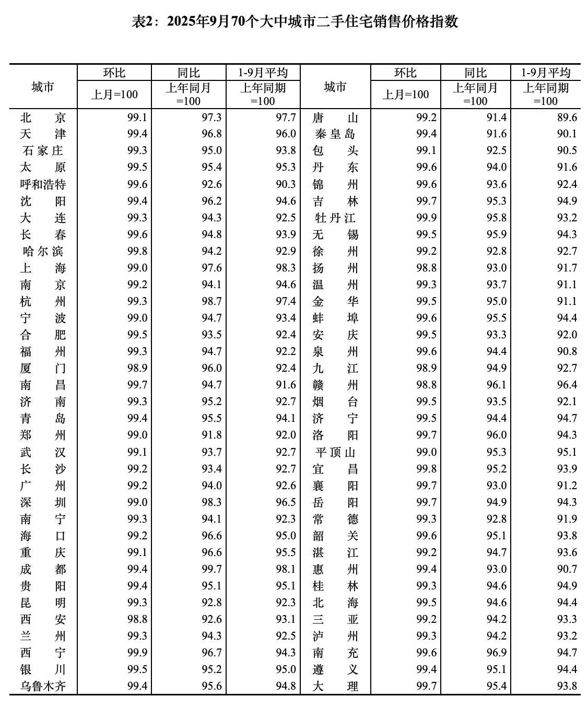

前几天一直有读者留言催我，这个月的70城数据是不是忘记更新了？

No，我没忘，我每天都有去统计局的网站上刷，是他们这个月更新的特别晚，一直到今天才发了9月份的表格，我马上就搬过来了。

惯例给新读者讲讲怎么看，环比99就是比上个月跌了1%，同比95就是比去年这个月跌了5%。

70个城市环比同比全部下跌，五一例外。环比北京-0.9%、上海-1%、广州-0.8%、深圳-1%，和我预期的差不多。

可能有些读者觉得这1%不到的跌幅也不算很多，但要注意这是环比，一个月跌1%一年就是12%，房价的12%对普通家庭已经是很庞大的巨款。前几年中国一线城市买房收入比普遍在25-30，就是要用25-30年的家庭收入去买一套房，那反过来可以推算，房价的12%已经相当于3-4年的家庭收入。

自己打工辛苦挣一年的薪水，结果房价跌了三四年，这就是为什么这几年中产阶级普遍有财务焦虑的原因。房价虽然不卖就不亏，但信心被重创了，没有安全感。

从目前的趋势来看这个冬天也很难有什么好转，房价最快要到明年开春可能才会企稳。政策上能打的牌前面都打完了，全国现在只有北京上海这两城市还有一些象征性的限购，但即便全取消了也就那样。

接下来可能会降息，昨天已经有部分小银行下调了存款利率，机构开始吹风年底之前降息0.1%。其实我认为房贷利率要下调到2.5%以内才有效，也就是目前的位置再下调0.5-0.6%，0.1%太少，但利率下调受息差控制，不是想调就能调。

中国的负通胀和消费萎靡我觉得和房地产去杠杆有很大关联，所以在楼市企稳之前消费板块大概率是好不起来的，我觉得这可能是明年的叙事。
最后顺带一说，本月的LPR持平，1年期和5年期都不变。

……

今天a股迎来了回暖，所有宽指都反弹，中位数上涨1.06%，但也有个很大的问题，两市的成交量只有1.74万亿，过去两个月都没出现过这么低的量。缩量反弹往往被视为弱势反弹，显示了目前的市场信心还远没有恢复。

板块里涨最多的是煤炭+5%、燃气+4.3%，这绝对算一对稀客，炒作的逻辑是预热入冬采暖。话说这几天北京真特么冷，我在书房打字手都冻麻了，要开戴森的暖风来吹才行。但冷归冷，供暖时间也没听说会提前，供暖总量每年都是差不多的，往年炒供暖的时间窗口都很窄，这次我觉得也不会例外，不要恋战。

另外今天机器人板块表现活跃，其实从上周特斯拉50亿三花智控订单的小作文开始，就明显感觉到场内一些热钱开始转战机器人概念，那天三花智控打板的有章建平的6.8亿，第二天虽然辟谣了但是只跌了不到3%，大佬多半没走。ai和电池最近热度下降，可能就是由于部分炒作资金在板块之间流动。

今天a股只有黄金板块遭遇重锤，跌幅超过7%，这个节奏完全跟着国际金价走，周五晚上金价回调2.5%，今天黄金股就数倍放大跌幅。不过这不是太大问题，因为今晚黄金又拉回了4340，明天黄金概念肯定能回血。但我还是觉得这个位置炒黄金股的值博率不高，金价今年涨了50%多，黄金股板块今年涨了95%，已经预支了很高的估值和市场情绪，缺乏性价比。

总的来说今天能回一波血肯定不是坏事，但在k线趋势和量能上都没有解决问题，后续应该还有考验，得再往下看看。

……

1、宁德时代第三季度净利润185亿，增长41%，营收1042亿，增长12.9%。这个业绩当然很劲爆，比市场预期的170-175亿还要再高一点。市场预期全年利润660亿左右，目前三个季度已经达成490亿，四季度看趋势还能再往上拱一拱，最终落在670-680区间。

2、越南股市今天大跌5.6%，越南政府监察局公布了对67家债券发行人（包括5家银行）的检查结果，发现存在多项违规行为。其中，越南第二大地产商 Novaland集团相关案件已移交公安部。越南VN指数里14只银行股8个跌停。越南这些年摸着我们过河，形似神似学到了七八分，连房地产暴雷这个副本也成功复刻，真是每一条弯路都不愿错过。

3、今天吃到一瓜，周杰伦有个姓蔡的魔术师朋友，给他1亿多新台币（大概2000多万人民币）帮忙投资比特币，周杰伦自己的说法是对方替自己“代持”，结果这几天这个蔡魔术师联系不到了，跑路了。周杰伦在社交媒体上让他赶紧出现，不然就完了。

周杰伦自己很喜欢变魔术耍酷，估计是兴趣爱好交的朋友，但不理解为什么要一个魔术师替自己炒币，台湾出金入金又不用担心被冻账户

4、前三季度GDP5.2%，这是好事啊，年内5%的目标眼看着无惊无险又要轻松达成了，一切尽在掌握，稳中向好。

就这些吧，发射！

