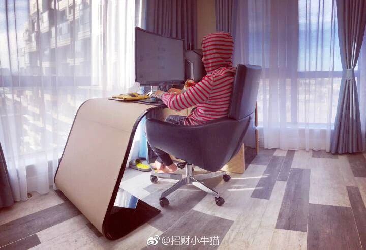
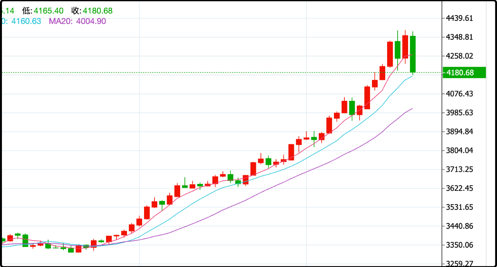

先给昨晚的内容做个补充，有读者理解不了我说的现在新建的房子得房率高至90%+，甚至超过100%。因为过去几十年中国人买的商品房大都是70-80%得房率，超过80%就算很好的户型，我说的那几个数字突破了他们的认知上限。

其实办法是很多的，开发商现在会在户型设计时加入一些不在建筑面积里的可用空间。比如弄一个半露天的设备间，8-10平米，名义上是放空调外机用的，可谁家空调外机也占不了那么大的地。等到收房后业主可以把玻璃封上，把空调外机挂出去，这个房间就可以自用了。

别问我咋知道的，因为我现在正在写文章的书房.......就是这么来的。我以前给你们贴过照片，房间不大，9平米左右吧，但是给我当书房够用了。

除了设备间，另外常见的还有储藏室和开放式阳台。以前大家接触的阳台都是半封闭的，阳台面积50%算建筑面积，但如果是开放式阳台，阳台面积100%赠送。

就这样利用规则，七送八送的，最后实际能用的面积比房本里的建筑面积还多一点。早年房子不愁卖，开发商玩这么鸡贼的不多，但这几年房子不好卖，几乎所有的开发商都这么干，美其名曰住宅2.0。

政府当然知道开发商这套潜规则，但都默许了，因为他们知道房子不好卖，觉得开发商贴点送点能把房子卖出去是硬道理。所以你们能看到新建商品房的售价比较坚挺，不像二手房市场跌那么惨，因为买家同样的价格买住宅2.0能多20%-30%的实用面积，这其实就是变相的降价了。

……

今天a股继续缩量反弹，两市成交规模1.87万亿，依然在2万亿之下，但涨势是很不错的，宽基普涨1-3%，市场中位数上涨1.33%。沉寂多日的ai芯片卷头重来，重新回到了领头羊的位置，一切似乎又回到了上个月的感觉，除了成交量少了1/3。

有些读者留言问，缩量反弹是不是诱多，后面会不会崩？这个没有固定的公式，缩量反弹确实显得有些虚弱，让上涨不是很有底气，但再弱势的反弹也比下跌强。如果大盘震荡整理过后还要向上攻击4000点，成交量一定会回到日均2.5万亿的水平。

今天行情比较有新意的是房地产板块+3%，罕见的拉动了上下游的难兄难弟，这当然不是因为最近房市回暖了，而是资金开始在提前下注降息的消息。这几天多个银行都在下调存款利率，这是降息的前置条件，等小银行降完了再大银行降，快的话下个月20日LPR就会下调。

所有行业板块里今天只有3个是下跌的，煤炭-0.75%、燃气-0.42%，这两个是昨天涨最多的，今天反向调整合情合理。倒是黄金-0.1%让我有些意外，高开低走连续六天收阴线，看起来是有一部分资金提前跳车了。

今晚的金价一路跳水，从4370目前跌到了4210附近，明天还会接着盘整，终于能给黄金空头喘口气了。之前连续逼空2个月，带杠杆的非死即残，k线上全是倒毙路边的空头。我之前说金价在4500之前有一波周线级别的调整，但说归说，我自己的黄金仓位是不打算卖的，更不敢去做空，可以看作是一直买够仓位的狐狸在骂葡萄酸。

今天这根中阳稳住了下跌的趋势，但还不够逆转和修复图形，它给了那些不想走的人call下来再看几张牌的理由，暂时说明不了更多。我最近看行情很轻松，因为中证500往下300点或者往上300点我都没有交易计划，要不是外面太冷，规划着出去旅游几天其实蛮合适的。

……

1、苹果又创历史新高了，今晚最高到了265美元，巴菲特之前是在190-200、220-230这两个区间大幅减持的，看起来是卖早了，伯克希尔现在手握大量现金，耐心的等着美股大跌，不知道哪一年能等到。写到这我想起芒格之前买的阿里已经解套赚钱了，很多人又开始称赞芒格有先见之明，可是芒格2023年已经去世了。

2、欧洲多个国家领导人今天又发了一个针对俄乌的声明，最重要的一句话是根据目前两军的接触线作为基础开始谈判。这话的意思就是接受现实，不再追求恢复战前的边境，大概是要乌克兰接受放弃克里米亚和乌东四省。另外还说了要大力援助乌克兰，要用俄罗斯被冻结的资产（3000亿）来为乌克兰提供资源，但多半是说说的，欧洲现在还在用俄罗斯的能源，不然这3000亿拖了那么多年早就挪用了。

目前的战局是俄罗斯还在持续主动进攻，但是战线推进很慢，俄罗斯作为进攻方承受了更大的伤亡比，但乌克兰人少，兵源压力更大。

3、荷兰称要和中方化解安世半导体的僵局，中国政府这次是狠狠替自己国家的企业出头，我猜最后荷兰那边会让步妥协。今天闻泰科技已经有资金打提前量，股价封涨停。

4、特朗普说明年初访问中国。

我去，就我写文章这会黄金又跌一波，4180了，我在k线上比划了一下，这波回调可能要踩到4050-4100区间，之前一直后悔没上车的可以看看。

今晚就这些，发射！

