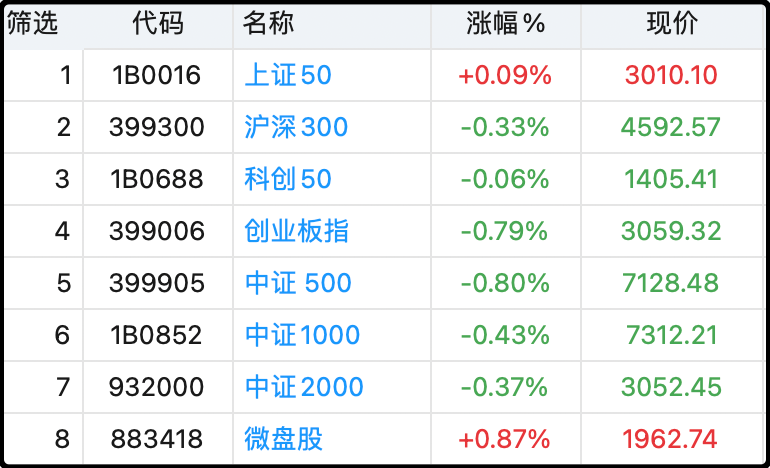
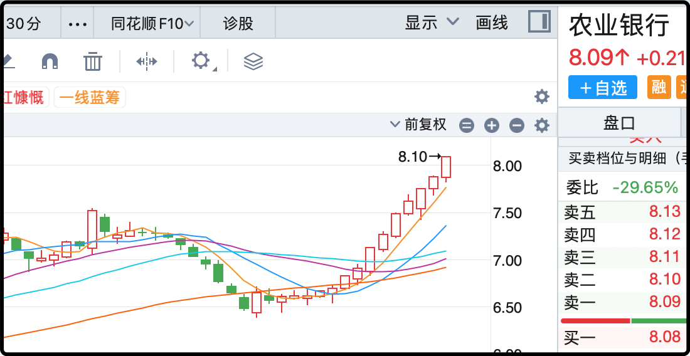
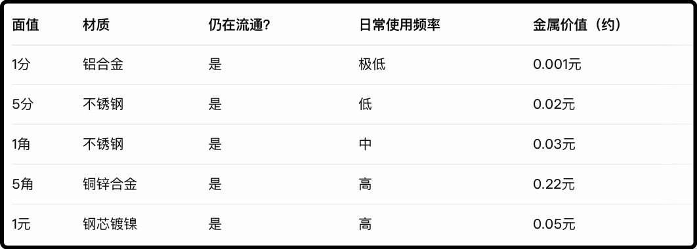

我今天去税务局把离岸收入过去三年的税给补了。

最早接到电话是7月初，暑假回台州了，后来又一直在度假旅游，但最重要的是我拖延症，一直到今天才把这事给了了。

下午去专门算离岸收入的个税接待窗口的时候发现没什么人，一共两个工作人员，都闲的冒烟。和我们说七八月份那会每天整个房间都是来补税的人，乌央乌央的。估计我来了算是给她解解闷，热心接待，全程耐心指导，在中国无论你做什么都要错峰，否则交税体验都是天壤之别。

另外我发现去线下面对面沟通很重要，我说个细节。边上那个女业务员接了几个线上打过来的电话，语气不善，动辄就不耐烦的训斥对方，可以说是摆足了税局公务员的谱。结果有一个大哥连续来了几次都没办成业务，一进门就满脸怒容，恶狠狠的说今天我不管，你们必须给我把事办了！同样是那个女业务员，态度温和，一直在好言安抚大哥，最后把事也办了。

你们看，随着物理距离的拉近，人与人之间沟通的障碍也消失了

最后我这边算完了，两个账户加起来补了一大笔钱，我按照自己账户里盈利总数乘以20%填上去，系统再按照年化18%给我算了滞纳金。

交完税心里踏实了，了却个事。你们有被打电话的尽早交，滞纳金挺狠的，2022年欠1万的话，现在交就是16400了。

最后我想说这一轮涨上去港股我只卖不买，接下来的打算是全部清仓。后续如果还要再炒港股我就用港股通买，离岸券商不用了，毕竟两边待遇差太多，亏损不抵，分红和盈利交税20%，这种条件长期投资很难，我没有信心能炒好，就这样吧。

……

今天a股继续缩量，全天成交1.66万亿，这个量能已经回到了6月底7月初的水平，大量资金偃旗息鼓暂停了交易，市场中位数下跌0.24%，宽基里一头（上证50）一尾（微盘股）是红的，其余都是绿的，腰部的创业板指和中证500跌的尤其多，是因为今天电池和新能源板块表现不佳。

跌这么一天倒是没太大问题，只是成交量持续低迷还是让人怀疑行情会不会就此熄火，之前几次单日跌破2万亿很快就有反弹，这次已经连续3天跌破2万亿，大盘很平静的习惯了这个状态。

黄金过去24个小时经历了一波大跌，从4380最低回撤至4010附近，不过最新又反弹到了4070附近。从技术上这可能是近期超涨后引发的调整震荡，从消息上俄乌可能停战带来了情绪上的诱因，不过最新消息俄罗斯已经拒绝了欧美的方案，坚持要控制整个顿巴斯地区。我去地图上搜了一下，俄罗斯目前大概已经控制顿巴斯88%面积，还有12%在乌克兰范围，按照目前的进度大概还要打6-10个月才能达成这一目标。

所以一时半会可能还停不了战，但黄金暂时也没有涨回4400的意思。今天a股的黄金板块再跌4%，差不多跌回了9月初的位置，不过抄底的资金不少，日内低开高走收了根阳线。我觉得大多数人还是看好黄金中远期能去向更高的位置，我节前在3850加过一次仓，如果后面能跌到类似的价格我会再加一次仓。

其他板块亮点不多，资金总体在向老登板块流动，但毕竟成交量整体萎靡了将近4成，所以绝对的流入量也不多。中证银行指数过去10个交易日9天阳线，最离谱的是农业银行14连阳，每天都刷新史高，涨出了妖股的感觉，已经登顶a股市值第一。

最近3年农业银行的涨幅分别是42%、60%、58%，说实话我没看懂，银行板块高度同质化，农行的各维度数据在银行股里都没有很突出，不是很理解为什么资金就怼着农行买。不过最近随着连续上涨，农行的讨论度已经飙升至明星人气股水平，这通常不是什么好的信号。

……

1、保利发展前三季度营收1737亿，下降5%，利润19.3亿，下降75%。这已经算是房地产里混的好的了，现金流健康，还有利润，别的房企这两年都是咔咔爆亏。

2、高盛最新报告称中国慢牛市正在形成，预计关键指数到2027年底还能涨30%，主要由12%的盈利增长外加5-10%的估值修复。建议心态从逢高减仓转向封底买入。哈哈哈，这句话像是在劝我，因为我现在的心态总体上还是逢高卖出，等我先把计划外加仓的ic都卖了再说心态调整。

3、信达生物披露了一个重大海外BD，是日本的武田制药出资12亿美元首付，获得3个adc药物的bd，最高付款规模可达114亿美元。照理说这样的大利好应该涨一波，结果市场不认，高开低走砸了根阴线，感觉创新药板块的心气没有上半年高了。

4、你们还记得好几年前有一个人造肉的概念吗，美股当时有个票叫beyond meat，刚上市的时候200多美元，后来热度褪去一路暴跌，跌到只剩5毛钱，结果最近它突然被翻出来爆炒，3天涨了10倍，从5毛到5美元。不过现在已经没人在乎它骗鬼的人造肉概念，大家就是把它当作meme股来炒，美帝那边的赌狗也玩行为艺术。

5、最后是这两天看到的一个有意思的事情，有个美国男子专门去银行换5美分的硬币，换了25万美元。他这么做是有逻辑的，因为5美分硬币是75%的镍+25%的铜，就算抛开人工成本，仅就原材料金属成本就价值6美分，超出了面值。

所以这哥们想的是，要是后面镍和铜涨了，他就把这些硬币融了卖金属，要是跌了他也不亏，这25万硬币还能去银行换钱。万一美国政府觉得铸5分钱硬币亏本，停止铸币，他手里的这些硬币有可能短期就能涨2-3倍。相当于是下有保底，上不封顶的一笔投资。

我看了以后就去问ai，中国硬币有类似的投资机会吗，ai说没有，中国的硬币成本都远低于面值，只有5毛钱那个黄色的铜币成本比较高，要0.22元，但也低于面值。

今晚就这些吧，发射。

