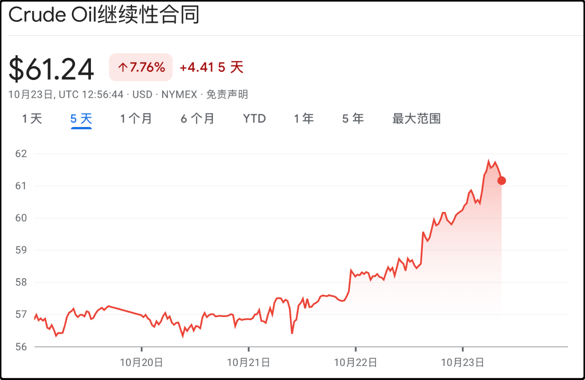
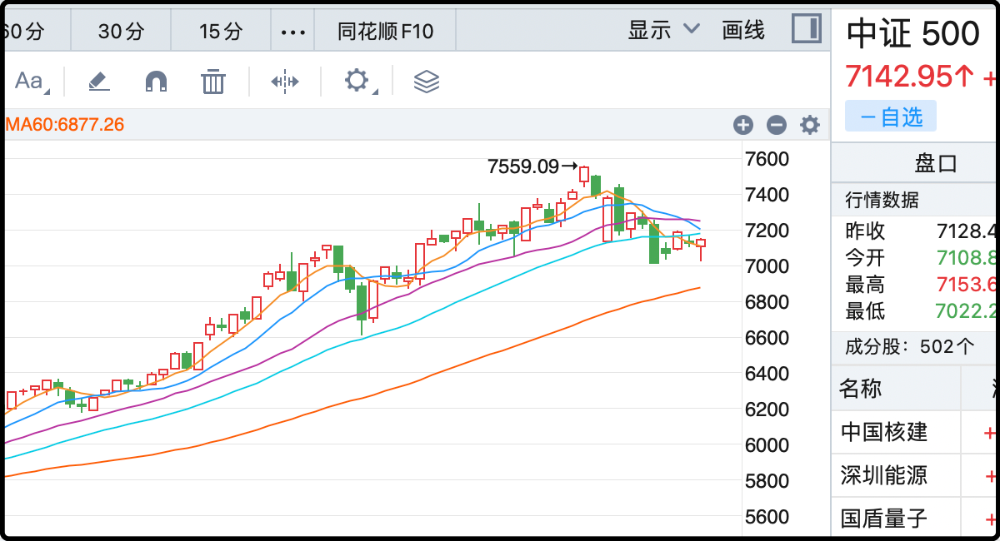

昨晚文章发出后我去搜了一下，滞纳金虽然按照年化18%的高利率收取，但它原则上是不会超过税金本身的，也就是说翻倍封顶。你如果有1万元的税没交，第二年1.18万，第三年1.39万，第四年1.64万，第五年1.94万，从第六年开始就一直是2万，不会再涨了。

应该说离岸税的征收对境外投资是一个沉重打击，之前很多人在港股投资采用高红利收息策略，哪怕前几年熊市肆虐也都能沉着坚守，结果这波征税后很多人和我说要撤了。

因为股市的涨跌是波动的，但税负是刚性的，跌下去的股票未来还有希望能涨回来，但付出去的税是绝对支出。遇到像前几年那种先跌后涨，大起大落的行情，你可能只是刚刚赚回本钱，却要付一大笔税金，这对本就在港股历经沧桑的股民来说是雪上加霜。

有不少读者问政府为什么突然催收这笔税，我觉得大概是公民个人对离岸市场的投资本来就是不被鼓励的，甚至是禁止的，这几年已经把所有对外渠道都关闭了。至于已经出海的钱，那就收税补充财政收入。不想被征税就老老实实回来用政府指定的港股通渠道和qd基金，都是免税的。

但港股通也好，qd基金也好，虽然你投资了离岸资产，但你的钱无论盈亏，终究是在岸的，不是外汇，有取有舍，倒也是公平的。

……

今天国际原油价格大涨5%，原因是欧美对俄罗斯进行了新一轮的制裁，这次不是搞形式，是动真格的要打痛俄罗斯财源。

起因是欧美这一轮很认真的尝试推动俄乌停火，甚至都已经说服乌克兰放弃战前领土主张，接受目前的实际战线来进行谈判，但依然被俄罗斯拒绝。俄罗斯车轱辘话重申2点主张，1是乌克兰放弃加入北约，其实特朗普很早就说了北约不可能接纳乌克兰，但俄罗斯还是坚持要乌克兰自己表态。总的来说这是一个主观的，可协商的要求，但第2点俄罗斯要求完全控制乌东4省，目前已经控了接近90%，还在每天派兵进攻要拿下剩下10%。

这彻底惹毛了欧美，连之前一直劝泽连斯基让步的特朗普都觉得难以接受，放弃了和普京会面，并且签字同意对俄罗斯进行制裁。

这次欧美联合对俄罗斯最核心的石油公司进行封杀，欧盟还首次推动全面禁止俄罗斯天然气，禁止辖内公司进行任何贸易往来，同时嗨威胁对外国金融机构实施二级制裁（如与中国、印度和土耳其的银行合作销售俄罗斯石油）。另外欧美还加强了对影子船队偷运俄罗斯石油的打击，以及对虚拟币协助交易的监察。

总之确实是动真格的，机构预测俄罗斯石油收入将减少30-40%，每年少1000亿美元的收入，俄罗斯如果坚持战争，3-6个月后就会资金吃紧。俄油比国际原油便宜5-10美元/桶，中印很矛盾，既舍不得便宜货，又怕制裁。这次欧盟拉黑了4家中国石油公司，还好都不是上市公司。
其实今年国际油价不行的，供给量大，需求萎靡，大趋势一直在跌，就全靠胡塞拦路打劫，或者俄罗斯这边搞事刺激一下，最近石油石化就靠这个涨回来不少，但持续性存疑，一旦俄罗斯决定收工不打了，原油还得跌。

……

今天a股还是低量能运行，全天成交额1.64万亿，这基本就是6月初行情刚刚启动那会的交易规模。中位数表现还好，小涨0.23%，但过程还是蛮惊险的，中午开盘跌那一下子的时候，眼瞅着就要向下突破了，但大a挺住了，甚至尾盘还来了一波急拉，堪堪在收盘的时候翻红了。
你别说，拉这一下子真挺关键的，现在大盘的趋势就在岔路口，这个位置下去了可能一些忐忑、犹豫、纠结观望的人心气就散了，现在挺过来了队伍就还在，虽然短期均线依然是空头排列，但还有的搞。

ai芯片和电池已经连续沉寂了好几天，感觉大盘缩量缩掉的就是原先炒这两个板块的钱。今天涨幅最多的是煤炭开采+4%，看起来是受国际油价大涨的影响，但其实煤炭板块涨了半个月了，国庆长假回来后一波行情涨了13%。

核心原因：冷空气来袭+冬季供暖炒作+限产核查，另外我觉得还有比较明显的补涨逻辑，因为就算最近涨了13%，整个2025年中证煤炭指数累计上涨只有3%，也就是说9月底那会还跌10%，属于苦逼老登领低保过年，你们别羡慕。

最近的市场风格确实迁移了，科技板块的炒作大军感觉集体潜水，台上只剩下传统板块唱戏，这挺诡异的，场内突然就少了40%的流动性，双创能横在那里没有下跌也算很有主见了。

……

1、今天看到一新闻说中国网约车订单量下降23%，我后来看了一些分析，主要是统计口径有变化，新标更准确，实际下降订单没有那么多，大概是5-6%。但确实还是减少了，我是没想到网约车这种出行刚需也会减少，分析了一下可能是经济下行消费降级，一些人舍不得打车选择去坐地铁或者共享单车省钱。多个城市网约车饱和，司机收入下降至4000以下，所以以后别老觉得找不到工作就去送外卖或者开滴滴保底，这个底也没那么容易保了。

2、十五五规划讲的大都是2026-2030战略层面上的内容，强调了要抢占科技发展制高点，所以未来5年科技行业肯定还是重中之重。提出要达到中等发达国家水平，也就是人均gdp要上2万，目前是1.34万亿，反推出未来五年gdp增速要保持在4.8-5%。

就这些吧，发射～

-------------
Q：我注意到，公报说的大意是，十五五之后再过五年，达到中等发达国家水平，不是十五五结束
A：确实，你说的对，我看岔了，因为按照5%的增速到2030年无论如何也到不了人均2万，最快也要2035年才能到。抱歉正文我就不改了，因为每一次修改都会导致划线评论无法显示。