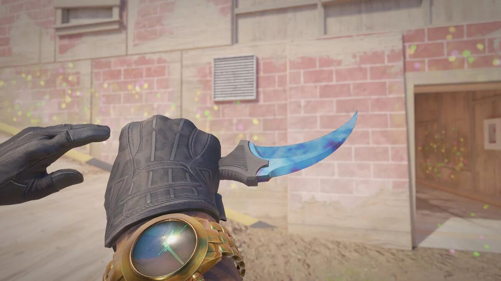
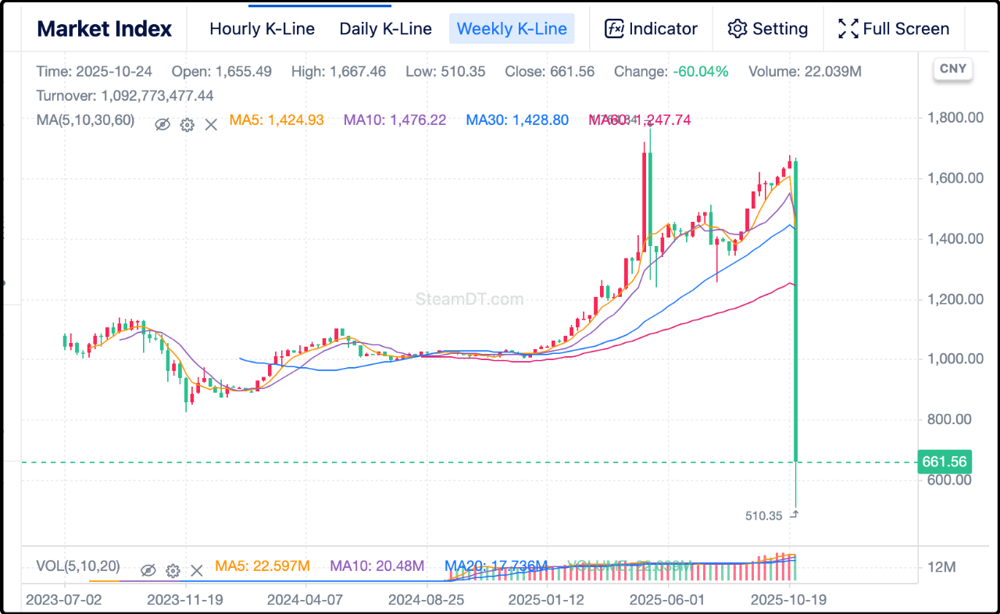

肯定说的不是a股，今天a股借着外围利好高开高走，涨势喜人，这个周日晚上再说。今天带你们吃瓜的是游戏圈最近发生的事，V社修改了饰品兑换模型，导致饰品市场2天暴跌60%，年轻小登惨遭血洗，一片鬼哭狼嚎。

CS，反恐精英，这游戏你们就算没玩过起码也听过吧，25年过去了，历经多个版本迭代，目前依然是全球最火的射击游戏，每天在线150万人左右，我每天晚上下钟了都会找大学的哥们一起玩几局。

这游戏有自带附属商品，就是各类武器皮肤，手套、刀、枪械之类的，通过付费开盲盒获得，根据稀有程度分7个等级，最高级是金色饰品，有专门的二级市场交易流通。

金色饰品不便宜的，几百几千几万都有，个别稀有饰品甚至几十万，几百万，最贵单品交易峰值记录是蓝宝石爪子刀，150万美元，不开玩笑，一个饰品一套房。就是下图：

你们多半会懵逼，这刀有什么特殊功能吗？

没有，除了样子很特殊很好看，其它功能数值和普通刀具一模一样。当然有一个隐藏功能，就是你在游戏里掏出这把刀，你的队友、你的对手就知道你是个有钱逼。

我哥们也有一把普通爪子刀，不算贵，二手市场行价8000人民币出头，每次和路人组队时经常会有小孩上来搭讪：“哥，发把刀玩玩呗。”可以把刀借给队友玩，暂时的，解解馋，死一次就没了。

很多玩cs的小孩省吃俭用存钱，就为了买一把几千块的刀，因为对他们来说这是很重要的社交资产。如果你还理解不了，想想女人的包，男人的表，还有今年刚火起来的labubu，一样的道理。

cs饰品有一个很成熟的二级市场，官方和三方平台都支持买卖，饰品总市值在80-100亿美元，有专门跟踪统计的数据k线（steamDT），前几天最高到过1650点，结果最近两天暴杀660点，回撤60%。

暴跌的具体原因，是开发cs的公司宣布5个次一级的红色饰品，可以合成1个金色饰品。

原先金色饰品只能小概率开盲盒出，以后可以从次级饰品合成，供给量暴增，于是先前的价格体系直接崩盘。昨天跌44%，今天再跌30%，几十亿美元的市值蒸发。

cs玩家圈遍地哀嚎，那些自用的跌一半还能承受，更要命的是看到过去几年饰品涨的好，就投资买入囤货当理财的人，这一波直接被打断狗腿，有大学生网贷几十万囤货，这一把亏到自闭。

这是属于小登们的黑天鹅，a股腰斩要几年，cs饰品腰斩只要48小时，刺激。

之前评论席互动的时候也有人问我考不考虑囤cs饰品理财，我说不考虑，当时就想到了中心化产品有规则调整的风险，游戏公司原则上没有义务保障饰品的价格只涨不跌，一旦营收有压力，就很可能通过增发来刺激销售，代价就是稀释原有饰品的价值。

大仓位买这类虚拟资产，就是把自己的身家财富放到别人的枪口，富贵荣辱只在别人的一念之间。我不排斥自己买一把刀消费娱乐，但投资或者投机是不可能的。

最好的投资品是去中心化+标准化+流动性充沛+易于保存，举例的话就是黄金、白银、币，其它像钻石、翡翠都差点意思。

……

最后我想翻过来说一个以前讨论过的话题，关于父母会不会把资产平分给自己的孩子。

我当时随口回答无论男女，无论亲疏，我的财产都会平分给孩子。本来我觉得这么做没问题，结果后来有个读者的留言改变了我的想法，他说我之所以这么轻松的做决定，是因为我比较有钱，无论孩子本身是否优秀，我留给他们的钱都可以过上体面的生活。

他让我假设如果我就是个普通的城市工薪族，辛辛苦苦养大两个孩子，家里只是略有薄财，这个时候如果两个孩子，一个很优秀，年收入50-80万，日子过的游刃有余，另一个就普通人，年收入10万左右，日子过的也是磕磕绊绊。我还会坚持一人一半去分钱吗？

说实话我当时就被问住了，因为我稍微代入了一下，第一反应就是不会端水平分，我会倾斜帮扶那个比较弱的孩子，不然心里会有些难受。

再多想一层，如果我的两个孩子是一男一女，家里经济条件依然很紧张，等到男孩女孩都要结婚成家了，我作为父母可能也会倾向于给男孩多一些，因为这个社会的主流价值观是男方要在婚姻中承担主要经济压力。父母不帮衬的话，只靠男孩自己结婚很难。女儿的嫁妆会尽力而为，让她嫁过去不被夫家看不起。

唉，想的多了整个人都有些沮丧和挫败，说真的要是经济条件紧张的话还生屁二胎，我要是没挣到钱的话就大崽了，不会有阿弟，夫妻倾尽全力养育好一个孩子就谢谢了，别没苦硬吃。

还是得多挣钱，有钱了生活里大部分的烦恼都会消失，祝大家尽快发财。
就这些吧，周末愉快。

