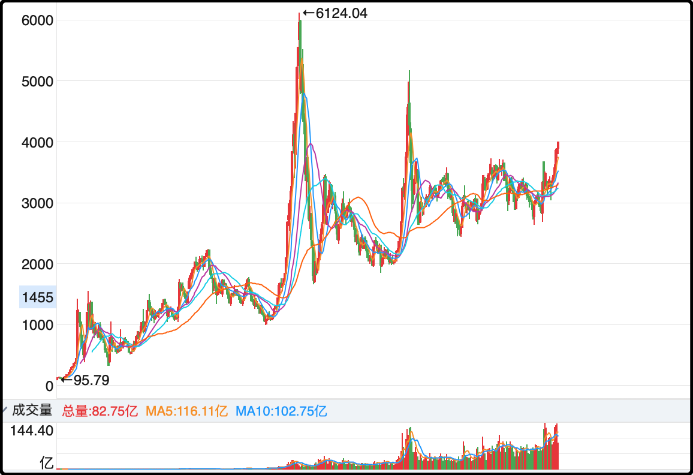

今天上证最高点3999.07，距离4000点仅一步之遥，愣着干嘛，快发到群里，找人帮我砍一刀。

之前很多年每次聊到4000点都带点许愿性质，没想现在已是触手可及。很多人因为2007年的牛市到过6124点，潜意识里面觉得4000点也不过如此，就连央媒10年前也说过4000点只是牛市起点，但事实上a股30多年的时间里，站上4000点的天数很少。

2007年那波行情175天，2015年那波行情62天，加起来也不过237天，凑不出一个完整年。如果明天冲上去了，就是上证指数历史上第三个自然年达成4000+，这么一想是不是觉得自己很幸运，毫无疑问，现在就是a股历史上屈指可数的好光景。

只是这第三次上4000点和前两次普涨的牛市不同，这次是贫富差距悬殊的结构性行情，有些板块年内涨幅接近翻倍，有些板块今年还是绿的。扩容到5000多支股票的a股就像已经开枝散叶五六代的大家族，底下的晚辈们彼此都已经不熟悉，过的好的，过的坏的也已经天差地别。

也正是因为这一轮行情的冷热不均，导致股民们的情绪一直没有起来，百度指数和微信指数的关键词“牛市”，热度至今都不如2024年9月底那波行情的一半，尽管指数已经超过去年的最高点了。

这是一个有意思的现象，a股似乎已经找到了办法，如何在不引起公众沸腾的情况下，悄么么的向上涨，这样虽然失去了以前的爆发性，但却换来了以前没有的耐久性。

明天a股可能就是4开头了，到时候新股民就不用再听老股民的经验了，因为他们也没几个在4000点以上挣过钱

……

今天官方竟然“带货”了可控核聚变概念，中午休息那会外交部发言人毛宁称中国的人造太阳预计2027年竣工，届时有望成为人类历史上首个实现核聚变发电的装置。

之前就有读者问过核裂变发电和核聚变发电有什么区别，总结起来有4个优势：
更环保，没有碳排放，也不像核裂变那样产生核废料。
燃料更丰富，核聚变的氘和氚来源广泛（如海水），储量巨大。不像核裂变的燃料那么稀缺。
更高效，能量输出效率高于核裂变发电。
更安全，没有核裂变的熔毁风险，核反应可快速中止。

人类其实很早就掌握了核聚变的技术，1952年美国就试爆了首个氢弹，氢弹就是核聚变。但像氢弹那种核聚变只能当作武器，想要捕获和利用这种能量，前提是让核聚变可控。一旦掌握了可控核聚变，人类文明就将整体进入下一个维度。

现在外交部出来宣布这件事，以中国人谨慎的行事风格，多半是对项目的进展有把握，届时可以弄出可控的核聚变装置来尝试发电。但要注意这并不意味着可控核聚变就被人类攻克了，因为这还涉及能量产效比，简单说现有的可控核聚变装置，你要用它发1000度的电，投入和维持运转的能量都不止1000度电，账面是净亏的，还需要很多年的技术迭代。

不过对a股的概念炒作来说这不重要，现在行情好，只要是有利叙事都会被放大。可控核聚变概念今年已经涨了76%，主要是给发电装置生产设备的企业，这其实也不算离谱，a股很多企业都给300倍以上的市盈率，我觉得人类300年之内肯定能掌握可控核聚变的。

……

1、现货黄金价格继续回调，刚我看了一眼是4030，基本可以确认这一波主升浪结束了，确实是在4500之前受挫调整。这一次月k线的乖离率比4月份那一波还要大，所以要么是更深幅度的调整，跌到3800附近，要么是更长时间的调整，横向震荡2-3个月，有足够的时间给想上车的人慢慢考虑。基本上机构还是看好明年，目标价都在5000美金左右。

2、国家税务总局，已有超过6500家平台企业报送相关涉税信息。话说这几天很多小红书平台上的商家都收到了税局的短信，内容是他们增值税报少了，和平台上报的金额不符，要求他们修正申报错误，否则会产生滞纳金并支付高额利息。我已经看到六七个博主吐槽说自己被平台坑了，以后电商行业就不要再搞刷单和数据虚报了，不然税局电话打过来都是麻烦。

3、央行恢复公开市场国债操作，目前10年起国债收益率报1.82%，你们看这就是眼下中国公允的无风险收益率。以后别老问我5%的稳健理财在哪里，现在想要稳健就不到2%，嫌少你可以来炒股。

4、这个周末有台湾光复80周年，就是二战结束后从日本手里收复台湾，今天央媒开始宣传统一台湾后有7大好处，经济、能源供应、基础建设、安全保障、外交、民生福祉、精神文化，都会比现在更好，然后福建板块就在a股被炒起来了。

另外最近还会推出一部电影《澎湖海战》，预告是统一台湾，势不可挡。你们别误会，这个澎湖海战是讲康熙时期清朝水军收复郑氏台湾，这片子太会卡时机了，只要内容拍的别拉胯票房应该有加成。我隐隐感觉时间表在加快了，不会一直满足于维持现状的。

今天就这些，哦对了，大盘成交量反弹到2.3万亿，一切又回到了正轨。发射发射～！

Q：深证ETF，15%。 创业板ETF，15%。证券ETF，15%。中证500ETF，15%。  纳指ETF，30%
黄金ETF，10%

你意下如何？
A：证券etf不要，换掉，证券板块不说这次牛市表现不佳，它的长期回报率也一般，换标普，或者红利。

Q：黄金又跌 如果到3850附近你还会再加吗？对黄金后续你有信心吗
A：如果跌到3800我会再加一些仓位，我确实蛮有信心长期持有的，未来的不确定性很多，增加一些黄金仓位心里踏实。