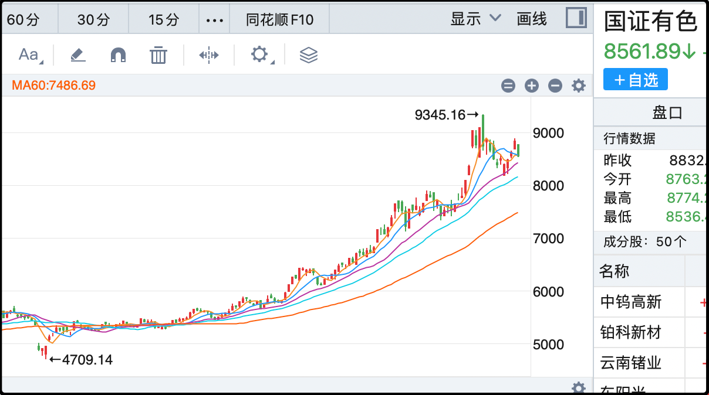

今天刷抖音的时候刷到一部短剧的广告，估计是算法知道我平时会看翡翠赌石的内容，就给我推了一部和翡翠赌石有关的短剧，男主师从大佬，具备观石断玉的能力。

我被拿捏了，停下来看了一集，后面要我下载才能继续看，我一脸不屑，划走。接下来抖音不耐其烦的给我连续推送这部短剧广告，一而再再而三的拿捏我，堪称赛博版本的三顾茅庐，于是我下载了。

app广告没骗人，里面确实能免费看，没有广告，并且我每看30秒就会弹出提示说又挣了0.2元，还没看几集我已经挣了5元。提示说可以取现，我半信半疑点了提取，好家伙，银行账户真收到钱了。

这一套组合拳真厉害，爽剧下饵诱你下载，点进去爽看同时还挣钱，对于一些收入低，有大量无聊时间需要打发的人来说，这样的产品根本毫无抵抗力，估计还会给身边的人推荐下载，一起看爽剧一起挣钱。

我很好奇这样的平台怎么挣钱，去搜了一下，答案是该app收入90-95%来自于广告。新注册的用户有新手保护期，随便看，零广告，但等你看多了，上瘾了，看热门剧集就要看广告解锁。目前爽剧平台有近2亿活跃用户，每个用户每个月看广告贡献约1.5～2元，平台年收入预估在50亿以上。

用户获得了奶头乐，打发了时间，获得了快乐，还领了点小钱，平台获得了流量，赚取了广告收益，同时还给大量不入流的边缘艺人提供了就业，这样看是一门好生意呀。

就是生产的内容真的很粗糙，之前遇到过年轻女艺人，说实在找不到工作就会去演短剧，这差不多是她们行业鄙视链的最底层，她们也知道拍这玩意上不了台面，是无奈的保底。

我看了几集就戒断了，除了一开始抛出的悬念吸引人，后面的剧情内容比较尬，看不下去。但我也没删app，留着吧，万一以后还用的上呢。

……

今天a股盘中站上了4000点，不过下午又跌回来了，这不是问题，目前趋势良好，k线形态健康，重新站上4000点是大概率的。两市成交2.15万亿，比昨天少了1000多亿，市场中位数-0.16%，整体风格微微向小盘股倾斜。

今天两市涨最好的是海峡概念，因为新华社又发了一篇文章《祖国必然统一势不可挡》，是继昨天之后央媒继续在台海问题上发声，这让市场猜测统一的进程可能要加速。福建板块今天18个涨停，另外嗅到机会的军工板块也有资金涌入炒作，军工装备指数上涨2.8%，是除福建板块之外表现最好的概念。

这件事我没啥可评的，我们普通老百姓在时代浪潮前没有选择，只能随波逐流，如果顺应时势的同时能再让自己挣点钱就更好了。

今天吊车尾的是黄金和有色板块，金价继续调整，今天最低一度击穿了3900，我写文章这会已经反弹至3930。我国庆节前在3850加过一次仓，如果这次再跌到3800附近我还会再买一点。上一次买了6万刀，这次大概也计划买这么多，我不能说这占家庭财富的比例是多少，反正仓位是不重的。

我预定的理想状态是黄金占家庭资产的5-7%，前几年一直没买足仓位，这次有回调我就补一些。虽然这个位置的黄金绝对不便宜，但考虑到未来5-10年会有诸多不确定性，比如上面提到的“势不可挡”，以及美债的堰塞湖，增持黄金可以起到对冲风险的作用。

有色今天也遭遇了回调，但接下来美元就会降息，北京时间10月30日凌晨2点的会议，降息0.25%概率98%。另外12月份预期降息0.25%，以及2026年预期降息0.75-1%，大宗商品的行情不太可能就在这个位置止步，后市还能再看看。

……

1、伯克希尔很罕见的被分析师给出了卖出评级。给出评级的是KBW的Shields，他是资深保险分析师，覆盖伯克希尔超10年，在行业内有一定的影响力，因此他的发声被彭博社关注报道。他怀疑巴菲特退休后继任者不一定能做好，同时伯克希尔的保险业务也有下滑的趋势，他把伯克希尔的目标价从74万下调到70万。目前伯克希尔的股价是72万，比历史最高价81.9万回撤了11%。

伯克希尔也是我美股的重仓股，我目前没有卖出的打算。你们别误会，我买的不是a股，a股太贵了我也买不起几股，我买的是伯克希尔b股，483美元一股，很亲民。

2、飞天茅台批发价首次跌破1700，之前夜报里说跌破1700的是散装价格。茅台是这样的，整箱包装的比散装的要贵，因为整箱包装有出货单，更保真。很多人整箱整箱的买，不喝，拿回去囤酒。茅台不喜欢这样，他们希望把酒拆散卖掉，大家喝掉，所以之前有一个开箱令，就是批发商拿到整箱后必须拆箱。我觉得目前茅台的价格还会跌，散装很快就跌破1600了，1500见。

3、吉比特三季度营收增长129%，利润增长307%，主要是仗剑传说（大陆版）这个游戏卖的很好，贡献了主要增长的利润。国内游戏厂商都注重手游，开发了就是要赚钱，至于品质不太关注。你们别看我玩了快40年的游戏，玩国产游戏的时间不到5%，我steam唯一一个内购的国产游戏是黑神话。

4、st绝味前三季度利润下滑36%，鸭脖卖不动了；爱美客前三季度利润下滑31%，医美也不行，消费行业今年也就这样了。

5、赣锋锂业第三季度营收增长44%，利润增长364%，锂矿真的周期拐点了，后面就看光伏了。

6、阳光电源前三季度利润119亿，增长56%，它虽然是光伏行业，但是比较特殊的逆变器赛道，日子比那些做面板的难兄难弟强太多了。

今晚就这些，发射～

