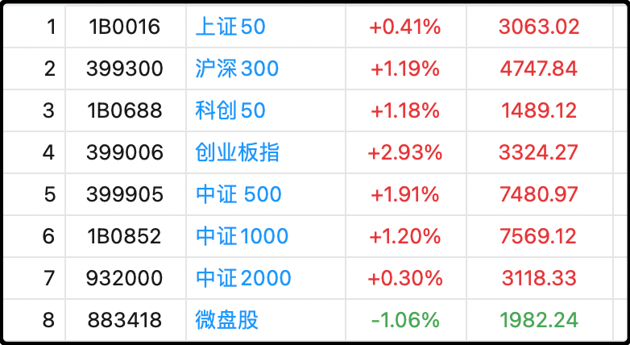
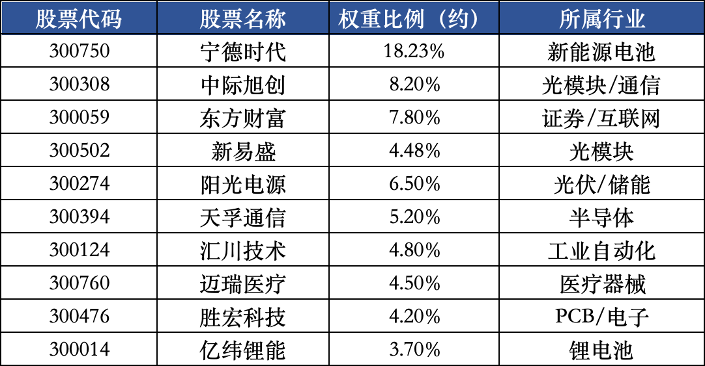

今天指数涨麻了，但两市的中位数今天还是跌的，-0.05%。

有人可能会说这是资金故意去拉升指数里含权重高的股票，导致涨指数不涨个股。我跟你说还真不是，因果讲反了。

我们随便举个例子，今天涨最多的创业板指，我列一下它的前十大权重股列表。像宁德时代、中际旭创、东财、新易盛、阳光电源、天孚通信，都不是天生的权重股。事实上早期创业板指的权重股是乐视网、温氏股份、碧水源、蓝色光标这些，经过了这些年的优胜劣汰，才换血出了今天大家看到的这一批。

像宁德时代2018年ipo的时候市值是550亿，上市后7年涨了30倍才成为创业板一哥；中际旭创2012年上市的时候市值只有40亿，这些年涨了140多倍才荣升二当家。后面几个也差不多类似的情况，股市马太效应很明显。

所以不是资金故意去买权重股，而是资金这几年热捧的明星股因为涨太多，涨成了权重股，顺带推动了指数的上涨。

很多人今年抱怨跑不赢指数，本质上还是交易习惯的差异。指数是典型的去弱留强，每个季度都换淘汰末尾的公司，换入处于上升势头的公司，而成分股里那些涨势凶猛的明星股，不但不会减仓止盈，还会不断增加权重。用一句话概括就是截断亏损，让利润奔跑。

散户如果觉得这一套交易模式很别扭，自己改不过来，最简单的办法就是投资指数etf，那些你自己不敢买更不敢持有的股票，整合包装到etf里，你看不到就不害怕了。

……

今天储能概念爆了，诱因是机构数据称今年1-9月的国内储能项目招标新增255.8GWh，同比增长97.7%，全年招标或可达361.6GWh。

我前段时间去敦煌旅游的时候给你们拍摄过当地巨大的光伏基地，一眼望不到边的光伏面板铺设在西北戈壁滩上，甚为壮观。当时我给你们算了各类储能技术的经济账，其中锂电池2023年每度电储能成本还高达1.8元，但随着规模化扩产和技术迭代，2024年就降到1.2元，到了2025年已经降到0.7-0.8元。

虽然依旧比火力发电的0.3-0.35贵一倍，但作为太阳能和风电的波峰波谷储能调节，综合计算成本已经具备一定价值。

今年项目增速翻倍，意味着储能行业在中国的发展开始提速，未来几年都会是景气周期，届时像光伏面板过剩，锂电池过剩的问题都会迎刃而解，因为巨大的储能需求会吃下这些产能。

昨晚写赣锋锂业三季报超预期的那一段，我还提了一嘴，说下一个就看光伏了，结果今天这两联动上了，锂矿大涨4.2%，光伏大涨4.3%。

我现在回头看去年高盛那篇研报真挺有水平的，当时就说了锂矿和光伏是过剩的行业里最先走出拐点的，结果今年二季度锂矿翻身了，光伏稍微晚几个月，日子也好起来了。另外那篇研报里还说了电动车市场虽然需求增速快，但是产能增速更快，所以发展来看也会有过剩的问题，这个判断现如今也应验了。

研报中文标题是《变革中的中国：聚焦产能周期—面对不均衡、判断转折点、穿越长周期》，英文标题是《China in Transition: China's capacity - the imbalances, the inflections, and beyond cycles》，你们感兴趣的可以让ai搜索总结。

……

1、今天有色也爆了，国证有色反弹4.44%，北京时间周四凌晨2点美联储极大概率会降息，今年剩下两个月还会降一次，明年会降3-4次，美元宽松周期里大宗商品的表现通常是不会差的。

2、贵州茅台公布了3季报，比较拉垮，收入增长0.56%，利润增长0.48%，勉强没有下滑，但几乎也不增长了。就这已经是白酒行业最好的表现了，底下的二三线白酒跌20%以内就算优秀。消费今年是指望不上了，我还是之前的观点，可能需要等房价企稳了才能跟着消费回暖，看明年了。

3、新易盛第三季度营收同比增长152%，环比-5%，利润同比增长205%，环比+0.63%，别看数字很炸裂，其实还是低于市场预期的，分析原因是部分收入在财报上没有确认。不过机构大都看好四季度能重新提升增速，看明天市场咋给价了。

4、美的集团第三季度营收增长10%，利润增长9%，家电行业没有国补能有这个表现很不错了，美的的亮点是机器人和自动化的业务收入持续提升，弥补了消费的不足。

5、中金黄金前三季度利润+39%，山东黄金前三季度+92%，这个没啥好说的，别瞎搞今年不爆赚都很难。

6、保险业协会，当前普通型人身保险产品预定利率研究值为1.9%。这话的意思就是保险公司在精算定价时假设的未来资金增值率就是每年1.9%，基于这个收益率，计算保费和保额。现在买保险产品肯定远没有前几年的划算，前几年买的保单本质上都赚了。

7、道琼斯工业指数、标普500指数，纳斯达克指数，都刷新了历史新高。qqq和spy的k线太恐高了，不能多看，看多了手就想犯贱。

就这些吧，发射发射，今年真的一路发射一路涨，这词好彩头。

