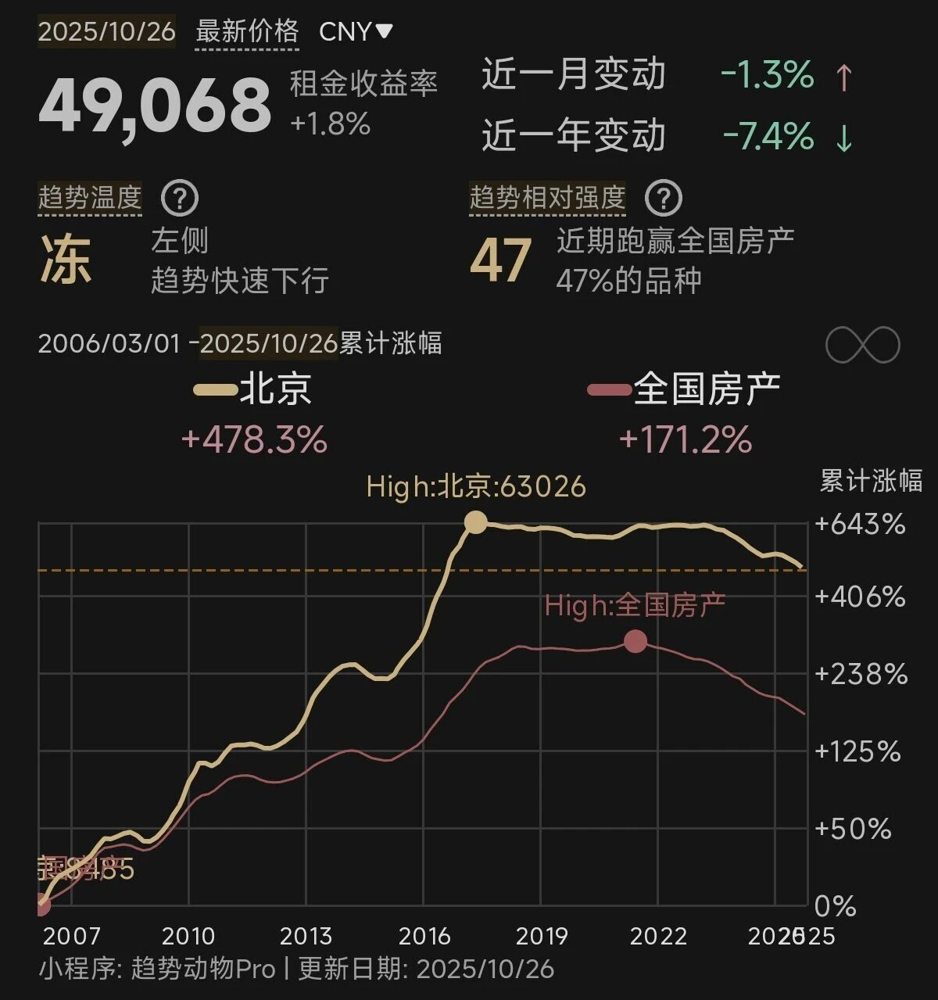

最近不知道咋滴，看短视频的时候接连刷到卖房子的内容，我也妹说自己想买房啊...?

抱着好奇的心态看了几个，都是北京的，2017-2022那几年买的，北京的情况和外地的不太一样，它2017年2月就见顶了，官方出台了史上最严的政策打压，之后差不多横盘了6年，没怎么涨。大概是从2023年6月开始跌，从高点回撤了20%，这是政府官方统计的数据，实际个例我观察大部分回撤30%以上。

所以只要是2017年2月-2023年6月买的，那都在高位，账面亏25-35%是常态。这些房东之所以找自媒体博主拍视频，不想用肯定是实在不好卖，希望增加流量曝光，卖个好价格，或者尽快成交。

让我印象深刻的是中间讲价环节，每一个女房东讲着讲着就开始抹眼泪，全家老小平时辛辛苦苦工作，省吃俭用，结果房子这里一亏就亏100-200万，说是老人难以接受，其实夫妻两也是心碎了一地。

视频里房东的报价都自称是小区里比较低的，但即便如此依然卖不出去，有一个挂了快两年，挂牌价下调了130万，房东说完后一脸痛苦面具。可即便如此短视频博主依然建议他们根据市场行情下调价格，因为眼下的趋势不主动让利是没人买的，买家需要一定的折价安全垫才敢出手，上个月的成交价拿到这个月就不能参考了。

这种视频没房的看了觉得解压，有房的看了心如刀割。其实北京市政府已经做的很好了，你们看2017-2023那个上涨波峰愣是用政策给它削平了，让那6年里买入的人少亏了一大笔钱。只是那几年行情太疯狂，高首付高利率也无法劝退恐慌上车的老百姓。一套房掏空6个钱包，赌的太大，导致很多人输不起。

希望这种时代性的全民重注博弈以后都不要再发生了，一个家庭通过一笔交易从另一个家庭那里转移几百万财富的事情，真的造孽。

……

今天全市场的焦点肯定都在中美的会谈上，综合国内媒体报道的信息，这次谈判的结果有：
美国继续暂缓24%关税一年。
美国取消芬太尼税10%。
美国暂停实施对华海事、物流和造船业的301调查措施一年
美国暂停实施​​9月29日公布的“出口管制50%穿透性规则”一年

国内媒体报道谈判成果比较具体，其它没细说，这个美国那边也是一样的，前几天我写了他们对美国媒体介绍了对中国的谈判成果，所以你们把两边的报道拼凑一下就知道整个谈判的结果。

简单总结就是这次协议达到了短期缓和的效果，双方罢兵休战一年，但没有解决核心矛盾和分歧。未来这一年里双方回去后肯定会努力补强自己的软肋和短板，积极准备下一个回合。至于下一回合随时开启，不一定非要等一年后的。

总的来说略微低于预期，所以资本市场的反馈比较冷淡。

……

1、万科a前三季度净亏损280亿，营业收入下降27%，继续向深圳地铁借款22亿元，利息一如既往的优惠。所以就算辛杰不在了，深铁对万科的支持不会动摇，毕竟投入太多了，加上这一笔22亿沉没成本累计快1000亿了，这怎么可能割肉。

2、五粮液拉了一泡大的，第三季度营收下降52%，利润下降65%，不演了，直接给股东上强度。相比之下另外两个二线白酒的业绩要好一些，汾酒第三季度营收增长4%，利润下滑1%，泸州老窖第三季度营收下降9.8%，利润下降13%，这都是正常发挥。毕竟连茅台都不增长了，底下小弟只会混的更惨。
酒鬼酒第三季度营收增长0.78%，亏损1876万；洋河第三季度营收下降29%，亏损3.7亿，这两不是利润下滑，已经实打实的亏钱了。

3、比亚迪第三季度营收下降3%，利润下降32%，前三季度累计营收增长12.75%，利润下滑7.55%。这个业绩也很挣扎，高速增不会有了，二季度那波价格战后比亚迪的业绩就萎靡不振，我猜是高层反内卷的态度传达下来，迪子也开始在自己的产业链上降杠杆。新能源车行业目前也有产能过剩的问题，而且是刚刚爆发，未来1-2年内都需要时间去消化。机构已经陆续从比亚迪这里撤退，本季度散户股东人数从32万涨到了64万，他们接下了抛售的筹码。

4、好几个券商今晚也发布了业绩，我就不一个一个列了，都挺好的，普涨40-70%，但气人的是证券板块就是不涨。证券指数今年累计上涨7%，这个涨幅纯恶心人，现在有很多人都在怀疑金融板块滞涨是官方故意在控节奏，这不一定是事实，但可以缓解股民们的愤懑。

5、中际旭创第三季度营收增长56.8%，利润增长125%，涨了140倍的科技新贵，创业板二当家，这个业绩符合预期，q4环比有望提速，给2026年的备料高于预期，说明公司对明年的判断比较乐观。

6、长江电力第三季度营收下降7.8%，利润下降9.2%。今年水量下降，发电量低于预期，股价最近表现也不好，不过三峡集团获得了增持贷款72亿，打算用来回购股票，目前已经卖了25亿。

7、隆基绿能第三季度营收下降10%，亏损8.34亿，环比亏损收窄了。光伏行业已经逐渐走出低谷，这个时候业绩不看绝对金额看趋势。

8、中国中免第三季度营收下降0.38%，利润下降29%，消费板块就没好的。

9、牧原股份第三季度营收下降11.5%，利润下降56%，猪周期这次的底部折腾好几年了，不是v，也不是w，是L_______底我了个豆。

10、立讯精密第三季度营收+31%，利润+32.5%，相当稳健。

本来还想等格力的季报看看有没有刺激的，结果一直拖着就是不发，上学时的经验，一般作业拖着不交，赖到最后一刻的通常不是好学生。就这么着吧，大盘今天调整，问题不大，现在这种程度的波动应该都适应了。

发射发射～

