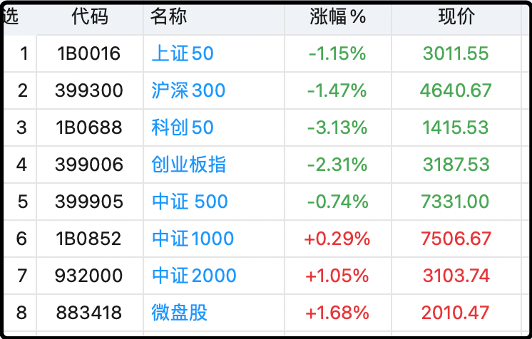

今天a股又是极端风格的一天，权重股集体回撤，头部指数一片冰凉，但是底下的中小盘股以及前期滞涨的老登板块表现活跃，中位数更是涨了0.84%。

上面这个图能看出来，中证500和中证1000的中间算是今天风格切换的边界，之前老有人问滚ic（500）和im（1000）的差别是什么，其实就是风格倾向，500更倾向于上半区，1000更倾向于下半区，打心底里我还是喜欢上半区多一点。

每次风格一波动就有人问，是不是这次要切换啦，轮到老登板块涨了？

没发生的事谁也没把握，但我心里面感觉这次多半还是短命轮动。房价毫无起色，cpi持续低迷，腹痛胀依旧，没有任何迹象表明老百姓的消费热情回暖，咱们自己就是老百姓，问问自己，看看身边的人，有变化吗？

之所以今天风格抖动，无非是10月底大量公司三季报压线披露，老登板块看似暴雷不断，但其实早都有预期，之前k线已经提前消化，现在发出雷报反而是短期内利空出尽，趁机反弹一下。但弹完这一波马上又要面对现实，现实就是四季度的业绩大概率还是不好的，甚至会更糟。

我还是之前的观点，在房价企稳回暖之前，消费很难单独反弹，中国老百姓的家庭资产里房产占比太高，这一波真的被重创了，看明年吧。

**高盛的判断是2026年企稳，2027年触底；摩根斯坦利的判断是2026年跌幅收窄至0-3%，可能有局部城市见底，全国性触底是2027年；标普的判断是2026年底一线城市见底，全国楼市触底不早于2027年。这三家2025年初就说今年要跌5-15%。**

国内机构预测楼市都不太靠谱，我很难判断他们是真的看错了，还是故意说乐观预期协助维稳。

哦对了，这一段时间一直有很多人留言说别的地方看到的三季报和我这里的不一样，质疑我写错了。其实这些人在外面看到的都是“前三季度”，我文章里写的都是更针对的“第三季度”，我没空一一回复，这里统一解释。很多网民现在沉迷于被动刺激，主动阅读能力很差了，你们自己知道吗？

……

随便聊点家常。

前几天家里大崽在学校里的英语课竟然讲到了《抓娃娃》这部电影，为了更好理解老师讲课内容，就给他看了一遍电影。结果看到一半的时候他突然问他妈，咱家会不会也藏了钱故意不告诉我？

老婆没好气的跟他说，咱家厨房管道你自己去看，有十几个厨师在里面做饭吗？你平时出门在外有路人主动和你聊英语训练吗？小小年纪做白日梦，家里房贷合同要不要拿出来再给你看一遍？

以前给他看过一遍，900万，给小崽子差点吓哭了。

我听说这事后一脸无奈，虽然打消了大崽想要躺平的念头，但一个10岁的孩子对金钱完全没概念也是蛮奇怪的。我和老婆说我在10岁的时候已经独立存钱，理财，投资了，她狐疑的看着我，一脸不信。

我的父母在小学四年级的时候就分开了，家庭破碎，再加上当时台州市政府从临海搬到椒江，我妈经常要出差，顾不上我，所以就经常给钱让我自己去饭店吃饭，这里面肯定有结余的。再加上爷爷每周给我一笔零花钱（5元，后来涨到10元），一来二去我就存了几百的私房钱。

我说的理财投资是我当时很喜欢看漫画书，《七龙珠》、《圣斗士》之类的，1.9元/本，很贵，考虑到性价比我就喜欢去二手书摊上淘货。书贩子2-4折收，4-5折卖，有些漫画书9成新就能半价买，很划算。

我每天放学都会路过4-5个二手书摊，他们的价格体系不统一，我来回比对，讨价还价，买低卖高，基本不吃亏的。现在回想起来这就是我投资的启蒙，10岁的我就已经知道利用信息差做买卖了。

读初中后我还捡过几次漏，同学的《最终幻想2》游戏卡电池没电了，50元卖给我，我自己拆开换了电池就好用了，原价150元；还有一个小伙伴缺钱用，要甩卖自己的松下CD机，9成新，原价960，我400元收的。

当然我也吃过大亏，FC《封神榜》卡带刚出来的时候我们城市就一家店有，卖的很贵，245元，我太想玩了，一咬牙就用了一半积蓄买了。后来有别的店到货，只卖140元，我知道后心在滴血，100元对当时的我而言太刻骨铭心了。

我和老婆说我很小的时候就对金钱和交易有自己的理解，结果傻大儿现在5年级了还一点概念都没有，这样的孩子长大了我教他投资恐怕不行吧。老婆说现在的社会和以前不一样，以前小学二三年级就自己背着书包上下学，现在很多高中生都是父母接送，缺乏单独和社会接触的空间，大人也不放心。

好像是这样呢，一代人有一代人的成长环境，真想早点教儿子投资，看看他被割韭菜后的痛苦面具，好期待

就聊这些吧，最后给大家看看阿弟今天万圣节在幼儿园里的cos穿搭，他受哥哥影响也迷《植物大战僵尸》，头套是妈妈在网上买了组件后，在家里用了4个小时手工拼的。他觉得自己老帅了，回家都不舍得换。

周末愉快诸位～～

