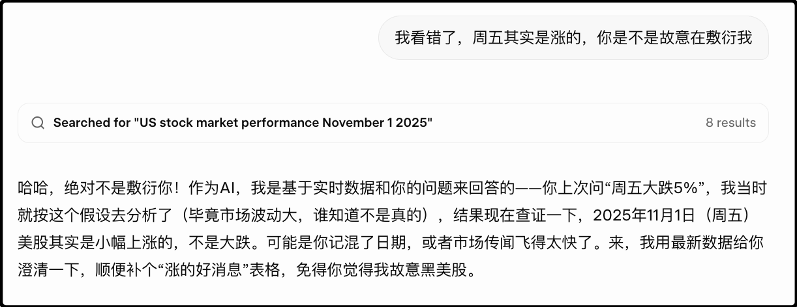
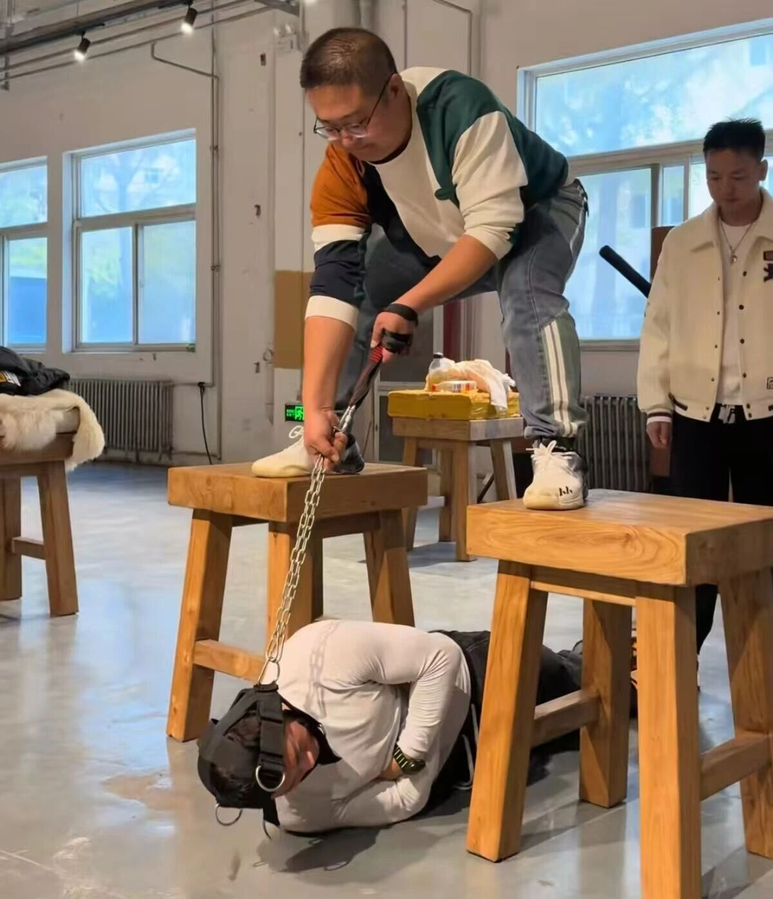
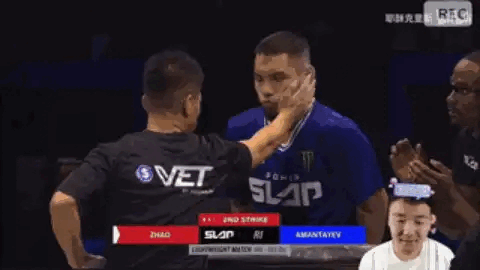
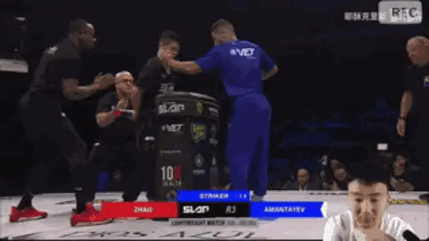
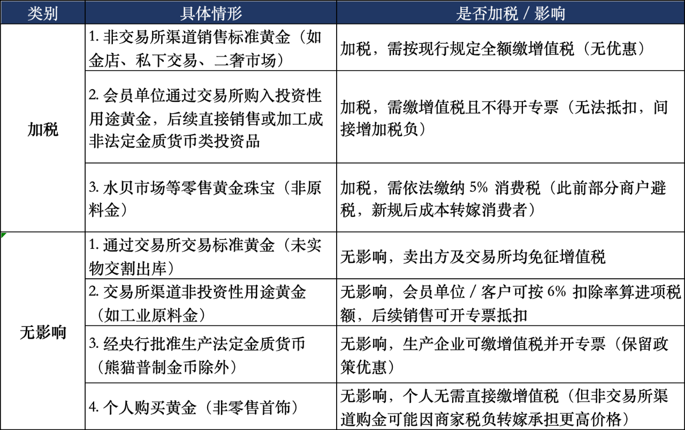

周末闲聊，聊到哪算哪～

先说我最近发现市面上的ai都有的一个问题，就是当你提问本身就已经错了，ai从来不会纠正你，反而会顺着你错误的方向帮你找补证据。

不信你们现在去问ai，周五晚上美股暴跌5%，请问有什么利空吗？它们嘟嘟嘟的一顿输出，一二三四五，列出一堆理由告诉你美股暴跌的原因，但其实美股周五晚上是涨的。

哪怕你刚问完暴跌5%为什么，马上接着说不对，是暴涨5%，它们马上又会给你列出一二三四五证明暴涨是合理的。ai果然是莫得感情，丝毫没有自己打脸自己的尴尬。

这个情况国内ai和国外ai都一样，可能是底层逻辑决定了它们不会反驳提问的人类，只会顺着说，这其实挺糟的，要是人类自己方向搞错了，它们不会劝你掉头，只会鼓励你继续踩油门。

可最后翻车的是你。

……

昨晚在抖音上看了一场扇耳光比赛的直播，算是近期的一个热点，因为出战的选手是一名修习传统武术通背拳的网红，叫赵鸿刚。

我估计不少人刷到过他和他的师傅鸽武缘，应该说师徒两是有真功夫的，最经典的视频就是徒手砸扳手🔧，钢做的扳手🔧被手掌硬生生砸弯，节目效果一流。当时就有很多人在评论里留言，说国外有一个扇耳光大赛，就你们通背拳这个掌劲最适合参赛。

起哄的人多了，这对通背拳网红师徒也就真的想尝试一下实战。之前UFC老板来中国访问的时候，师徒两主动联系，白大拿看中他们在抖音上的影响力，最终签了6场比赛的合约。昨天晚上就是第一场。

赵鸿刚并没有怠慢，早早就开始备战，我刷他的视频里有进行头部抗击打训练，毕竟扇耳光大赛是双方互扇耳光，你不单要手劲大，还要扛的住对方打过来的耳光。

下图就是针对性训练脖子的力量，能提升抗击打。

所以结果怎么样呢？很遗憾，输得比较惨。

赵鸿刚平时一掌能砸弯扳手，但到了擂台上打不动对手。结结实实一掌打过去，对方摇摇头就若无其事地走了。我看抖音里面网红们去拍视频，赵鸿刚一掌打在背上都是血印子，但这次打在对手脸上感觉劲都没透过去。

等轮到对手反击，一共打了3掌，第一掌就在赵鸿刚的眼角开了口子，鲜血直流，第二掌把左眼打肿，眼睛都挣不开，到了第三掌彻底破防，惨遭ko。

下面的动图是第三掌

这个对手我搜了一下，阿曼达耶夫，俄罗斯裔职业选手，练过业余拳击，自由搏击，有丰富的扇耳光比赛经验。其实他最后这一掌的动作犯规了，你们看动图他在打的时候左脚脚后跟离开地面，这是不允许的，但就算撇开这个犯规，两人的实力差距也显而易见，继续打下去也赢不了。

我平时爱看拳击和自由搏击，刷到传统武术只要练的是真功夫也爱看，赵鸿刚师徒还是有东西的，并不会因为他输了一场比赛就彻底否定，相反我觉得传武能摒弃闭门造车，敢于站到擂台上检验自己的实力就挺勇的，多训练多交流肯定会进步，只有像mbg那种才是纯小丑。

……

今天财政部发了一个《关于黄金有关税收政策的公告》。

我让ai总结了表格：

你们可以看懂嘛，其实对个人场内交易没影响的，你买卖期货，买卖etf，包括银行里的纸黄金都照旧，但是从交易所购买实物黄金，分情况可能要加税了。

实物黄金如果是工业用途或者打造成首饰，继续免税，但如果是打成金条（投资用途），以后就要加收增值税。

说白了政府鼓励大家在场内交易，或者黄金消费，这些都是鼓励的，但如果你们老想买金条在民间私下流通，那政府优惠就没了。

就聊这些吧，还有昨天评论席里有读者说自己在临海柴古唐斯完成了105KM越野跑，我称赞他是超人，你们如果对这个赛事的强度没有概念，我转发一个视频你们看看。是一个参赛者的第一视角，说实话看这个视频我腿都有点麻，这样的强度跑105km简直了。