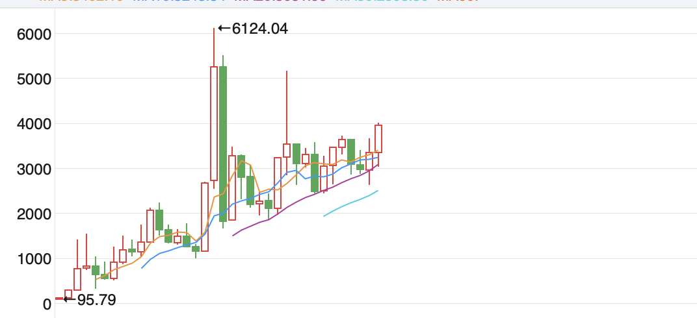

我下午刷了两部老电影的解说，都是葛优和徐帆演的，一个是92年的《大撒把》，另一个是98年的《不见不散》。剧情还挺衔接的，前一部是讲葛优送老婆出国，被老婆抛弃，徐帆送老公出国，被老公抛弃，两个国内弃子抱团取暖谈恋爱的故事。后一部是讲两个美国打拼的孤男寡女谈恋爱，虽然人物不一样，但因为演员都是葛优徐帆，很像是续集。

《大撒把》里葛优还有头发，徐帆漂亮的让我震惊，我对徐帆有印象的时候她已经上年纪，没想到年轻时貌美如花，更难得是有一股楚楚动人的气质。

这两部电影都有很强的年代感，一个是90年代的“留美潮”，当时美国就是国人心目中的天堂，有本事没本事都想去，哪怕去美国饭店里刷盘子都是香的。现在的年轻人理解不了，觉得是可耻的慕洋，但背后是巨大贫富差距的客观事实。

当时去美国刷盘子做苦工月收入有8000-12000，虽然消费也高，但极限省吃俭用能省下2/3来，而当时国内的收入普遍是400-800。葛优老婆去了美国后吃不住苦，就靠颜值变现了，不过她还挺仗义，离婚时寄了一万美元给葛优，这在1992年属实是巨款。

另一种年代感就是低信息社会。90年代上半叶没有微信，没有短信，没有手机，连座机都没有普及，两个有点熟又不算很熟的人，彼此相见只能靠偶遇，所以经常是一个错过，再见就是半年、一年后。现如今找人太方便了，微信上问一句“哪呢？嘛呢？”异地异国可以开启视频聊天，没有了以前生活里的随机和意外。

我妈小时候带我去朋友家玩，要走到对方楼下，看看窗户是否亮灯来确定有没有在家，现在回想起来这种感觉也蛮有意思。

……

周五晚上已经写过对行情的看法，今天就补充这两天发生的要闻：

1、原本以为随着中美协议的落地，安世荷兰和安世中国的问题也能迎刃而解，结果没想到荷兰方面出人意料的强硬，已经对安世中国断供，两边彻底闹僵。安世荷兰主要负责研发，以及晶圆的生产，安世中国偏下游，负责组装和出货，毕竟中国制造成本低，产能主要是在中国的。

现在荷兰那边断供晶圆，却也掐不死国内的产能，因为安世生产的晶圆不是技术含量很高的那种，中芯国际和华虹半导体可以覆盖80%的规格，目前已经启动国产替代，短期内可以把产能从50%恢复到90%。

所以我也没想到安世荷兰这次会强硬到底，他们那边觉得再让中国人搞下去技术和产能都会被掏空，从欧洲供应链安全的角度，就算政府补贴也要杠下去，否则有可能像稀土那样被拿捏。

闻泰科技的股价已经涨回来一多半了，市场觉得最后肯定能妥善解决，感觉有些过于乐观。

2、伯克希尔三季度利润308亿美元，高于市场预期，但更让人关注的是公司目前持有3816亿现金，刷新历史记录。只说数字你们没概念，还要加上比例，伯克希尔目前总资产规模（算上他们买入的非上市公司），大概是11600亿美元，所以持有现金的比例大概是30%左右。

值得关注的是由于持续的减持苹果，目前伯克希尔的第一大重仓股已经变为美国运通。有人说不明白巴菲特是咋想的，还能是咋想的，就是觉得科技板块泡沫太大了，提前避险。但不是说他一卖大盘就崩，他卖比亚迪也没有卖在最高点，卖出后股价还涨了一段。不过巴菲特对科技板块的担忧是有基础事实的，我心里面也觉得美国科技股这几年涨的太顺了，我也在想年底前要不要卖一些。

3、段永平给江西水利电力大学捐赠了1万股茅台股票，他的父母曾经在这所学校里任教。段永平之前也给江西水利电力大学捐过以父亲命名的图书光，包括这次教育专项基金也是父母命名的。捐了1万股茅台就是1500万左右市值，段永平在雪球上说每年花分红就够了，其实我也是这么想的，学校要是把这1万股给卖了，50年后这钱就毛了，但持有茅台，每年花2%的分红，50年后应该也挺可观的。

写这事是因为我也想过，如果我的孩子未来不擅长投资，我以什么样的形式把资产留给他们。肯定不能是现金，部分红利股+ETF+黄金+币的组合可能是最合理的，要有现金流，要能扛通胀，还要有保值增值的能力。

4、有一个黄金税收调整的公告，详细分析昨晚写过了，简单说对场内交易没影响，无论是期货还是etf，照旧，对场外投资性金条有影响。

5、寒武纪前核心员工梁军起诉上市公司，要求赔偿股权激励损失42.87亿元，案件已经受理立案，这个金额差不多是公司年利润的4倍。具体情况我之前在网上看到一些帖子，但没必要和你们细讲，因为都是单方面陈述，最后还是看法院怎么判，我觉得全额支持的可能性微乎其微。

就这些吧，今晚我妹妹和我说了她去参加了一个线下的脱口秀比赛，拿了前三名，几千块奖金，哈哈哈哈，她在大学时也拿过演讲比赛的冠军，口才是真的很好，怪不得当初公务员面试环节爆杀。

发射～

-------------
Q：对中国科技股有影响吗？
A：假如，我是说假如美国科技板块崩了，a股的科技板块也绝对无法幸免。这一轮ai科技的叙事就是美国兴起的，a股炒作是跟风，要是老美的盈利逻辑被证伪了，a股你不跑必被活埋。

Q：请问猫哥，定投黄金基金想作为二十年后的退休金补充储备，现在盈利19%，是需要先止盈还是不卖收益继续定投？
A：以20年后的退休储备为目标，目前的黄金绝对可以继续持有，不要卖，也不要停止定投。

Q：4000点以后会不会像以前的3000点，成为日后的锚点
A：把上证指数切换到年k线来看，发现整体上是沿着ma20上行的，就算有些年份调整，基本也兜的住。最新的ma20是3081点，以每年130-140点的速度上行，这大概是肉眼可见的底线。

Q：那位家长为啥会觉得读大学没用呢
A：有读者提醒我说他可能家里有产业要交给孩子接班，但即便是这样，我也觉得应该让孩子去读大学有益无害，一个年轻人经历大学生活可以完善社交能力，完善心智。再说了，如果家里有产业，可以花点钱让孩子读更好一些的大学，接班不着急的。如果家里没矿，那更应该读大学投资孩子教育。

Q：巴菲特不买科技股，那巴菲特持有海量现金，也不意味着他看空科技吧
A：他这几年卖的最多的就是苹果，表面理由是以后卖税更高，但我觉得他口是心非，就是觉得科技估值看不懂，卖出避险。他目前仓位最重的股票已经是美国运通了。

Q：红利股具体有哪些，哪些更有性价比要怎么查？每年的分红会不会波动比较大？毕竟分不分红是公司决定。靠ai怕错了，先请教下
A：分红稳不稳定，关键要看公司的盈利能力稳不稳定，公司盈利要是上蹿下跳，你不能指望每年如数分红。买银行股是很多人能想到的选择，茅台的分红、盈利也很稳定，但是年率只有2-3%，显著低于银行。香港的盈富基金不错，汇丰银行、港交所，都是稳定分红的。

Q：巴老头：世人老觉得我跑的早，我什么资金量，你什么资金量（）
A：我也是这么想的，这就是我不着急马上跟着抛的原因，巴菲特卖股票需要一个过程，我卖股票只要1分钟。

Q：请问下双非研究生和三年工作经验哪个更划算
A：综合看还是读研划算，因为读研是确定性增益，而三年工作经验是随机的，可能有明显提升，但也很可能在浪费时间。职场不一定都是100%向上走，多的是人浑浑噩噩，迷迷糊糊，浪费个三五年，甚至10年20年。

