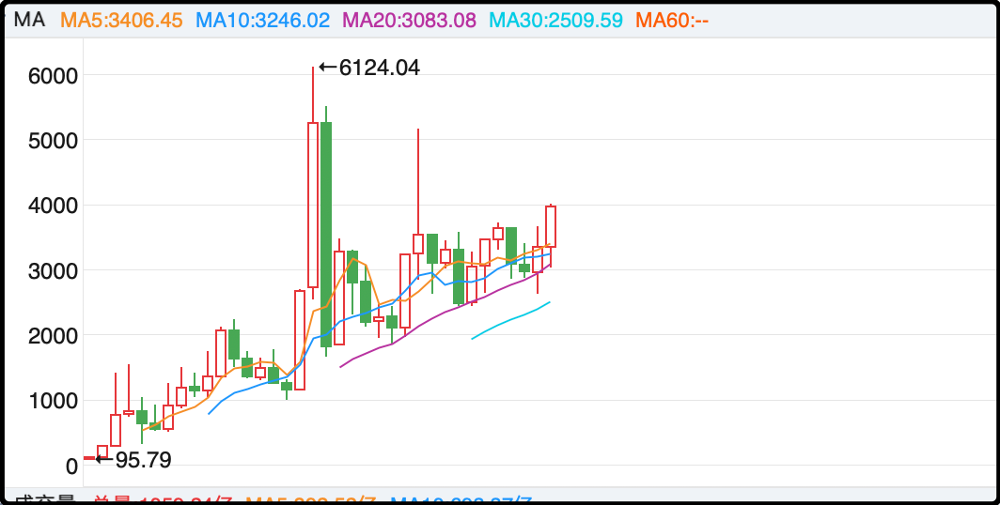
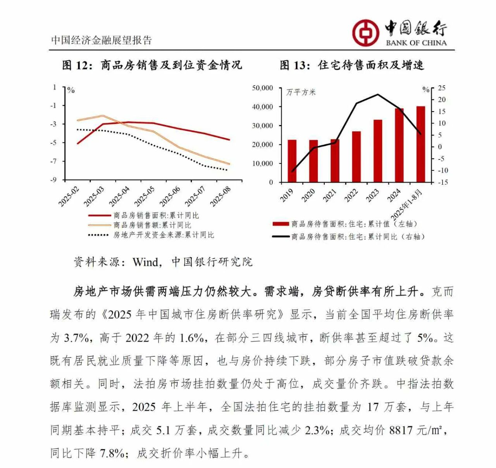

最近留言问我中年焦虑的读者越来越多，主要是失业和收入下降，另一边负债是刚性的，月供一分也不会少，一下子就导致生活压力骤增。这里就不说房价的事了，只说说职业生涯规划的问题。

我其实很早就写过一篇文章，把职业生涯拆分成5要素，按重要程度升序排列分别是体力、时间、技巧、经验、人脉。低质量的工作通常是体力+时间的比例较高，而一个有成长性的高质量工作则更多的包含了技巧、经验、人脉。

都说女怕嫁错郎，男怕入错行。这句话老话的本意还是提醒从一开始进入职场就要进行规划，尽量从事可以持续积累技巧、经验、人脉的工作，这样的你会随着时间一直在成长，建立专属于自己的竞争力门槛。

一些职场老人说年轻人不要太过在意起薪，要更专注自身发展，也是这个意思。如果你长时间从事没有积累没有成长的工作，长时间的处于舒适区，到了中年就会产生危机，因为你的实际能力已经匹配不上你的收入，你很依赖目前的岗位，因为一旦失去你大概率找不到同等待遇。

而让一个中年人和年轻人比拼时间和体力，无异于自取其辱。中年危机只能预防，等到它爆发了再想怎么办，只能凉拌。

至于具体哪些工作有成长性，最典型的就是医生和律师，后期英雄，中年没有危只有机，另外像投资、咨询、产品运营管理这些都很依赖技巧+经验，年轻人难以替代。然后就是猎头、高端销售、私人服务，也可以靠持续搭建的人脉关系越混越好。还有更多职业，你们可以把我上面的内容复制给ai，让它们帮着扩展总结。

如果实在迷茫，就问自己三个问题：
1、我目前接触的客户，5年后还能给我带来资源吗？
2、我现在做的项目，3年后写进简历还能加分吗？
3、我目前学习的技能，10年后会过时吗？

……

今天a股成交2.11万亿，市场中位数表现不错，涨了0.68%。之前的明星板块，比如ai科技、半导体、电池、黄金继续在调整，不过幅度不大，没有上周五那么血腥。

今天涨的也不算老登板块，传媒、游戏、光伏、煤炭，各有各的理由。如果看持续性的话游戏板块是里面最好的，年内涨幅51%，远远跑赢大盘，三季度游戏公司的财报大面积超预期，在这个实体消费萎靡的年代，游戏这类虚拟消费却在逆势增长。

昨天有人问我大盘会不会在4000点来回穿插，我看似答非所问写了a股长期的底线是年线的ma20，目前3080点，以每年130-140点的速度上移，其实是想说在这个底线之上的所有波动都是可能的，4000点自然也会是频繁上下的整数关口。

这里大家要注意，上证年线的ma20它不仅仅是坏情况的下限，如果大盘涨多了，离它远了，也有引力把大盘拉扯回来。历史上指数从未脱离ma20运行，每隔几年就会回踩确认支撑，所以如果是以超长周期来做投资的话，每次在ma20线上买，离远了就分批出，这算是在a股一个说的过去的策略。

那现在呢？其实在常规波动里现在也到了该卖的节奏，但你也不能卖的太狠，因为a股除了常规波动外，还有2007、2015那两年异常波动，错过了要拍大腿的。要不是有这个盼头吊着我，我之前抛售的仓位毫无疑问会更多。

……

1、今天挖黄金的矿企没怎么波动，那些卖黄金首饰的纷纷大跌，老铺黄金单日大跌7%，基本跟上了泡泡玛特的进度。关于这次黄金税收新规的解读有多个版本，行业内部也没有完全达成共识，今天比较流行的一种说法是未来珠宝商采购黄金的增值税抵扣率从13%降至6%，成本增加7%。从而对这些黄金首饰商家的利润影响15-20%。

可以肯定的是新规对场外交易的金条肯定不友好，官方不希望大量金条在没有监管的民间交易。比如今天深圳水贝市场的黄金价格从930涨到了990，这很明显就是把税加进去了，因为深圳水贝就是标准的场外交易。

虽然税加了，但你们想买的话该买就买，不必因为多这7%的增值税就改变主意，政策鼓励的未必是好事，限制打压的也要看实际结果。

2、看到一个银行数据，中国目前平均住房断供率3.7%，比2022年的1.6%翻了一倍多。我还特地把图片放大，确认是%，不是‰，部分三四线城市断供率5%。前几天刷到一个短视频，里面的房东借钱卖房，因为房屋现值已经低于欠银行的贷款，需要借一笔钱才能填上窟窿把房子卖出。

3、台积电已经准备在2026年对先进制程（说是5nm以下）涨价4-10%，并且这是连续4年涨价计划的开始。台积电一直是全球芯片制造的龙头，它们主导涨价会对行业产生巨大影响。

4、中欧在布鲁塞尔就出口管制进行磋商。欧洲那边拿捏我们的是电动车进口门槛价，我们这边拿捏欧洲的是稀土出口，另外还有市场准入、政府补贴的分歧。我们和欧洲的关系虽然没有像美国那么尖锐，但这几年也一直有摩擦，肉眼可见的矛盾增加。

就这些吧，发射了～

