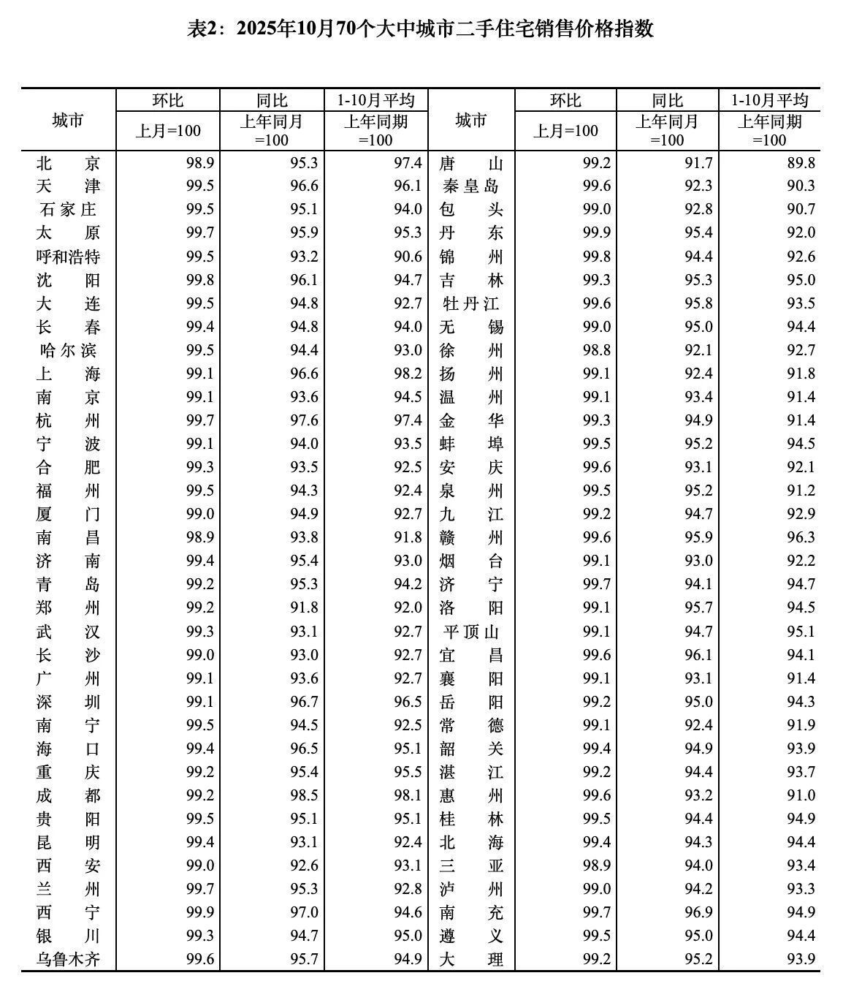

诸位，我放假回来了。

我们国家法定年假待遇，工作10年以下的5天，10-20年的10天，20年以上的15天。我写公众号13年工龄，提前享受14天年假，这波额外优待了属于。

刚歇笔的第一天、第二天挺不适应，一到晚上8点就不自觉的走进书房，坐在电脑前，愣了一会才反应过来自己不用写。说不上来的感觉，有些怅然若失，有些如释重负，还有一种陌生的新鲜感。

以前听人说过日更的公众号就像雨燕，一生都在飞行，等到停止飞行，落地了，就快死了。我以前从没试过这么长时间的中断更新，但这次事发突然，我也感受下戒断写作是什么样的体验。

……

放假的第三天，主任拉我参加了一个饭局，目的是出来溜达散散心。他以前知道我的作息，从不约我晚上吃饭，现在无所谓了。

一张大圆桌，坐了差不多20个人，有卖方首席，有基金经理，有私募同行，还有江湖游资，龙虎榜常客的级别。说是饭局，其实更像是行业分享会，桌上每个人轮流发言，说自己后面看好的板块和逻辑，因为是私局分享，在座的又都是行业老炮，所以也不避讳直接推荐个股，听者自负。

我还是第一次参加这样的聚会，多听少说，很有收获，当然也没耽误夹菜干饭。

这个局最意外的宾客是老胡，他当然不是这个圈子，是被另一位朋友叫来旁听。前面2个多小时他就坐那里一言不发，认真听各位大佬爆论a股，结果等到他发言，第一句就提到了我被放假的事。嘿，这个是真没想到，我和他前几年有过一面之缘，我以为他过了这么久大概没啥印象了，没想到他有关注。

他以过来人的经验给了我一些善意的建议，还劝慰我不要因此沮丧，我真诚致谢，我当然不会因此内耗或沉沦，因为更大的坑我也爬出来了。

打车回家的路上我突然闪出个念头，趁着放假的这些天，带上老婆出去玩一趟。

……

和家人说了这个想法后，我妈表示支持，我两出门旅行的日子里她负责在家照顾孩子。老婆也很高兴，说起来我两婚后还没有单独旅行，唯一的顾虑就是要等大崽参加完期中考试（11日），我们次日出发。

大致规划了一下行程，12-14日去杭州玩，15日去老家参加朋友婚礼，16日我带她爬临海城墙，17日坐飞机去张家界，玩4天，21日坐飞机回北京。我估计有读者也发现了，今天发文章的ip在湖南，没错，我们还在张家界玩，还剩最后一天。

通常我会把自己出门旅游的体验和你们分享，但这次旅行的经历太长，从杭州到台州到张家界，我全部写下来是老长的流水账，等以后有空了见缝插针慢慢说，反正来日方长。

我曾经设想等两个孩子都抚养成人了，脱手了，就带着老婆全国、全世界旅居，每个城市住一星期，玩够了就换下一个城市。这次我们就提前尝试了未来假想的自由生活，当了一回“忘崽夫妇”，爽玩。

但旅途中的一件小事让我颇有感触。当时我在张家界爬山，随口说了一句强度不算很大。结果边上另一个游客大姐接了一句，强度不大是因为你年轻，我们年纪大的已经快走不动了。真羡慕你们两年纪轻轻就能出来旅游，我们两都是把孩子养大了才能出来玩。

我和老婆当时面面相觑，好半晌她才说了一句，这是不是未来的我们？在那一刻我想明白了，以后还是要趁着年轻多出来玩，不能老想着等孩子长大，年轻时旅行的体验和年老时旅行的体验是不一样的。

每个人的人生只有一次，不要把自己等老了，更不要给自己预设障碍。

……

过去14天还发生了很多原本想聊的事。

比如巴菲特的谢幕信，我特别喜欢他前面絮絮叨叨年轻时的回忆，关于伙伴，关于家乡。明明已经是全世界最有钱的人，却很享受生活了一辈子的小城市，3万美元买的房子住了60多年，在向公众写的谢幕信里没有回顾一生的功绩，也没有指点江山，就是分享自己还能想起来的美好的往昔，这真的很酷。建议你们有空的去看看。

还有前些天特别火的段永平访谈，我也看了，坦率讲低于预期。方三文控场能力不够专业，问的一般，段永平难得接受长访，没有充分挖掘内容潜力。整个访谈让我印象最深刻的不是段永平说股票，而是他说了很多次的“啊不是”、“没有”，每当方三文尝试话题引导，只要方向和他内心不一致，段永平就会果断纠偏，真的没有一丁点讨好型人格。你们如果没有段永平的高度不要模仿，这种生硬性格在职场中多半是不招人喜欢的，但反过来想，这种性格在做重大的，独立的投资判断时会很有主见。

另外统计局更新了上个月的70城房价，这数据我每个月都跟踪的，不能因为这次放假给中断了。我贴一下表格你们自己看。

半个月前我说自己投资踩雷了，有很多读者问我最后啥结果，我抢救了部分仓位，但还是遭遇了年内最惨重的亏损，亏了大几百。我发现倒霉的事情总是集中爆发，踩雷的第二天公众号这边就放假了，也许最近几个月我的运势就不好，哪怕我不是迷信玄学的人，最近也倾向于收缩防守。

让我想想还有什么事想说的，哦对了，这半个月有很多公众号写我，我知道是蹭流量，我不介意自己成为别人的话题，但希望这些写我的博主们能花时间研究一下基础事实，不要在写我的时候连猜带编的添加虚假信息，你们这些语料喂给ai，ai被污染后又去误导下一批提问的人，这样循环几次就说不清了。

还有就是写我的文章只是通过标题里“猫笔刀”关键词吸一波流量，这些博主大都却没有做好准备去展示自己。我的读者因为标题好奇，会点进去看，看完走了，他们关心的是我，对这些写我的博主却没有太多印象，这样的文章效率不高的。

公众号内容最核心的价值是每一个截然不同的自我，能让网友长时间关注的永远是有趣的作者本人，请勿沉迷于短时的流量刺激。

……

今天差不多就写这些，有读者留言说歇了14天，复更首日起码要写1万字，我真的裂开，那不成导休了嘛？其实今天的内容已经比平常要多20-30%了，稍微意思一下就行。

我以前和你们说自己计划是写到2050年，其实内心里我觉得达到这个目标的可能性很低。有10%的可能性是我没热情了，不想写了；有20%的可能性是我没活到2050年，毕竟世事无常，未来25年很难说；还有70%的可能性就是其它情况。

真有那一天亦不必介怀，命运自有安排，好好珍惜眼下尚能互相陪伴的时间就是了。

就这些，发射发射。

