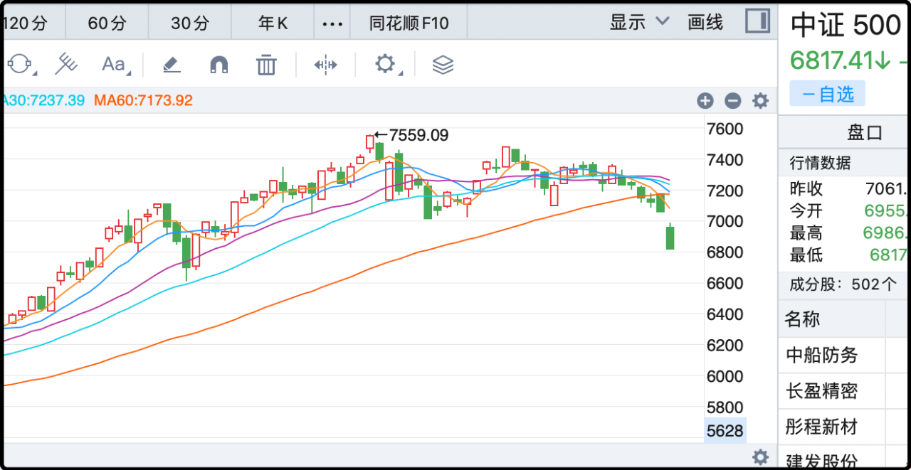

今天的文章是提前写的预制菜，因为今晚上钟的时间我在回北京的飞机上，所以文章发出后的评论互动也无法第一时间完成，你们可以先留言，等我到家了再补翻牌。

通常周末我是不怎么聊行情的，但今天的这根长阴线真的刺穿了上千万散户的心，这不是慢牛行情的正常回调。昨天指数就已经跌破了ma60，今天跳空低开，中位数大跌近4%，最终以几近日内最低价收盘。就算是对技术图形一窍不通的新手，也能很直观的感受到趋势不妙，之前半年行情积聚起来的市场人气又被砸的七零八落。

市场恐慌也是分等级的，用词语来形容，第一级强装镇定，第二级无言沉默，第三级躁动不安，第四级吐槽咒骂，第五级抱头鼠窜，第六级鬼哭狼嚎，第七级欲哭无泪，第八级心如死灰。

今天收盘我觉得已经直接跳到了第四级，各个聊天群和社区要么在阴阳怪气的蛐蛐时事，要么在咒骂市场，这个阶段的特点是愤怒大于恐惧，毕竟过去半年是挣了些钱的，亏这一下还没伤筋动骨，只是很生气自己又被a股给骗了。

假如下周再来1-2根长阴线，大概就要进入抱头鼠窜和鬼哭狼嚎，到时候会有很多人因为无法抑制的恐惧而割肉砸盘，任其蔓延就会发展成难以挽回的主跌浪，也就正式宣布本轮行情结束。

那下周还会跌么？我也没有把握判断方向，我只有具体的操作计划，老读者都知道的，即中证500超过7000点，每涨1%卖1手期指，最高到7559点，我因此卖了7手，总持仓31手降至24手。

后续如果再创新高（>7559）我继续卖，如果向下跌破6000点，我会考虑逢低捞一点回来。6000点以上不考虑。

以上是几个月前的计划，有了计划就无需再做即兴判断，按部就班执行即可。其实这个计划也侧面显示了我对劣迹斑斑的a股的态度——半信半疑，有限度信任，不赌气，没信仰，优先保存利润，在可承受风险范围内放几颗卫星碰碰运气，舅酱。

……

话说上次饭局的时候我听一个卖方首席提到个概念，好像是叫竞争式慢牛，就是目前的a股承载众望，它不仅要走的稳健，还背负了横向和其它离岸市场竞争的任务，不能在金融的维度上示弱认怂。

我当时就判断了一下，官方从未有过类似的表述，只是这位首席的个人意愿。但他说的可能也代表了很多人的想法，如今国内经济形势严峻，a股已经是2025年为数不多的亮点，从上至下在各个阶层主观上都不愿看到行情熄火。

尤其是最近几天，和不省心的邻国摩擦加剧，这个时候a股“神助攻”原地开摆，即没有觉悟也不正确，这种关键时刻掉链子真的很挑战舆情底线。有人可能会说股市的涨跌和舆情的底线有关吗，模模糊糊...有点关系，我本来想举2024年的例子来说明的，写都写完了又给擦了，先保住狗盆。

……

昨天有很多读者留言问我放假的这14天有没有变化。

a股、期指、港股我都没动。

美股我减仓了，卖了一半的qqq，一半的微软、一半的谷歌、一半的苹果，一半的亚马逊，我没有英伟达，如果有的话也会卖一半。spy、dia、伯克希尔、可口可乐、美银这些没动，我主要思路就是减估值偏高的科技股。

一部分是受巴菲特的影响，当然我自己也有判断，纳斯达克过去3年+56%、+26%、+15%，技术上超买，明年比较理想的情况也只是横盘震荡，走第四根阳线的概率低。我隐隐然觉得科技板块后面会有调整，没具体思路，纯直觉。

某天晚上下了决心，登上软件kaka一通卖，多出来的现金都买了mint（短债基金），操作完后有如释重负的感觉。

黄金我还在缓慢加仓，隔几天收了矿就去加一点，时局动荡我也看不了太远，只是莫名觉得应该加仓。

这两天还有“其它市场”也跌的很厉害，你们不用问了，我年初就开始说2025只卖不买，套现防守为主。每次都有人说这次不一样，但其实最后都一样。

……

就这些吧，机场广播我的航班要开始检票登机了，我设一个22:15的定时发送，到时候嘱咐小伙伴帮我翻划线评论。至于文章底下的留言，要等我到家后再看，大概11:40？

