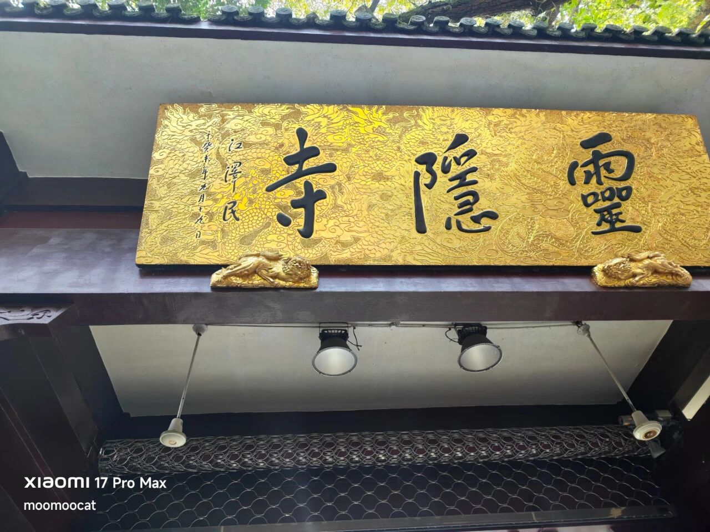

周末闲聊，把前段时间想说又没得说的话补充一下。

首先关于段永平专访，他行事低调难得露脸说那么多话，很多网友就试图通过采访内容来学会投资秘籍，我想说没那么简单。

投资这件事和两个变量有决定性的关系，第一个变量是投资者的性格，比如有些人极度风险厌恶，有些人得失心很重，有些人严重情绪化，有些人抗压能力差，一挤就爆，这些都是天生的，后天通过训练可以少少纠正，但人和人之间的差异极大。

很多人的性格其实就不适合炒股，只是他们在撞到头破血流之前往往意识不到这一点。

第二个变量是投资者的财富规模，你的投资策略和你有多少钱是息息相关的。江湖上有句烂马路的话，穷人要拼命，富人要稳定，说的就是这个意思。很多人炒股的目的是变成有钱人，而段永平在刚刚开始炒股的时候就已经非常有钱，很多散户需要在生存和财务压力下做交易选择，这样的情况段永平是从来不需要面对的。

性格不一样，财富规模不一样，投资路径就很难去类比参考。如果只是想了解段永平对个股的看法，那他管理的基金持仓是公开的：

苹果60.4%，伯克希尔17.8%，拼多多7.7%，西方石油4.4%，阿里巴巴3.4%，谷歌3%，再往下就是一些可以忽略不计的mini仓。段永平的交易频率不高，你每个季度根据信息披露抄作业，差不多能做到80%跟踪。

但抄作业的人永远也做不成段永平，因为他现在在管的基金有150亿美元规模，他的持仓是基于这个量级资金的选择。如果他是个年薪10-20万的打工族，还在为买房买车养老婆孩子奋斗，我认为他很可能就不这么买了。

总之投资思考的逻辑可以向市场里的赢家学习，但具体的方向和路径，每个人最好根据自己的性格习惯和财富规模去个性化摸索，投资这事千人千面，按图索骥容易走进死胡同。

……

还有很多读者问我这趟玩的怎么样？

11月是浙江气候最好的月份，最近半个月杭州和台州的白天温度都在13-16度，加个薄外套就能在西湖和古城墙爽玩，爽歪。唯一需要注意的是浙江今年搞了中小学放秋假制度，旅游之前记得查公告错峰，别和人潮撞了。

我这次带老婆去灵隐寺还吐槽，这么有钱的寺庙还要收2道门票（景区票45元+灵隐寺门票30元），佛门圣地铜钱味道太重。结果今天就看到12月1日起灵隐寺改为免费开放，以后不再收费卖票。所以我两是最后一茬被割的韭菜，你们不着急的再等几天。

话说这次还发现一个细节，灵隐寺的牌匾是长者题的，癸未年，问了下ai是2003年，当时我还在杭州上学。

我以前写过杭州西湖和临海古城墙的游记，这里就不复述了，接下来重点讲讲去张家界的体验。

张家界是中国第一个国家森林公园，也是中国第一批申报的世界自然遗产，由此可见在官方看来张家界是中国最有特色，也是在世界上最拿得出手的自然景观。

它的特点就是以张家界命名的石柱峰群地貌，别说在中国，哪怕全球也很罕见。网上宣传的照片很多，我发几张我拍的，没滤镜，100%原图

可能有些读者看后第一反应是，就这？好像也没有很惊艳。

坦率讲我在现场的观感也觉得差点意思，我找了找网上张家界的景点宣传片，很快就发现了重要区别，就是宣传照里通常有云雾点缀，衬的石柱峰群仙气飘飘。我来的这两天没下雨，没有雨雾，景区能见度极好，所以就是照片里的样子

没有云雾也有好处，石柱峰看得更清楚，我多次惊叹于大自然的鬼斧神工。那么高、那么细的石柱，就像神仙搭的积木，一个个矗立在那里。

它们会倒吗？会的，但时间单位是百万年，大概500-2000万年后大部分的石柱都会被风化侵蚀、倒塌，但以人类短暂的一生去观察，它们几乎是纹丝不动的。

武陵源景区很大，极其费腿，我日均接近2万步，景区故意引导你从东面看，从南面看，从西面看，动辄就要走2-3公里的山路，但其实看的是同一组石柱峰的不同角度。

后来我发现，那些爬来爬去的观景台，都不如缆车里观景位置好，极近距离，相当于无人机视角，看爽了。我和老婆坐缆车下山看一遍，再从出口回到入口，上山再看一遍，反正淡季人少，就来回来回的看。

请欣赏我在缆车里拍的视频，窗户拉开，手伸出去拍的，风吹的我手都麻了，但为了给你们出片我忍了。

顺便的，关注一下视频号，以后有啥事还能在那里通知一下。

哦对了，张家界景区的外国人好多，肉眼可见的（欧美）就很多，肉眼看不出来的（韩国）的还有很多。我在中国玩的地方也不少了，含外率像张家界这么高的，印象里只有故宫和兵马俑。韩国人迷之喜欢张家界，据说孝敬老人的标杆就是带父母来张家界玩一趟，也不知道是谁给他们洗的脑

就聊这些吧，其实.....我觉得后面去的天门山更有特色，回头再分享。

舅酱。

