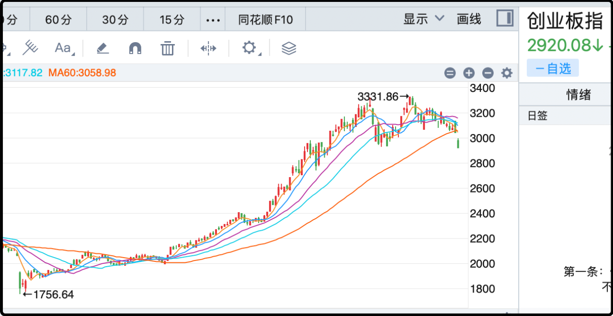

昨天写了张家界旅游，很多读者留言问为什么上市公司张家界业绩这么差，都被st了。

长话短说就是张家界核心旅游资源，像武陵源景区，国家森林公园，天门山，这些资产都不在上市公司里。当初地方政府把好东西都留下，就装了一堆边角料到a股，像观光小火车、环保客车、旅行社、支线索道之类的辅助业务。景区吃肉，上市公司喝汤，正常年景大概能挣3000-4000万。

本来每年挣点小钱也不错，结果上市公司搞骚操作，投资20亿建了个大庸古城，是一个纯人造的仿古小镇。古镇经济内卷严重，这几年大面积退潮，大庸古城门可罗雀，项目亏炸，目前已经计提10亿亏损，剩下10亿也在计提的路上。

就上市国企这群草台班子，拍脑袋就敢用60年的盈利上马一个高风险项目，反正搞砸了股民买单。

顺便说一句，另一个旅游股曲江文旅的情况也类似，西安核心景区的收入都被地方政府拿走，曲江文旅只能赚一些管理费和服务费。

更要命的是这些管理费和服务费的拖欠对象是地方政府和国企，是上市公司的上级单位，钱拖着不给也不敢起诉去追讨，最后只能计提坏账处理。

这两个案例说明在地方眼里，上市公司只是融资和变现的一个工具，好资源藏着掖着，遇到困难了让股东帮着扛雷，商业道德真就一言难尽。相比之下黄山旅游、长白山的情况就要好的多，上市公司持有景区核心资源，财务健康，也没有乱七八糟的财务填坑，所以股价回报也明显要好。

ps：张家界市是1994年配合旅游业发展改名来的，之前那里叫大庸。

……

说回周五的行情吧。

跳空低开是受全球资本冲击的影响，前几天市场对美元在12月降息的概率感到悲观（低于50%），导致全球资本普跌，周五除了a股，香港日本韩国台湾股市也都遭遇重创。

但是a股自身的问题也不小，因为除去低开的幅度，a股日内也差不多向下砸了2%，热门板块都有明显的筹码抛售出逃，终究还是人心不齐，眼见趋势破位一些聪明钱又开始抢跑。

下周的前几天很关键，一根跳空阴线是有可能兜回来的，但如果出现第二根甚至第三根长阴线就洗洗睡了，上周五的缺口确认为趋势发动缺口，后面可能要连着跌好多天。

我在这个位置没有抄底的计划，宁愿看错踏空也不愿在半山腰接盘。

当然这个周末也有一些好消息。首先是周五晚上的美股稳住了，小弹1%，没有进一步挖坑，但反弹力度比较弱，短期k线依然是空头排列。

其次美联储官员表态温和，认为短期依然有降息可能，链上赌场关于12月份降息0.25%的下注从30%反弹至67%，市场情绪明显回暖。

还有就是周五收盘后的a50期货有反弹，幅度不大，1%左右。

综上，周一开盘后的a股大概率会有反弹，幅度别过高期待，因为弹的多了就会有人出货跑路，盘中很可能还有下探的考验，其实暴跌次日公式在这个情况下是可以套一下的。周一再遭重创的概率小，我觉得周二和周三更危险。

……

美国搞了一个二十八条，态度很强硬的逼着乌克兰在27日之前确认回复，核心内容如下：
1. 领土让步
    - 承认克里米亚归俄罗斯
    - 顿巴斯（顿涅茨克、卢甘斯克）部分地区归俄罗斯
    - 赫尔松、扎波罗热按当前战线冻结（俄罗斯实际控制区不归还）
2. 军事限制
    - 乌克兰军队规模永久限制在60万人
    - 放弃远程导弹等进攻性武器
    - 前线建立非军事区
3. 安全保障
    - 乌克兰30年内不加入北约
    - 美、俄、欧三方签署“互不侵犯协议”（若俄再入侵，只恢复制裁，不出兵）
4. 经济与重建
    - 用1000亿美元冻结俄罗斯资产重建乌克兰
    - 美国公司拿走50%重建利润
    - 欧洲再出资1000亿美元支援重建。

泽连斯基说要体面的结束战争，但仅凭这二十八条的内容，乌克兰毫无体面可言。领土主权几乎都满足了俄罗斯，乌克兰自我阉割被迫非军事化，30年不能加入北约，更糟糕的是即便退让到了这个程度，也只能签一个软约束的协议。一旦俄罗斯赖账再次侵略，美国和欧洲也只是恢复制裁，没有武力保障的承诺。

俄罗斯想要的都得到了，乌克兰想要的一个没给，名义上不是投降，但实际上区别不大。乌克兰目前还没同意，欧洲那边也强烈抗议，但抗议有卵用。老欧洲那群软蛋的底色已经被普京看透了，朝鲜都成建制的派军队参战，欧洲也没有一个国家正式出兵。这些人不愿流血，就只能接受窝囊的结局。

如果最后按照二十八条签，乌克兰几十万阵亡的士兵就白死了，这场战争的根源是两边的领导人都有明显的误判，但乌克兰错的更多，被自己的榜一大哥抛弃，命苦。

……

昨天有个读者提到我在a股的核心投资思路是时间补偿性，说的很对，新关注的读者不理解我简单说一下。

a股有一个很大的问题就是浪费时间，动辄就是三五年甚至十年震荡不涨，所以在a股做投资一定要找有时间补偿性质的资产，避免干耗。我买有贴水的股指期货就是寻求明确的时间补偿，类似的资产还有期权，持有红利股拿股息，打折的封闭基金，以及可转债都含有时间补偿。

时间补偿短期内不明显，但时间久了，三年五年十年下来就非常可观，远远跑赢那些拿着股票死磕的散户。

很多成功人士都说过要和时间做朋友，有补偿才算朋友，那些占着茅坑不拉屎的都是嫖客，白嫖你的钱，白嫖你的时间。

舅酱。

