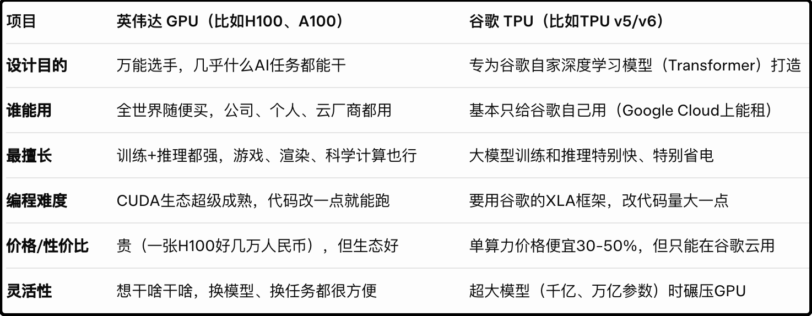

晚上好诸位，我的病好的差不多，又能正常上钟了。奥司他韦这药真管事，我昨晚还烧的迷迷糊糊，今天醒来就没事了，体温退了，食欲也正常了，就是嗓子还有些咳嗽，我一直有慢性咽炎，已经提前预防在吃止咳的药。

今晚复盘的时候看到新闻里说北京流感肆虐，奥司他韦最近7天销量暴涨237%，玛巴洛莎韦销量增长180%，我在软件上切到流感的概念主题，今天上涨2.6%。这个板块季节性很强，时间窗口短，另外关联生产的药企太多，资金分散，历史上流感板块很难走出整体持续行情，不过个别龙头股今年真没少涨。

这药进口的比国产仿制药贵了5-7倍，国内药监局做的一致性评价显示药效和副作用反应数据都差不多，但之前发生过一些鸡零狗碎的破事，导致老百姓对仿制药信心不足，老婆给我买的也是罗氏的达菲。

……

昨晚我爬上来请完病假后发生了两件大事，第一件是中美元首通了电话，根据外交部透露这次通话是美方主动要求的，通话内容很可能和中日摩擦有关，因为特朗普随后就要求和日本的高市早苗通电话。通话的内容没有对外公布，但资本市场做了乐观的反馈，因为再差的沟通也好过对抗的沉默。

美股里的中国指数昨晚就已经反弹了，涨了3%。

另一个事就是美联储官员昨晚再度释放了12月份降息的信号，机构分析12月降息0.25%的概率从69%上升至82%，链上赌场里对这一事项的下注也涨至83%，目前看12月份虽不是板上钉钉，那也是十拿八稳。受此刺激纳斯达克昨晚大涨2.7%，我早上醒来的时候发现饼圈也普涨4-5%。

以上是今天a股跳空高开的背景，开盘就涨，上午10点半的时候中证500就已经+2%，但反弹背后有一个软肋，就是成交量萎缩，缩量反弹弹着弹着就开始心虚。等到吃中饭的时候脑子一凉，下午就又有不少资金开始提前跑路。等到最后收盘，日内阳线已经回撤了一半，全天成交1.8万亿，离2万亿的牛市量能及格线尚有差距。

昨晚说的5日线依然有显著压力，你们可以去挨个挨个看主流指数的k线图，收盘的时候都很默契的回到了5日线以下，这是对上周五跳空缺口的尊重。其实今天上午有几个冲的猛的指数离补缺就差一口气了，但股市终究是综合博弈，差一点就是差一点。

今天涨完后形势比前两天要好一些，但并没有真正扭转下跌趋势，明天还得看，第一个目标是先收复5日线。

……

1、这几天市场在下注炒谷歌的TPU，这是谷歌自己研发出来对抗英伟达的GPU的产品，我让GROK给我简要概括两者的区别，如下表格：

简单说就是谷歌生态的专属算卡，比英伟达的便宜30-50%，只能在谷歌生态使用。最近业界一个大新闻是meta考虑倒向谷歌，购买数十亿美元的TPU来建设数据中心，这事目前还没落地，一旦实锤肯定是个重要风险标。

英伟达链和谷歌链有区别吗？有的，关联的上市公司有一些区别，我这里不写个股，细节你们去问ai。

2、今天市场热议最近新推出的《移动电源安全技术规范》，大背景是最近充电宝频繁出事，所以升级了史上最严版本的充电宝标准。要标安全使用年限，要有屏幕显示充电宝数据，要扛极端环境测试，还首次把关键材料和工艺写进标准。大厂达标不难，小厂生死存亡。

行业分析会导致成本增加20-30%，导致市占率进一步集中，未来的充电宝更贵、更智能、更安全，大量杂牌会被淘汰。

3、万科境内和境外的债今天同时大跌，境内债跌到70多，境外债跌到40多，发行的初始价都是100。收益率已经是标准的垃圾债。今天突然跌这一下是有小作文说深铁要收紧资金支持，并且有可能要被另一家金融央企重组。万科的股票今天倒没怎么跌，因为大家觉得就算重组也会嘎债权人的韭菜，不会放股东们的血，尽管万科的股价已经把股东的血快放干了。

上周20日，彭博社报道正在考虑对新增房贷进行贴息，但没说贴多少。目前房贷3.1%，一二线城市的租售比普遍在2%左右或者不足，所以理论上只要贴1%就会立竿见影的起效，但贴1%每年支出6000亿，感觉目前的财政很难挤出这么大一笔钱。退一步，贴0.5%也会对市场起到明显提振作用。

4、美国银行重申了对黄金的乐观预期，认为2026年目标是5000美元。目前黄金处于平台震荡期，从k线上看我觉得可能还会持续1-2个月。

5、今晚最后的重头戏是阿里最新的财报，具体数据我就不复制粘贴了，简单讲就是电商业务低增速但盈利稳健，外卖业务砸了300多亿干美团，有效，活跃用户数明显提升，市场最关心的云业务（ai）+34%小超预期，综合评价市场给了小幅好评，美股盘前上涨3-4%。

之前京东披露的三季报，在外卖业务上大概补贴了100亿，加上阿里的300亿，这400亿把美团打成什么样目前还不知道，28日美团出季报。

6、据说乌克兰已经同意修改后的和平协议，具体内容我搜不到，据说在领土主权这一块进行了修正，之前的28条太偏向俄罗斯了，我觉得泽连斯基政府能接受的就是就地停火，冻结战线，如果还要主动退让2000多平方公理的领土就要被国民骂死。媒体分析认为实现短期停火可能性大，但等俄罗斯积蓄了力量很有可能再来。

就这些吧，我今天遇到个烦心事，病好了，但是不知怎的眼睛看东西出现了虚影，屏幕上的字号小的话有些糊，需要微微眯着眼才能看清。我从小就是超清视力，之前在张家界黄龙寨山顶能看到30公里外天门山的洞，莫名其妙，突然看东西就出现虚影了。

老婆说我这是年纪大了，开始老花了，我听了蛮受打击的，打算约了去医院查查。我不能接受

心塞的一批。

