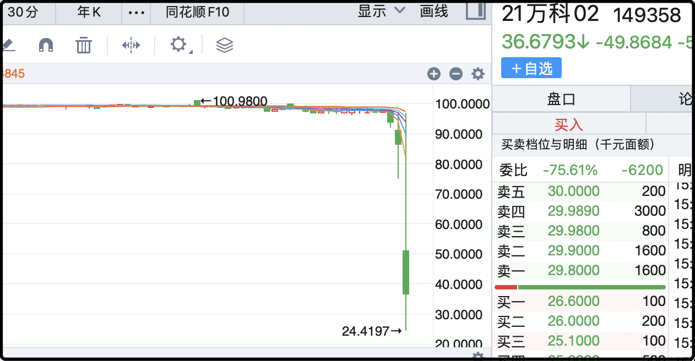
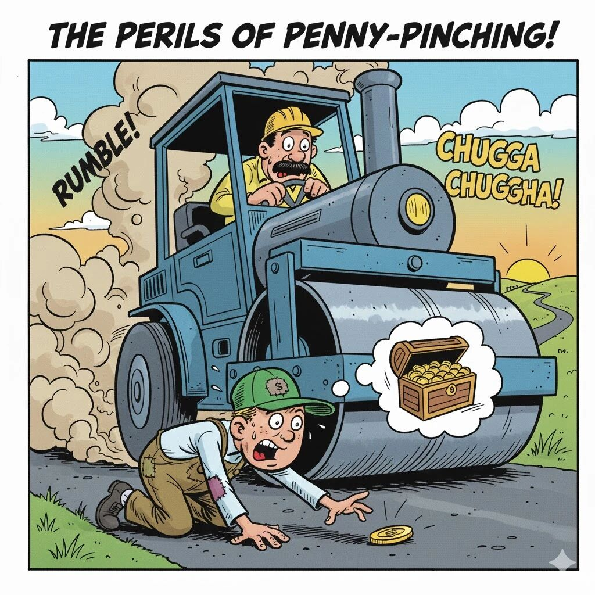
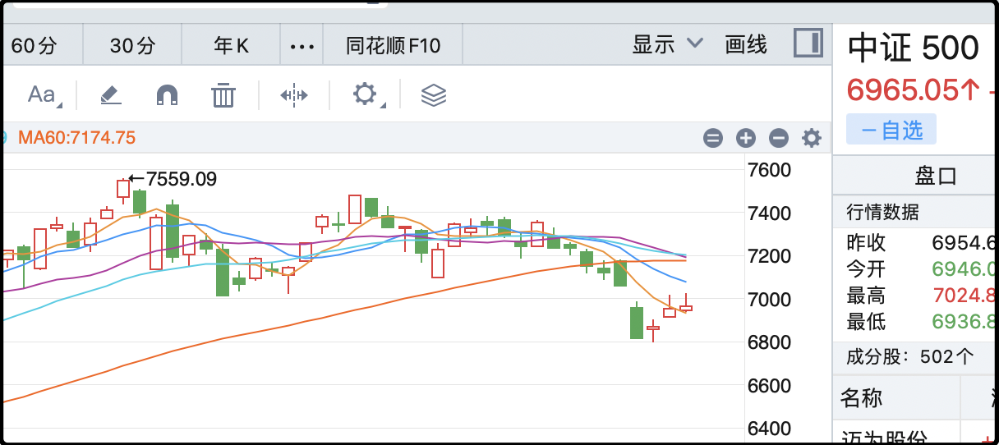

这两天的文章讨论了眼睛视力的情况，就有一些读者留言问我有什么用眼习惯可以分享。

很抱歉，我的视力更像是天生的，不是保护出来的，我从小到大的用眼习惯就是一场灾难，书上说要避免的不良习惯我全踩，我爱看小人书，爱看漫画，爱玩电子游戏，最近这十几年做职业投资看屏时长日均在13-15小时。

高中那会流行过眼镜热，艺人明星都会带个金框眼镜扮斯文气质，当时我就想过要是近视个50度、100度就去配一副，但一直没买上。

再说感觉就有点凡了，总之没什么秘诀可分享，就是狗命好。这两天眼睛只要连着看手机或者电脑超过1小时，眼睛会累，就会出现虚影，要休息一会才会恢复。我寻思我的眼睛大概是保质期快到了，不过这样也好，会提醒我不要久坐，不要连续用眼，没准我的生活习惯会变得更健康？

……

今天市场的焦点是万科计划20亿中期票据协商展期。

展期翻译成白话就是宽限几天，你的账我以后还。20亿只是一个开始，标志着背靠深圳地铁的万科不再坚持刚性兑付，转为用市场化的方式去解决债务问题。

所谓债务市场化，翻译成白话就是讨价还价，什么时候还，没钱能不能打折少还，用什么形式还债，这些都得商量。

这对债权人来说当然是晴天霹雳，万科债今天暴跌，最惨的21万科02一度跌了70%。这债周一的时候还有98元，2026年1月22日有一个回售选择权，里面的人原本再过2个月就拿回全部本息，但现在一切都变了。

3天时间从98最低跌到24，你们炒股是不是都没见过这么刺激的，这类投资都算压路机前捡硬币，特征是预期收益不大，但潜在风险极大。

有的读者可能会说我这是事后诸葛亮，万科的突发变故谁也料不到，但之前辛杰先离职就是一个很明显的警报，机智一点的资金那个时候就跑了，因为值博率不合适了。

至于万科的股票，今天跌7%已经不算很惨，虽然债务市场化主要针对的是债主，但对股民也不是好消息，原先市场对公司的预期是通过深圳国资源源不断的现金支持，一直撑到房地产市场回暖。现在既然要市场化解决，那万科后面大概率会像其它暴雷房企一样财务大清洗，到时候年度亏损就不是几百亿，有可能是几千亿，这样做也是为之后削债重组的必要铺垫。

另外也不排除最终债转股的方案，融创就是这么干的，债主们100块钱的债兑换20-30块的股票，认赔70-80%。增发的巨量股票会稀释现有股东权益，虽然现有股东真实的净权益也不多了。

万科作为老牌蓝筹，在散户里粉丝极多，有很多人今年一直在苦苦死扛，今天公司摊牌了，我能理解里面的股东有多失望，但非常时期更应该冷静思考。还记得我前段时间说的对a股的态度吗，不赌气，不较劲，没信仰，优先保存利润.

……

这几天a股的行情有点缺德，连续3天逗多头玩，挂旗杆上的人每天换一批。今天的成交量依旧萎靡，只有1.71万亿，这个量能很难直接涨上去把上周五的缺口补了。现在的好消息是卖盘也不多，说明前几个月的慢牛行情余威尚在，市场里的人心还没有散。

说起来也蛮怪异的，上周五明明还跌的很凶残，周五尾盘还追杀到最后一分钟，结果过了个周末空军突然就消失了，本周4天甚至都没有抛盘尝试过向下进攻。那上周五是哪些人砸的，他们图什么，仅仅是害怕中日矛盾升级么，反应也太过度了。

哦对了，高市在接完特朗普的电话后，表示不再谈及台湾问题，但依然坚持没有收回之前的言论。她的言论在日本国内有支持的右翼基本盘，不收回得罪中国，收回得罪右翼，她想来想去决定冻结话题冷处理。我们的外交部对这个结果并不接受，中日关系没有改善，但暂时也没有更坏。

现在大盘的情况是砸盘的人突然消失，然后多头有气无力的尝试了好几天的反弹，但都跌了回来，我觉得日内抛售的是看不清形势，打算先退出来观望的叛多筹码。

目前的情况有点怪异，按照以往的剧本，大跌后是向下试探，撑住几天后向上反弹。现在是大跌后向上反弹，连续几天被挡回来，难搞。如果我现在账户里面所有头寸清零，只有现金，我应该不愿意在这个位置建仓，宁愿它再向上涨一涨，度过这个尴尬区间。

……

1、俄罗斯称拒绝任何让步，不会放弃自身立场。乌克兰那边回应说不会接受俄罗斯对乌克兰领土的任何占领，不会就此修改宪法。这看起来是自说自话，完全谈不了。其实乌克兰目前可以接受原地停火，战线冻结，意思就是目前俄罗斯控制的地区，你继续占领，只是我不承认。但看俄罗斯的意思是坚持要把顿巴斯剩下的面积也打下来，我对乌东地缘政治不熟，不明白俄方为什么使命感这么强烈，搞得好像他们在打卫国战争光复旧土似的。

2、发改委：防止人形机器人企业扎堆上市。这个是过往上市公司ipo内卷吃过亏，这次提前预防。所以如果你的企业在这个赛道拿不到上市资格，基本就意味着输了一半。

3、飞天茅台批发价跌破1600，我以前解释过的，茅台的批发价比零售价还要再贵一点点，所以零售的飞天应该很接近1499的官方零售指导价了。个别电商平台上补贴的海外版茅台更便宜，1300-1400的都有。我最近几次聚会发现大家都喜欢买1000毫升装的茅台，这个人多的话最划算。

4、摩尔线程线上申购的弃购了300万，都被承销商拿走了。这个中签率很低，好不容易中了还弃购真是，但每一个新股都有小比例期购，感觉是自动申购没注意，忘记留钱了。这个股是近期最大的明星股，上市估计能挣大几万，对于一些散户来说可能炒一辈子股也没挣过大几万，估计这几天激动的睡都睡不着。

就这些吧，我周末要做一次账户迁移，从目前的主体换到另一个公司主体。原因是之前信息被ai污染，写错了上市公司信息，他们去投诉，主管的机构嫌我们惹麻烦，所以自觉滚犊子。你们不用做什么，只是会收到一条迁移通知，放心吧，不是卖号，我的号也没人买。

舅酱。

------------
Q：长期用利率3%的贷款买 qdii 的标普和纳斯达克，可行吗？
A：我觉得处于上行期的资产，不应该用借来的钱去买。风险总归是有些大，你可以等美股出现重大回撤，砸到市场极度恐慌极度不看好的时候再考虑目前的情况。借钱买股必须很高很高的值博率，不然宁愿错过也不买错。

Q：为什么万科年度亏损几千亿，是为之后削债重组的必要铺垫？这里面逻辑是啥？
A：你要债主们接受现实，接受削减债务重组，那首先得把真正的坏账给摊开算明白吧。融创碧桂园恒大当时财务清算的时候都是上千亿的亏损，万科之前一直刚兑死扛，不愿把事实上已经减值的资产给算明白。现在包袱已经放下了，你可以明年看，有可能四季度就会财务清洗。

Q：近期a股上市公司频繁在香港上市是什么原因
A：因为去年行情太差，监管层把a股融资给卡了，同比跌了将近80%，上市公司于是都选择去香港上市融资，导致香港今年前10个月成为全球融资第一的股市。另外有一些上市公司也是趁着在香港上市，趁机获得一些离岸资本。

Q：滚ic，1手对应期货公司25万+微众银行活期25万，另外预留资金50万买了纳指+黄金，请问这样配置是否妥当？还有什么风险注意？
A：差不多能覆盖风险了，微众银行的钱确保随时可以取出来补保证金就行。其实就第一年第二年有些压力，从第三年起贴水本身也会增加安全垫。