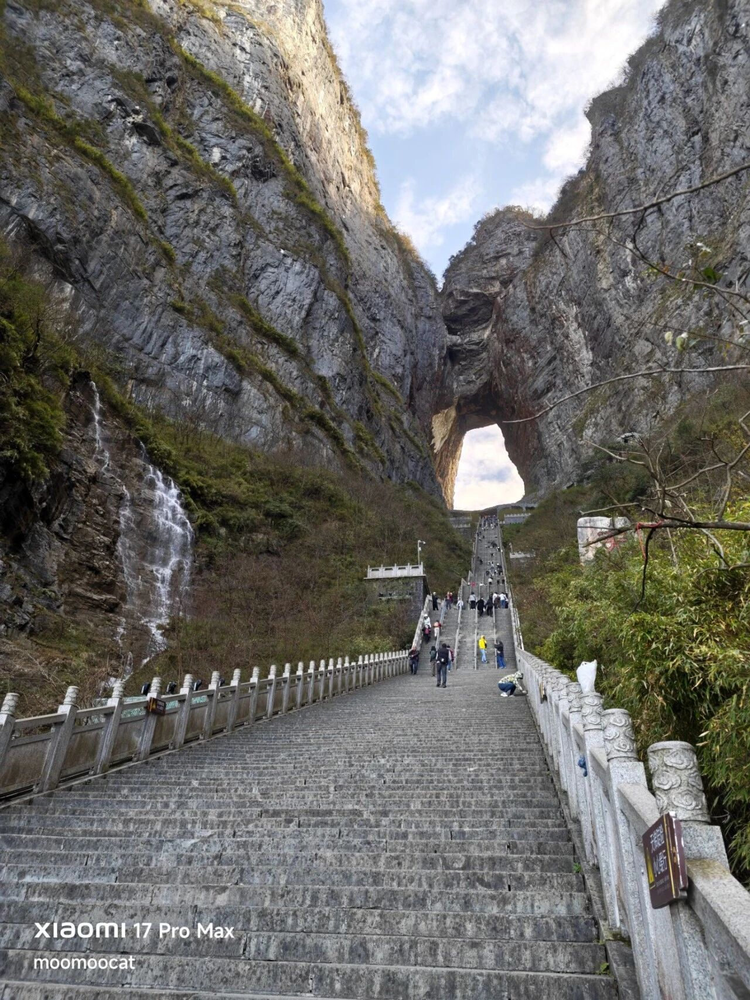

都在等着美团的三季报，所以一经发出立刻窜上最热门话题。

3季度营收955亿，仅增长2%，低于市场预期的977亿，调整后净利润亏损160亿，去年同期赚128亿，里外里也差了将近300亿。都知道美团三季报一定不好看，但没想到会这么惨，美团股东一看一个不支声。

核心本地商业营收710亿，同比仅增长1.5%，外卖市场份额从年初的70%跌至67%，这是美团自己的说法，我看外资研报都说美团实际份额可能已经跌到65%甚至更低。

从经营数据能推算出美团在三季度投入了200-250亿补贴，用来防御阿里+京东的进攻，阿里300亿，京东120亿，这三家加起来接近700亿，这还只是三季度，力度已经追上国补了。

京东用120亿补贴7%的市场份额，阿里用300亿补贴28%的市场份额，美团用250亿补贴65%的市场份额，美团的单均补贴力度肯定比不上另外两家，所以目前是苦苦支撑，延缓市场份额流失。美团在电话会议上说公司目前账上还有1000亿，那起码还能再撑1-2个季度。

盼就盼那两个冤家早点结束补贴战，美团的财力和阿里是不能比的，这场三方商战其实真正的主动权在阿里手上。每个季度补贴300亿对阿里来说也不是一笔小钱，一旦补贴带来的经营数据提升放缓，阿里随时会叫停。

从目前的情况看四季度三家公司的投入都会减少，有可能在年底前后逐渐结束，之后转为经营效率和生态服务的竞争，这对阿里、美团、京东都会是潜在的股价利好。

我觉得现在美团的市场情绪几乎已经处在最低谷，年内下跌32%，又出了一个炸裂的三季报，如果下周一有人主动挖大坑的话可能是个机会。我自己估了一下，一旦外卖大战结束，阿里有10-15%的补涨空间，京东15-25%，美团30-70%。

……

今天市场里还有一个八卦传得很广。

起因是昨天有一个股吧里的人发帖，说孩子重病钱不够，实在凑不齐就只能买入某支股票，希望主力帮忙拉升，自己已经走投无路了。结果这只票今天10点多突然一波暴力拉升，从绿盘直接干到涨停，前后不到5分钟。

于是今天在各大股票社区，求助贴的截图和涨停的分时图就疯狂传播，很多人看了以后都夸这股的主力仁义。

我请诸位理智思考一下这事算好事吗？谁家正经人孩子重病了，还拿着手里的钱来股市赌博的，你稍微带入一下，自己身边有这样的家人你不炸吗？现在这事是真是假还不好说，如果有同样情况的人模仿，把家人治病的救命钱扔进股市许愿，谁能担得起这种因果？

我觉得这样的价值引导很不合适，重疾求助的正确求助路线是找公益平台（水滴筹、轻松筹）、找公益基金(慈善总会、儿慈会)、找民政局、找卫健委、找三甲医院的慈善援助办公室。

最扯淡的就是投进股市，发帖求主力拉涨停。
……
还有篇幅，补一下之前游玩过的天门山吧。

张家界出名源于武陵源的石柱峰地貌，上世纪80年代就申遗成功，成为世界知名旅游景点。天门山不在武陵源景区，两边相隔近30公里，一直到2001年才有民企和当地政府签约50年开发协议。

天津宁发集团，我之前提到这个名字，不少天津网友说很耳熟，做房地产的。先后投了34亿，去过的游客都能感受到硬件确实细致，如果你不愿意爬山太累，有电梯+索道+摆渡车，一路给你抬到山顶。

因为是民企运营，所以天门山景区的营销宣传很活跃，早年请来了苏式战斗机穿越天门洞，后来还举办了翼装、高空钢索、盘山漂移、汽车爬台阶等一系列吸引人气的活动。最近一次出名....是奇瑞汽车挑战爬台阶失败，摔下来把护栏撞坏了。

天门山在抖音上的名气极大，甚至超过了武陵源，很多人不知道它其实2011年才被评为5A景区。但我说句心里话，只说旅游体验我觉得天门山更有意思。

武陵源虽然名气大，但景很分散，重复度高，缺乏重点，而且配套一般，一天下来不知不觉就会走2万步。

天门山景区每一个环节都很有新意，从市区开始坐缆车，全球最长索道；下来后坐摆渡车上盘山公路，超惊险刺激。我当时身后有几个韩国人，一直吓的在那里“西巴西巴”的大叫。

摆渡车送到广场，近距离仰视天门洞太震撼了，老婆掉头就去买32元的电梯票，我深吸一口气，告诉她票只买一张就够了，我要爬上去。她以为我在装杯，可我是认真的，最后我真爬上去了，大概用了20分钟，就是这么顶。

爬到天门洞口不是终点，还要坐世界上最长的穿山电梯到山顶，山顶也蛮惊喜的，栈道风景险峻，有视野极佳的观景台，景区深处有一个天门寺，竟然是中国10个存放佛舍利的寺庙之一。

整体体验上佳，私营企业做服务肯定都比国企细致，各行各业都是这个规律，景区管理亦然。

就这些吧，周末愉快。

------------
Q：恒生互联网etf终于要迎来春天里快顶不住了
A：名字叫恒生互联网etf，结果将近一半的权重都打外卖补贴大战，这个太影响表现了，起码少涨了15-20%。