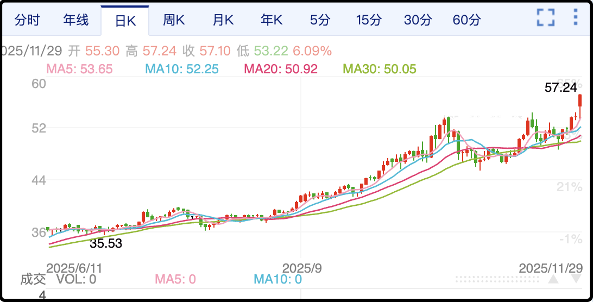

今天上午账号迁移遇到了一点小问题，系统提示由于我的关注人数和内容素材较多，需要较长时间（24小时）完成。这就有点尴尬了，因为一旦发起迁移之前的账号就不能再登陆了，而这边的新账号读者们还没有自动迁过来，所以今晚的更新就无法正常进行。

我的情况有点像前天上海的滨崎步，观众一个没来，自己一个人在台上唱歌。我这里倒是不用退门票，但今晚还要更新吗，我想了想还是写，日更有个交代，而且文章放那里，你们明天迁过来了会有人去补看。

……

这几天留言里很多读者问我对吸毒记录封存这事什么看法，这事在互联网上闹的很大，群情激愤。我完全能理解诸多网友反对吸毒记录封存的情绪，换做是我也不愿意日常接触以前吸过毒的人，但在表达完情绪后，能否理性的思考一个问题，就是这些吸毒的人怎么工作和生活呢？

我问grok吸毒人员在当下的中国可以从事哪些职业？像公务员、教师、医生、律师这些不用想了，事实上城市铁人三项（外卖快递网约车）也注册不了，进厂打螺丝会被拒，甚至建筑工地和小区保安只要查到吸毒史也肯定不会要的。

能做的工作只有个体户摆摊，废品回收，淘宝/拼多多/抖音开店，跑车货运，洗碗，洗车，农村种田养殖。总的来说就业面很窄，就业资源也很有限，吸毒人员不可能有体面的工作，找一份稳定的工作都很难，生存空间堪忧。

很多网友会说他们活该，谁让他们吸毒了，原谅他们就是对不起牺牲的缉毒警察。但吸毒不是死罪，吸毒人员服完刑出来还要生活几十年，他们得有出路，否则就会成为社会不稳定因素。90年代有个悍匪叫白宝山，就是刑满出狱后受到歧视，无法融入社会，最后成为连环杀人魔。现在社会治安好多了，但一个人破罐子破摔想要报复社会，谁也防不住的。

我没有吸毒人员就业情况的分析数据，但政府肯定有，现在推出封存记录的政策，应该是希望引导他们去参加工作，恢复正常生活。我在想不出更好的替代方案之前，也轻易不会反对，毕竟情绪发泄没什么用，能提出解决方案才有价值。

个别媒体把这件事往“掩护少爷”的节奏上带是不客观的，全世界无论哪一个国家，吸毒人员的主体（70%+）都来自社会最底层。

……

这几天另一个热点是《疯狂动物城2》的票房彻底疯狂了。

上映5天，票房已经20亿，这个周末每日票房占比达到惊人的95%！其它同时上映的十几部电影加起来只能分到5%的票房，原先排片已经完全倾斜。我昨天带着大崽去的那一场，全场爆满，边角料座无虚席，都是爸爸妈妈带着孩子来看的。

《疯1》是2016年上映，当时国内票房13亿，口碑极佳，豆瓣评分9.3。动画片能给到9分以上那都是全球爆款的经典，有极其铁杆的粉丝群体，这次《疯2》上映前就预估有20亿票房，结果还是爆了，大超预期，目前市场预估最终票房会在45-50亿区间，超过《复联4》，成为进口电影冠军。

至于电影本身的质量，我看完后觉得明显不如1，主要差距在故事情节，这次的续作没有前作的感染力，无论是人物设计还是情节推进都有些公式化的味道，甚至重要角色黑化我都能提前预判，没玩出新花样。

但即便如此我给《疯2》的打分也有8.5，很适合（4岁以上）亲子观影，兔子和狐狸重逢拥抱的那一段把我儿子看的抹眼泪了，有空就带孩子去吧，绝对值票价。

话说看到票房那么火，我想起这部电影的发行方是中国电影，他们通常可以拿到进口片票房分成的10-20%。按照45亿的预期，扣掉院线分成和各种税费，以及宣发的支出，中国电影最后估算净赚3-4亿。

发财了，要知道他们前三个季度加一起也就赚了6600万。股价周五已经涨停，当时电影口碑已经小范围发酵，敏锐的资金就冲进去了，下周一估计想买也买不到，等到能买到的时候价格肯定不便宜。

……

1、周末还有一件事热度急升，国际银价周五晚上暴涨6%，突破前期平台，创历史新高。看k线感觉是加速向上逼空头的仓位，逆势做空的这波要死人了。和银价联动的还有铜价，也是平台突破刷新高，启动轧空行情。

黄金周五涨1.3%至4250，离前高还有一些距离，暂时落后于银铜。

2、美团和阿里在外卖补贴大战上拼消耗，另一边抖音在加速偷他们两的家。抖音电商今年增长30%，距离阿里只有不到30%的差距；抖音到店增长60%，距离美团也只有不到30%的差距。所以快的话2026年，慢的话2027年，抖音就会在电商上超过阿里，在到店业务超过美团，更厉害的是抖音并没有因此付出补贴的代价，就是靠自己无与伦比的流量池来实现这一切。未来的中国互联网，只有腾讯和抖音尚有一战之力。

3、银行新规，取款5万不再需要等级，这是好事，但没说10万，20万，50万是否需要登记，也没说什么样级别的曲现不需要登记。

4、特朗普：永久暂停第三世界国家的移民。他的任期也只有3年，何来永久之说呢，下一个任期民主党选上来他的政策就都作废了。

5、最近很火的还有四川一家民营企业用70万成本造出超音速导弹，这事过于离谱，所以我让子弹飞了一会，从目前获得的信息看，这事并不像是胡扯炒作，这个民企是专注低空/高超领域的老玩家，这次的成品试射有视频证据，有记者探访，也有专家背书，感觉有一定的可靠性。就算没有70万这么便宜，也不一定有传统导弹可靠，但综合性价比的优势看来是真的。

差不多就这些吧，本周小碎步反弹已经几乎修复了上周五跳空阴线的重创，从下周一开始ma5就会上穿ma10，这是趋势明显好转的信号，虽然感觉量能低到不正常（不到1.7万亿），但涨了总比跌了强，缩量就缩量吧。

最近老有人问我为什么不发射了，k线趋势向下怕射到沟里去，别着急，先看看。

