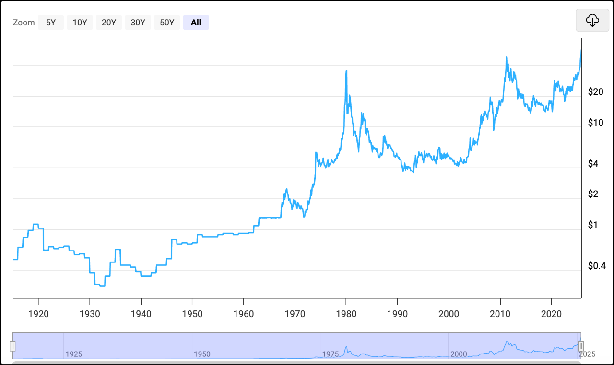

抱歉，读者迁移的过程还没有结束，我截图计算了一下，大概每分钟迁移600-700人，按照这个速度今晚更新的时候只能迁过来不到一半，剩下的大部队还在老账号一脸懵逼的吐槽我人又死哪里去了。

怪我把迁移这事想简单了，我以为平台内换个账号，就是我念个咒语“嘛咪嘛咪轰”，一个特效，你们就跟着我瞬移到了新账号。结果现实是腾讯开着小面包车，一车一车的把大家接过来，早知道这样我应该在以前的文章里直接贴新账号的名片。

只能说下次有经验了，我老觉得这次搬家不是最后一次。

……

今天ai最大的热点是字节跳动旗下的ai豆包发布了和中兴通讯合作生产的ai手机，演示视频11分钟，全网热传。

这款ai手机最大的突破在于它具备ai agent能力，简单说就是豆包像一个真人助手，它会选择和调用手机里安装的app，来完成你语音布置的具体任务。

比如你想买一瓶茅台，可以告诉豆包，希望买到最便宜的茅台。它就会自己打开天猫、京东、拼多多，搜索、比价、下单结账。另外像饿了，病了，让豆包订外卖，买药这些也不难，都是ai agent很容易能办到的操作。

总之ai不再只会聊天，它能实际做一些不是很复杂的任务，未来用户和手机的交互可能都不再需要屏幕接触，语音唤醒+布置任务即可。这让广大网友感到很新奇，纷纷惊呼手机革命到来，市场借着这股情绪，上午11点之前就助推中兴通讯涨停。

我觉得ai手机在现阶段并没有那么理想，我说几个我的顾虑。

1、演示视频里主动说了，所有内容虽是现场录制，但不保证100%复现。目前ai都有发挥不稳定的问题，你布置10次任务，可能会有1次听错了，有1次选错了工具，有1次执行结果不理想。如果10次里面有3次需要你打开手动干预，使用体验就差很多。

2、豆包在调用app时的权限是否过大，涉及个人隐私和信息安全，我用来安装投资类app的那个手机不会安装任何ai agent，它再聪明我也拒绝。

3、ai调用app会侵犯这些app本身的权益，比如开机画面的广告，以后可能就没多少活人看了，app内置的广告也会被ai忽略，这些app不会坐以待毙，它们后续很可能会抵制ai调用。

4、目前ai agent能做到的大都是轻任务，缺乏真正的痛点解决方案，视频里演示的都是人类花不多的时间也能轻易做到的事，只是豆包在演示时故意添加了人类手里抱着箱子，提着袋子等特殊情况。

我想了一下，炒中兴通讯的逻辑并不坚挺，首先豆包开放和所有手机厂商的合作，非独家，其次别的ai也可以跟进，以中兴在手机市场里的份额，感觉很快就会被卷的无声无息。

……

有色板块，尤其是白银概念随着国际银价的突破而大涨。我整理了一下过去100年的白银价格走势，如下图，1915年至2025年。

之前有人问投资白银和投资黄金的区别大吗？确实两者行情有较高的联动，但差异挺大的。最大的区别在于白银的市值和黄金有接近10倍的差距，它的盘子小，波动更大，易于被操纵。

其中1980年前后有过一波很离谱的行情，当时是亨特兄弟明牌坐庄，囤积现货逼空，从5美元涨到50美元都不收手，他们认定当时处于“石油危机”的美元会崩盘，想把银价干到150美元。结果遭遇官方打压，禁止新开多单，只能平仓，于是银价崩了，亨特兄弟来不及逃命，200亿美元资产亏光还倒欠几十亿。

操纵银价的难度远低于黄金，所以总有人铤而走险，今年白银已经上涨90%，价格创历史新高，境外机构分析后续可能也会启动情绪化逼空。相关的催化剂还有美元12月份的降息确定性增加，目前概率已经升至87%，基本没跑了。

……

1、中指院11月份百城二手房价13143元/平方米，环比下跌0.94%，跌幅较上月扩大0.1个百分点，同比下跌7.95%。50城住宅平均租金为34.36元/平方米/月，环比下跌0.60%，同比下跌3.57%。这个中指院是业内更新较久的民营机构，会在月初公布数据，统计局的70个大中城市房价是官方数据，月中公布。

2、疯狂动物城2票房20亿，已经是国内动画片票房第3名，前两名都是哪吒。目前看疯狂动物城2最终票房会突破40亿，对进口引进的中国电影带来3-4亿的收益，293亿市值的中国电影因此已经涨到355亿，我认为合理的估算后面还有1个涨停的空间，再多就是短期情绪溢价，后面会冷却回来的。

3、wind上的消息，万科20亿境内债展期方案据知情人透露，本金和利息兑付都推迟1年，票面利率不变，还是3%。刚违约的时候展期条件都不会很差的，但机敏的老债券人现在砸盘都砸到3折了。

4、峨眉山a今天股价封停，是有资金借周末的消息来炒作，买500股免门票，到明年1月31日为止，节假日除外。我前几天评论过了，这个方案其实很没有诚意，现在是旅游淡季，还要扣掉节假日，上市公司就没打算真的让利给股东。但方案本身引起了市场讨论，有眼球关注价值，所以就是价格投机博弈。需要注意的是有可能会带火股东实物分红概念。

今天就这些吧，大盘的量能稍稍回暖了一些，超过1.8万亿了，市场中位数上涨0.39%，k线趋势在慢慢修复，已经逐渐填上前一个周五挖的坑。从技术指标上看过去这一周涨的不够踏实，感觉随时吹一阵风过来就会倒，但邪门的是前一周还急风骤雨的，突然就风平浪静了，所有的卖盘都消失了，没人卖，少少买一点都能涨。

刚看了一眼，用户迁移进度39%了，感觉腾讯的小面包车累够呛

---------------
Q：哈哈，趁大部队没过来。我先留言了，请叫大猫，如果模仿美股七姐妹的强者恒强思路，是不是定投A50指数比定投沪深300收益好。当然如果有A10更好。但是我没有找到。我长期持有，就当自己购买养老金（平替），预计20年后退休把这比投资补贴家用。
A：不，美股七姐妹的逻辑在a股没有对应的标的。美股是没有大型国企的，而a50里面几乎一半以上都是国企。美国的科技公司有制度优势，还能全世界拓展业务，赢家通吃，这是全球独一份。a50并不能复刻这种成功。

Q：太容易复现了，谷歌这一代新机几乎没有介绍硬件，通篇再介绍gemini和手机的融合。而且包的话在国内确实也不算t0。小米主要被小爱拖累了，估计也不会愿意放出去。中兴也不是第一梯队，我说今天怎么突然拉涨停了…
A：小爱永远年轻，智商一直没变过，我用过几次就再也不用了。其它ai agent在手机端的应用我还没试过，之前在电脑端上用过几个，体验不好，发挥很不稳定。

Q：白酒是不是再也好不了了
A：再坏的趋势也有否极泰来的拐点，前几年被集采锤烂的医药板块，今年因为bd出海就翻身了。白酒现在是各种坏的情况都叠加到一起，连跌5年，之所以迟迟没有反弹，我觉得和它跌的不彻底有关。你别看跌了5年，其实加起来没有2021年一年涨的幅度大。白酒目前确实很颓废，但是里面的长期资金并没有真正绝望。

Q：猫哥，如有三十万闲钱，是还公积金2.85%还是分笔买一些宽基或红利etf，或高股息高分红股票十年长持，钱不着用。
A：买红利etf的长期收益预期肯定超过2.85%，而且波动也不会太大，如果家庭现金流不紧张的可以搞。

